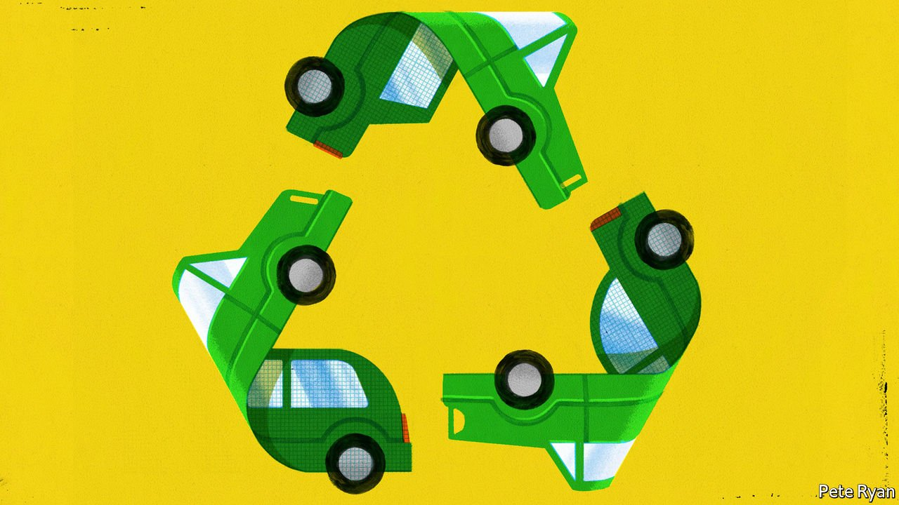
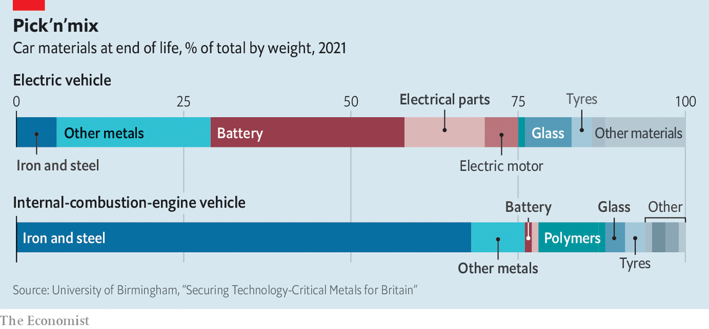

###### Scrapyards of tomorrow

# Old electric cars are a raw material of the future 

##### But they need to be designed to make recycling them easier 

 

> May 13th 2021 

CAR SALES have, generally speaking, . But there has been one bright spot.  (EVs) continue to grow in popularity. According to IHs Markit, a research firm, almost 2.5m battery-electric and plug-in-hybrid cars were sold around the world in 2020—and the company expects that number to grow by 70% this year. BloombergNEF, another researcher, reckons that by 2030 some 8% of the 1.4bn cars on the road will be electric, rising to more than 30% by 2040. It is not, moreover, just a matter of cars. There will also be electric lorries, buses, motorbikes, bicycles, scooters, ships and maybe even aircraft. And, when all of these machines come to the ends of their useful lives, they will need to be recycled.

This coming avalanche of e-waste will be hard to deal with. When a petrol or diesel car is dismantled and crushed, as much as 95% of it is likely to be used again. Ways to do that are well-developed, straightforward and helped by the fact that, on average, almost 70% of such a vehicle consists of readily recyclable ferrous metals. EVs, by contrast, contain a far greater variety of materials (see chart). Separating and sorting these is tricky, especially as many of them are locked up inside complex electrical components.

 


Flat batteries


For those who can manage to do so, though, there is good business to be had here. EVs contain lots of valuable stuff. The magnets in their motors are full of , and their batteries of lithium and cobalt. Rystad Energy, a Norwegian research company, forecasts that as the number of electric vehicles being made rises, lithium prices will triple by the end of the decade. Cobalt, meanwhile, comes mainly from Congo, a country that is often war-torn and has a dreadful human-rights record.

Generally speaking, electrical waste is shredded in bulk before it is sorted and reprocessed. But lithium-ion batteries, the type used in EVs, are inflammable, so need careful handling. They are shredded separately in special machines filled with liquids or gases that suppress combustion. The result, called “black mass”, is then processed to extract its valuable components.

There are two ways of doing so. The more common at the moment is pyrometallurgy. This treats black mass as an ore, by smelting it in a furnace to liberate a metallic mixture from which pure metals, particularly the cobalt, can be separated. That, though, requires a lot of energy. It also destroys valuable non-metallic components such as the graphite in batteries’ anodes. And it fails to liberate the lithium, which ends up in compounds in the slag that is generated alongside the liquid metal, and must then be extracted separately.

The other approach, hydrometallurgy, works more subtly. It leaches metals, lithium included, out of the shredded material by dissolving them in acids or other solvents. That requires less energy and also permits the recovery of non-metallic materials such as graphite. Hydrometallurgy is more complex than pyrometallurgy, and comes with the added expense of treating the waste water it generates, to prevent pollution. But its overall advantages suggest it is the wave of the future.

Li-Cycle, a Canadian company founded in 2016 that is already the biggest recycler of lithium-ion batteries in North America, is one outfit betting on hydrometallurgy. To improve the gathering of its raw material Li-Cycle is testing what it calls spoke-and-hub systems. These collect incoming batteries of all sorts, not just those from EVs, at geographically dispersed receiving stations (the spokes), shred them, and then sort the debris, using automatic separation and sieving systems, into three types of mixture: plastic,  and aluminium, and black mass. The plastic and the copper-aluminium mix are sold to other recyclers. The black mass is sent to the system’s hub, a hydrometallurgical processing plant that serves many spokes.

Kunal Phalpher, Li-Cycle’s chief commercial officer, says experience with a demonstration hub at the firm’s base in Kingston, Ontario, suggests this approach can recover cobalt, lithium and also nickel (an important ingredient of some non-lithium-ion batteries) in a form pure enough for those metals to be used directly to make new batteries. In all, Mr Phalpher claims, the process recycles 95% of a battery’s materials. Li-Cycle will soon complete its first properly commercial hub, in Rochester, New York, and has plans for three more around the world by 2025.

Li-Cycle is not alone, though, in its hydrometallurgical ambitions. One rival is Redwood Materials of Carson City, Nevada, which was founded in 2017 by Jeffrey Straubel, formerly chief technology officer of , a big maker of EVs. Redwood uses a combination of pyro- and hydrometallurgy in its process, with some of the recovered materials providing energy to drive the pyro side of the equation. It already recycles rejects from the American EV-battery factories of two Japanese firms, Panasonic and Nissan, and is now setting up an operation that will take used batteries from general consumer goods.

Northvolt, another firm started by ex-Tesla-ites (Peter Carlsson, its chief executive, and Paolo Cerruti, its chief operating officer), makes lithium-ion batteries for European carmakers. It is adding a recycling plant to its factory in Sweden, to process the batteries it produces there when they reach the ends of their lives. Their steel and plastic casings, and copper wiring, are removed manually before they are crushed in an inert environment. Nickel, manganese, cobalt and lithium are then removed by hydrometallurgy. Northvolt has also formed a partnership with Hydro, a Norwegian aluminium producer, to recover that metal as well. The firm hopes that, by 2030, half the materials it uses to make new batteries will have been recycled.

Similar “closed-loop” systems are being developed in other parts of the battery supply chain. For example, American Battery Technology, a firm in Nevada that mines and processes lithium, is adding a recycling plant intended to recover lithium and other metals from expired batteries. It will use the lithium in its own production processes and sell the other materials on.

The biggest battery-recycling operations of all, though, are not Western, but Chinese—not surprising, perhaps, given that China is the world’s largest market for EVs, and the country’s government has been promoting the recycling of lithium-ion batteries for some time. Brunp Reycling, a subsidiary of CATL, the world’s biggest EV-battery-maker, has half-a-dozen hydrometallurgical recycling operations around the country. Brunp says it can recycle 120,000 tonnes of old batteries a year, which it claims represents about half of China’s current annual battery-recycling capacity. Meanwhile, American Battery Technology’s approach of integrating recycling with primary production of lithium echoes that of Gangfeng Lithium, one of the world’s largest producers of lithium for batteries. Gangfeng, which has already installed a heavily automated recycling plant at its base in Jiangxi province, plans to build another as part of its mining operation in Sonora state, in Mexico.

Tesla itself also has trans-Pacific ambitions. It is setting up a battery-recycling facility at its EV factory in Shanghai, to complement one it is developing at its battery factory in Nevada. Nor is Tesla the only vehicle-maker involving itself in the industry. In January, Volkswagen opened a pilot battery-recycling plant in Salzgitter, near Hanover, to recover materials from batteries used in EVs made by its various brands.

Salzgitter is close to the company’s battery factory in Braunschweig, which is being expanded to produce more than 600,000 EV battery packs a year. The idea, says Frank Blome, head of batteries for Volkswagen Group Components, is that the firm’s battery experts will work with its recyclers to make battery packs easier to dismantle. As Mr Blome observes, “anyone who takes something apart first needs to know how it was put together.”

Designing recyclability in from the beginning will, in the long run, be crucial to the effective recycling of electric vehicles—and especially their batteries. Shredding lots of different types of e-waste at the same time inevitably results in contamination. Separating components before doing so would yield greater levels of purity. Some components, such as cathodes, might even be reused in their entirety.

Deconstructing reality

Easing disassembly is also an important goal for Volkswagen’s domestic rival, BMW. According to Frank Weber, a member of the firm’s board, BMW will, from the start, be designing its electric vehicles with mass recycling in mind. This will include the handling of the solid-state lithium-ion batteries which BMW hopes to make in volume by the end of the decade. Solid-state batteries, which are able to store more charge than those using existing gel-based electrolytes, could double the range of EVs. They will also be safer to use for, unlike those containing gel electrolytes, they will not be inflammable.

While gel electrolytes continue to persist, however, it would be best if they too could be recycled. In the case of the most common of them, lithium hexafluorophosphate (known as PF6), that does not yet happen. Instead, this valuable chemical is destroyed during processing and has to be resynthesised from any lithium recovered. But a team led by Anand Bhatt and Thomas Ruether at CSIRO, Australia’s national science organisation, think they have come up with a way to recover PF6 intact. They use a special solvent to extract it from black mass before any further metallurgical process is applied to it. The PF6 obtained in this way is, they say, good enough to be used to make new batteries without further processing.

Also in Australia, a firm called EcoGraf has developed a process that can extract graphite from black mass with a purity that allows it be reused for making anodes. SungEel HiTech, a scrap-merchant that is South Korea’s biggest battery recycler, is now setting up a plant at its factory in Gusan to do just that.

Scrap merchants have to be flexible. SungEel’s previous main business was recycling plasma-television screens, which have, these days, largely, been superseded by LED versions. Plasma televisions turned out to be a passing fad. EVs, though, are likely to run and run. ■

A version of this article was published online on May 11th, 2021

