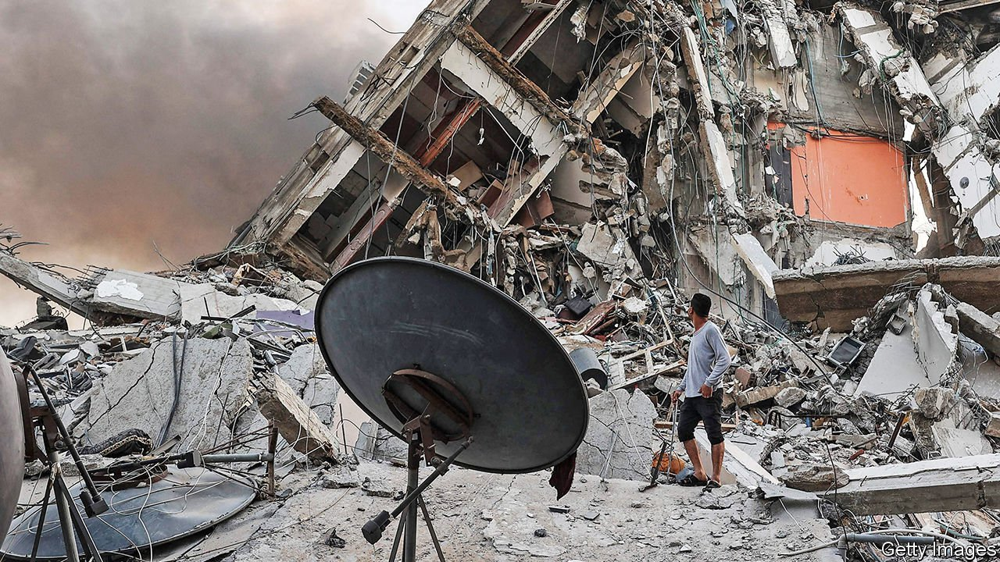

###### 

# Politics this week 

#####  

 

> May 15th 2021 

, the militant group that controls Gaza, were on the brink of war. The crisis began with clashes around the al-Aqsa mosque, Islam’s third-holiest site. Israeli police fired stun-grenades and rubber bullets at rock-throwing Palestinians. Hamas and its allies then fired more than 1,600 rockets at Israel, which responded with hundreds of air strikes on Gaza. Scores of people, mostly Palestinians, were killed. Israel said it had killed Hamas officials. Adding to the turmoil, street fighting broke out in several Israeli cities between Jews and Arabs.

Iran confirmed that it was talking to Saudi Arabia, its arch-rival, in an effort to resolve the many issues that divide them. The secret discussions were mediated by Iraq and started in Baghdad early last month. Meanwhile, an American Coast Guard ship fired warning shots at boats from Iran’s Revolutionary Guard in the Strait of Hormuz when they got too close to American naval vessels, the second incident in two weeks.


Republicans in the House of Representatives ousted  from her senior leadership role. The eldest daughter of Dick Cheney, George W. Bush’s vice-president, Ms Cheney has bona fide conservative credentials; her sin was to reject the lie that last November’s election was stolen. A defiant Ms Cheney urged her party to stand up to Donald Trump, warning that “remaining silent, and ignoring the lie, emboldens the liar.”

An attempt by the National Rifle Association to declare bankruptcy and move its legal headquarters to Texas was thrown out of court. The judge found that the gun lobby was using what is supposed to be a financial course of action to avoid possible charges of corruption in New York, where it is incorporated.

Protests continued in Colombia for a third week. At least 13 people have been recorded as being killed, though the actual number may be higher. Around 60 investigations into police brutality have opened. President Iván Duque attempted to negotiate with protest leaders, with little success. What started as an outcry against an unpopular proposed tax law has broadened into a larger push for reform.

The Scottish National Party’s drive for an independent Scotland faltered after it failed to win an outright majority in elections to . Together with seats held by the pro-independence Greens, there is a majority for a referendum in the Parliament, but polling has swung a bit against holding another vote. A bruising battle to break from the rest of the United Kingdom wouldn’t be easy. Brexit has proved that.

 in a by-election, a constituency it had held since its creation in 1974. A huge swing gave the Conservatives 52% of the vote, nearly twice that of Labour; sitting governments have won by-elections only a handful of times. Labour’s leader, Sir Keir Starmer, came under more pressure when the party lost many seats in council elections. Labour’s candidate in Hartlepool said voters did not know what the party now stood for.

At a summit meeting in Portugal, EU leaders rejected proposals by Joe Biden to waive  patents as a way to increase the supply of the drugs. They argued that it would be more helpful if America were to relax its restrictions on the export of vaccines.

Seven children and two adults were killed in a shooting at a school in the Russian city of Kazan; 23 others, most of them children, were injured. President Vladimir Putin said he would review the country's gun-control laws. The assailant was a former pupil.

A car bomb outside a girls' school in Kabul killed at least 85 people, mostly pupils. The Taliban denied responsibility. The attack, which occurred in a part of the city that is home to the Hazara ethnic minority, has intensified concerns that the American withdrawal from Afghanistan in September will be followed by greater violence against women and minorities. Meanwhile the Taliban seized control of a district near Kabul, the second in a week.

 to engulf the country, spreading into the rural hinterland and spilling over the country’s borders. Daily recorded infections in Nepal have jumped by a factor of 25 in the past month and one in every two tests returns a positive result, twice India’s already high rate, suggesting many cases are going undetected. , testing the capacity of health systems.

Debris from China’s Long March 5B rocket plunged into the Indian Ocean. The Chinese government announced that the “great majority” of the material had burned up before reaching the Earth’s surface. Nevertheless, NASA accused China of failing to “meet responsible standards” because of its failure to plan a “targeted re-entry” of the debris.

China finally released details of its census, which showed that its population reached 1.41bn last year, up by 5.4% from a decade ago. The results contradicted media reports that suggested China’s population had fallen below 1.4bn, which would have marked the first decline in six decades.

Coronavirus briefs


The United States reported its lowest number of new daily cases since June. Just over 22,200 cases were recorded on May 10th, down from a peak of more than 312,000 in early January. Daily deaths fell to 280 on May 9th; in January they peaked at over 4,000.

America’s Food and Drug Administration approved the use of the Pfizer vaccine in children aged 12 to 15.

The World Health Organisation recommended the use of the Sinopharm vaccine, the first vaccine from China ever to be endorsed by the global body. Produced by a state-owned company, it will be added to the COVAX programme providing doses to poor countries.

Hailed for its comparatively low number of infections and deaths, Taiwan tightened restrictionsbecause of a small outbreak of locally transmitted cases. The country’s stockmarket swooned.

