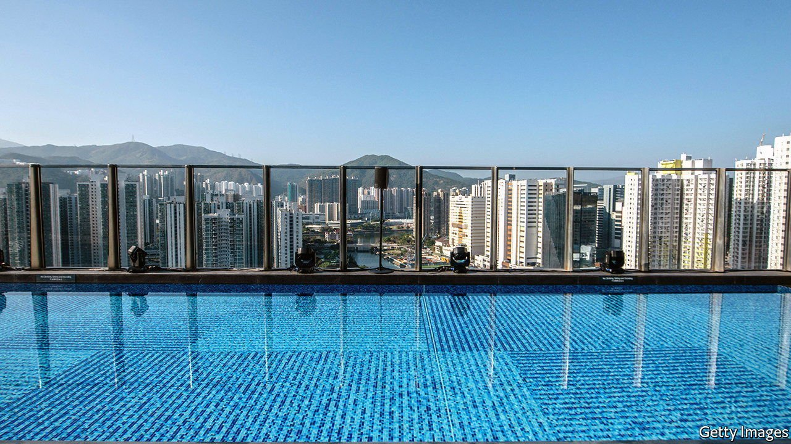

###### Check your privilege

# China’s Communist Party chips away at Hong Kong business houses 

##### The territory’s tycoons are falling out of favour 

 

> May 20th 2021 

TO GET A sense of how Hong Kong’s magnates and China’s Communist Party have coexisted, consider Tung Chee-hwa. When his family shipping concern, Orient Overseas Container Line (OOCL), faced bankruptcy in the mid-1980s, a Chinese state-owned bank swooped in to bail it out. Mr Tung became the territory’s chief executive after Britain handed Hong Kong back to China in 1997, until protests pushed him out of office in 2005. In 2017 he cashed out of OOCL through a $6.3bn sale to Cosco, another state-owned giant.

Closeness to power has characterised the entrepot’s business elites for decades. The relationship hinged on the “high-land-price policy”, an informal agreement to constrict the supply of land and guarantee high returns for bosses and the state alike. Taxes on property and property developers generated 45% of government revenues between 1970 and 1996 for the colonial authorities. Post-colonial ones benefited from it, too. For the tycoons the arrangement helped transform land holdings into sprawling conglomerates that now touch most aspects of life in the city.


The tycoons might have hoped the entente would help them in the pandemic, which has hit their businesses hard. Sun Hung Kai Properties and New World Development, real-estate empires controlled by the Kwok and Cheng families, respectively, saw their profits fall by 25-50% in the last financial year. Hang Lung Properties, another big developer, reported a net loss of $280m. Swire, which controls assets including Cathay Pacific, Hong Kong’s flag-carrier, lost $1.4bn as covid-19 grounded air travel; the airline’s share price hit a 20-year low in August. The shares of Hongkong Land, a subsidiary of Jardine Matheson, another family-held empire that includes Mandarin Oriental hotels, have lost 36% of their value since March 2019.

Ronnie Chan, Hang Lung’s outspoken chairman, summed up the rapport in his group’s latest annual report: “I see no incentive for Beijing to hurt us.” But Beijing’s incentives appear to be changing. The Communist Party is reducing the tycoons’ influence on the election committees which select the territory’s political leaders, where business clans were allotted strong representation after the handover in 1997. It has tightened its grip on Hong Kong, most recently with a national-security law that is stripping the city of many freedoms and putting its status as a global commercial hub in question. Most important, pro-Beijing business interests are drawing up plans to loosen the families’ grip on land supply, which remains the bedrock of their commercial empires.

Since the handover, tycoons have in effect controlled about a quarter of the appointments to the election committee that chooses the territory’s top leader. In a controversial move in March the Chinese government overhauled the system, depriving business elites of a tenth of their votes and barring anyone deemed “unpatriotic” from holding office. The 300 new seats that have been added will mainly go to pro-China business patriots.

Hong Kong’s government insists the reform will make elections fairer. One pro-Beijing businessman says this assertion—absurd on its face since the changes bar pro-democracy candidates—hints at the authorities’ desire to shift the balance of power away from the business lobby.

The security crackdown presents a more direct threat to the tycoons’ commercial interests. When Cathay Pacific did not condemn protesters in 2019, Chinese state media said the airline would “pay a painful price”. Its staff were later reportedly harassed by Chinese authorities and flights were unnecessarily delayed at mainland airports. Pro-Beijing politicians in Hong Kong and mainland mouthpieces have in recent years lambasted Li Ka-shing, the city’s mightiest tycoon, for his ambiguous stance on the protests; some have circulated an image of the 92-year-old’s face pasted onto the body of a cockroach.

Mr Li’s businesses, which span ports, telecoms and much else besides, have escaped chiefly because he has been diversifying his holdings away from Hong Kong and mainland China. Others got Beijing’s message. Swire, Jardine Matheson and many big developers backed the nationalsecurity law last year.

Perhaps the biggest danger has come in the form of an internal paper circulated in March within the Bauhinia Party, a political group formed in 2020 by mainland-Chinese businessmen. This argues that Hong Kong’s high property prices threaten China's security, echoing those who attribute the city’s gaping inequality and recent unrest directly to developers’ control over land. It says the central government in Beijing has the right to co-ordinate the supply of land in the city and could create new housing for 200,000 residents over the next five years.

One way of doing that would be for the government to expropriate farmland held by developers to build public housing. Just three large developers—Sun Hung Kai Properties, New World Development and Henderson Land Development, which is controlled by the Lee family—hold about 17.5% of Hong Kong’s total farmland. That puts them at greatest risk should the government take such steps, says David Blennerhassett of Smartkarma, a research firm.

Expropriations may violate local law. But laws can be changed, as the imposition of new security and electoral rules show. Such an outcome looks “all too believable”, says Mr Blennerhassett. The tycoons thought “they didn’t have to do anything as long as they didn’t question Beijing”, says Joseph Fan of Chinese University of Hong Kong. Now the Communist Party will not even settle for overt expressions of fealty. It appears intent on extracting value, too. ■

A version of this article was published online on May 18th, 2021

