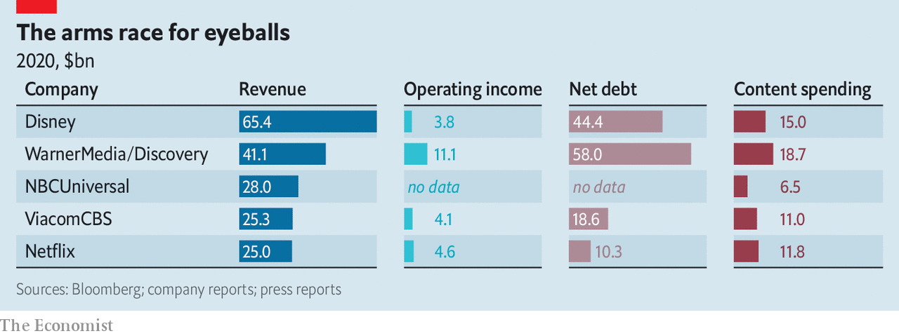

###### Monster merger

# The Warner-Discovery deal and the future of streaming 

##### To survive online, media firms are combining 

 

> May 20th 2021 

ONE OF THE biggest hits of recent years on Discovery’s cable television network is “90 Day Fiancé”, a reality show that follows the fortunes of couples in America on K-1 visas. A condition of the visa is that the pair must marry within three months, or else leave the country. Many of the show’s romances are rocky. But the couples—and riveted viewers—realise that, unless they tie the knot in time, deportation awaits.

On May 17th Discovery announced that it was to form a marriage of necessity of its own, joining forces with WarnerMedia, which is to be spun off from its owner, AT&amp;T, a telecoms giant. Combined, the two companies will form the world’s second-largest media group by revenue, behind only Disney. Their hope is that this scale will allow them to survive an existential battle for viewers that makes “Godzilla vs. Kong” look like cautious cuddling.


The announcement is a Hollywood plot twist for show business. It has already caused speculation about further mergers, as panicked media companies seek their own partners before it is too late. Some may already have missed their moment.

At first sight Warner and Discovery make an odd couple. The first specialises in high-quality TV series and films, such as “Game of Thrones” or the Godzilla-Kong saga, whereas the second serves up cheap factual fare. Yet their different programming, and the sheer quantity of it, ought to help them appeal to a wider audience. The $19bn that the two spent on content last year was more than either Disney or Netflix (see chart). The new firm will also have the biggest share of American cable viewers. Its channels accounted for 29% of viewing time last year, according to MoffettNathanson, a research firm, which expects it to use its heft to negotiate better affiliate fees and ad rates. The merged firm expects to save $3bn a year in costs.

 


For AT&amp;T, the deal represents an admission that its expensive foray into entertainment has flopped. It bought Time Warner in 2016 at an enterprise value of $110bn, later changing its name to WarnerMedia. The previous year it had purchased DirecTV, a satellite-television firm, at an enterprise value of $67bn. The idea was to vertically integrate the businesses of content creation and distribution. But the liaison proved an unhappy one. And while regulators delayed the Time Warner acquisition by two years, Disney and other rivals gained ground.

In February AT&amp;T began to unwind its position, spinning out DirecTV in a deal that valued the division at just $16bn. By hiving off WarnerMedia it will receive the equivalent of $43bn upfront, in a mix of cash, securities and transferred debt. As well as this, AT&amp;T shareholders will own 71% of the new company, with Discovery’s shareholders getting the rest. The deal values WarnerMedia at about $100bn, meaning that under AT&amp;T its value has stagnated even as other media giants grew fast.

The new company is to be run by Discovery’s boss, David Zaslav, leaving no place for Jason Kilar, who was hired a year ago to run WarnerMedia. Mr Kilar, whose background is in technology, had gone all out to push HBO Max, Warner’s streaming service. In December he said that all of this year’s releases from the Warner Bros studio would be available for streaming at the same time that they entered cinemas. Hollywood traditionalists were scandalised; many now feel some satisfaction. “AT&amp;T backstabs its own hatchet man” ran a headline in Variety, an industry magazine.

The shotgun wedding may be awkward, but it is necessary. Competition in streaming, already brutal, is about to become more so. The lockdowns of 2020 provided a captive audience. Total media-consumption time increased by 12% between the second and fourth quarters of last year, according to a nine-country survey by MIDiA Research, a firm of analysts. The average American household subscribed to four streaming services. As the world opens up people will spend less time in front of the box. Consumer spending on video media shrank by 2% year on year in the first quarter, according to GroupM, a giant in the business of placing adverts on behalf of clients. In recent weeks Netflix and Disney, the leading streamers, have both missed forecasts for subscriber growth.

To compete in this environment, says Michael Nathanson of MoffettNathanson, a streaming service needs four things: scale at home, high-quality content, a flexible balance-sheet to pay for it and, to help spread the costs, the ability to expand globally. With a compelling catalogue and a solid presence in America, HBO Max ticks the first two boxes. But AT&amp;T’s sickly balance-sheet has made it hard to keep up with the likes of Netflix in spending on shows. And having chosen to license content to distributors in other countries, such as Sky in Britain, rather than set up shop abroad, its international footprint is puny.

The Discovery deal helps to tackle both of these problems. Warner will no longer be beholden to AT&amp;T’s balance-sheet, although the new firm will start life with hefty debts of its own. And Discovery+ is already up and running in Europe and India. This earns the combined company a place in the top tier of streamers, alongside Netflix, Disney and Amazon, says Mr Nathanson. Amazon is looking to shore up its position, and is reportedly in talks to buy Metro-Goldwyn-Mayer (MGM), the studio behind the James Bond films, for $9bn (see Schumpeter). Last year it spent $11bn on video and music content, 40% more than in 2019. With 175m viewers it is not far behind Netflix’s tally of 208m—though many rarely watch, subscribing instead for shopping discounts and other benefits.

Where does that leave the rest? Some are scrambling to form mergers of their own. On the same day that the Warner-Discovery deal was announced, two big French broadcasters, TF1 and M6, said they would join forces, arguing that together they could provide an “ambitious French response” to competition from international streamers. The deal must first satisfy regulators; the two firms control three-quarters of the French TV-advertising market. Brian Wieser of GroupM expects more consolidation in Europe. He highlights BritBox, owned by Britain’s BBC and ITV, and TVNow, owned by RTL, a European group, as services that will require considerably bigger investments if they are to be truly competitive.

Of the larger American firms, Apple TV+ has yet to take off, despite giving away subscriptions left, right and centre (more than 60% of its 40m or so users are reckoned to be on free trials). It has not registered any big hits so far, but it has oodles of cash with which to buy some if it chooses; Apple executives reportedly looked at MGM before Amazon swooped in.

Strutting their stuff

NBCUniversal, which is owned by Comcast, a cable giant, and last year launched its Peacock streaming service, and ViacomCBS, which recently unveiled its own equivalent, Paramount+, are in a sticky position. Their competing television interests would make it difficult for them to merge. They could buy other media properties that have not already been snapped up, such as AMC Networks, which owns several entertainment channels, or Lionsgate, the studio behind films like “The Hunger Games” and TV shows like “Mad Men”. But none of these assets alone would help a company to leap to global scale. Those that have not already arranged their nuptials may face the corporate equivalent of unceremonious deportation. ■

A version of this article was published online on May 18th, 2021

