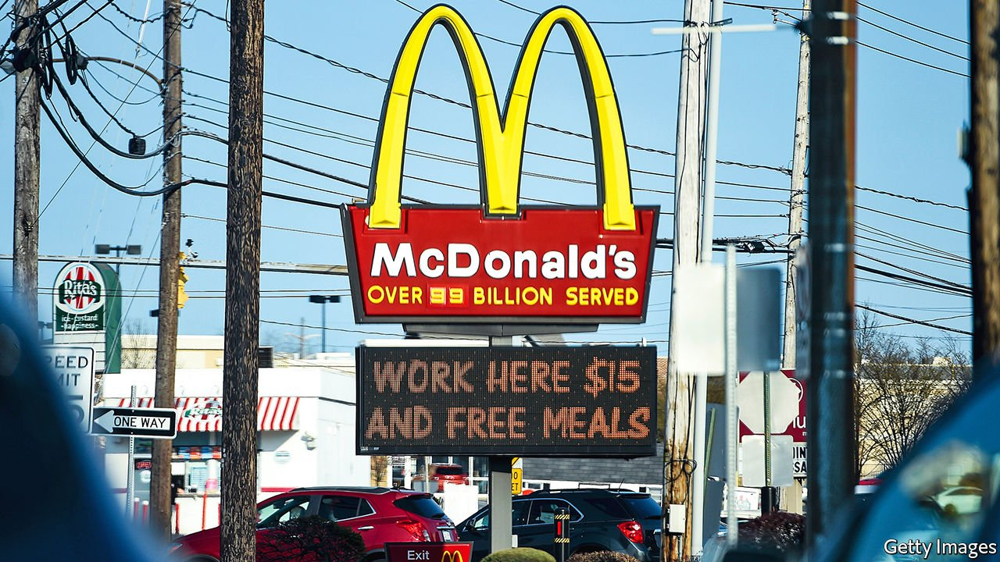

###### Paying a pittance is so passé

# Why McDonald’s is supersizing its wages 

##### It has few other choices 

 

> May 22nd 2021 

F OR YEARS McDonald’s has been a prime target of the battles of labour-rights campaigners over miserly pay. The day before its annual general meeting on May 20th Fight for $15, an advocacy group, organised a strike of McDonald’s workers in 15 cities across America. The strike went ahead despite the firm’s vow a week earlier to raise wages. The company said that its 36,500 in-house employees will get a rise of 10% on average, that entry-level wages for new hires would go from $11 to $17 an hour and that average wages for all staff paid by the hour would reach $15 by 2024. It added that it wants to hire 10,000 people for the 650 restaurants it owns outright over the next three months.

McDonald’s followed Chipotle and Olive Garden, two other restaurant chains that recently announced wage increases while they try to recruit staff as America reopens for business. The fast-food giant has room to reinvest in labour, says Sara Senatore at Bernstein, a broker. It reported growth of same-store sales in America of 14% in the first quarter, year on year, thanks to a boom in online orders. Because people spent twice as much when they buy from home, and 20% more ordering via mobile devices, the company’s operating margin hit 44.5%, the highest in years.


McDonald’s is not raising burger prices just yet to offset the extra costs. The wage hike will only marginally affect its profits, much of which come from franchise fees from the 14,000 restaurants that the firm does not operate. Fight for $15 says workers at all McDonald’s-branded restaurants deserve higher pay. But franchisers do not have much say in the labour practices of franchisees. All they can do is encourage better wages by subsidising employee training and other perks, which frees up money for franchise operators. McDonald’s has not said it would do so.

Restaurants big and small are struggling to attract workers. According to the Brooklyn Chamber of Commerce entry-level line cooks at the New York borough’s eateries who were paid $15 an hour (the minimum wage in the city) before the pandemic are now offered up to $25 an hour. Restaurateurs are stretching to offer health-care benefits even to part-timers. Many promise sign-on bonuses. Brooklyn being the wokest part of woke New York, some go so far as to throw in a commitment to social justice and equity in staffing (by, for instance, promising to hire reformed juvenile offenders).

Most economists expect the labour shortage to ease as potential workers’ worries over infection in the workplace abate and children return to school. Even so, before covid-19 wages were rising and businesses struggled to find workers, says Mark Zandi, chief economist at Moody’s Analytics. As life returns to normal-ish, employers will need to come up with ways to attract staff. Treating interviewees to a free Crispy Chicken-sandwich combo, as McDonald’s is doing in Florida, won’t cut the mustard for long. ■

