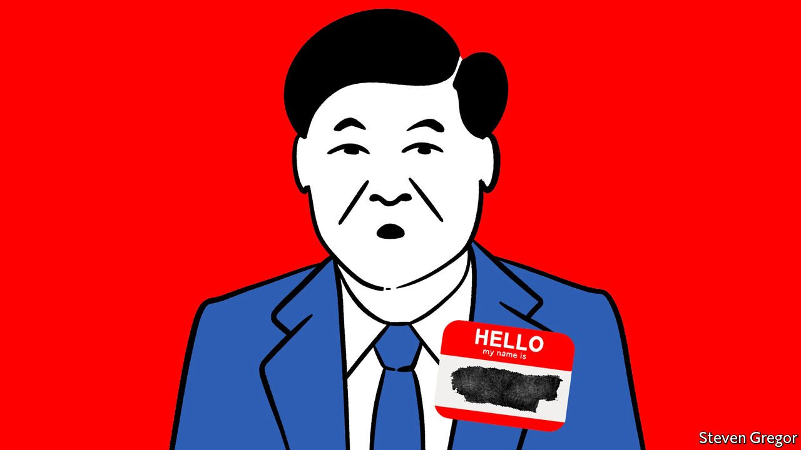

###### Xi who must not be named

# How disgruntled Chinese people talk about you-know-who 

##### Are they quoting ancient poems or complaining about a modern emperor? 

 

> May 22nd 2021 

ON MAY 6TH Wang Xing, a Chinese tech tycoon, posted a classical ninth-century poem on Fanfou, a social-media platform. The poem mocked an ancient Chinese emperor who tried to quell unrest by burning books. “The ashes of burnt books had not yet faded away but the Qin dynasty was already weak,” read the poem. For some reason, cynics suggested that the dynasty Mr Wang had in mind was not an ancient one at all, and the “emperor” he was mocking was Xi Jinping.

Mr Wang swiftly deleted the post, and censors wiped all comments. But the share price of Mr Wang’s firm, Meituan, a popular online platform for shopping and delivery services, promptly collapsed. In four days it declined in value by $26bn, wiping $2.5bn from Mr Wang’s personal fortune. He insisted that he had been referring to competition within the e-commerce industry. His firm is one of several that have come under recent close scrutiny from antitrust regulators.


Open criticism of the most important man in China is taboo. Last year Ren Zhiqiang, a retired property tycoon and vocal critic of the government, published an essay about a speech by Mr Xi in which Mr Ren said he was not an “emperor” showing off his new clothes but a naked “clown”. Shortly afterwards, Mr Ren was sentenced to 18 years in prison for corruption.

Even knocking lesser officials is risky. Jack Ma, the boss of Alibaba, another conglomerate, complained about China’s financial regulators last year. Authorities stopped the initial public offering of Ant Group, a fintech firm founded by Mr Ma, which would have been the largest ever.

Others have been more careful. In April Wen Jiabao, China’s prime minister from 2003 to 2013, published a remembrance of his mother in a Macau newspaper. It included lines calling for a China “filled with fairness and justice” and “respect for human hearts”. Some thought he might be suggesting that fairness and justice were currently lacking. Censors pounced.

Such is the current climate that even those who broadly support the government are sometimes nervous about mentioning Mr Xi’s name. Some employees at a state-run media group have taken to substituting the word “Trump” for Mr Xi in chat groups. At small social gatherings, people frequently stop short of uttering the name, even in the most benign contexts. They use instead phrases such as “you-know-who”, “big number one”, “the eldest brother” or “our big uncle”.

When, at a recent private gathering that included diplomats, executives and bankers, the talk turned to Chinese politics, it was suggested that all switch off their mobile phones. No one thought it likely that government snoops were really listening in and no one had anything particularly controversial to say. But all agreed it was better to be safe.

Electronic eavesdropping is not the only concern. The old-fashioned sort is also encouraged. Last month, the government launched a new system, with a website and hotline, for citizens to snitch on one another for making “harmful” political commentary. This can include “denying the excellent traditional Chinese culture, revolution culture and advanced socialist culture” as well as attacks on political leaders or their policies.

In 2014 the Chinese and Japanese ambassadors to Britain each fancifully declared the other’s country the “Voldemort” of Asia (after the Harry Potter baddy). Back then, an all-powerful leader known as “He-Who-Must-Not-Be-Named” was the stuff of fiction. Nowadays...shush! ■

