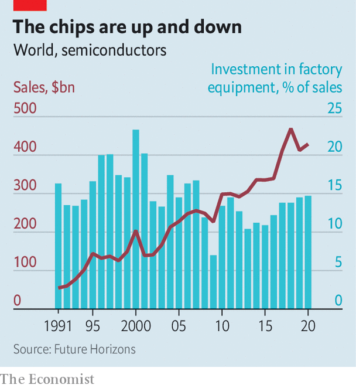

###### Loading, please wait

# The global chip shortage is here for some time 

##### Microchips were a boom-and-bust industry even before covid-19 

 

> May 22nd 2021 

FOR WANT of a chip, the factory was lost. On May 18th Toyota became the latest carmaker forced to cut production amid a global shortage of microchips, announcing it would suspend work at two of its plants in Japan. Firms including Ford, General Motors and Jaguar Land Rover have also had to send workers home.

The pain is not confined to the car industry, for the shortage spans all sorts of chips, from the expensive, high-tech devices that power smartphones and data centres to the simple sensors and microcontrollers that have become a vital commodity, scattered across everything from cars to washing machines, and often costing just a few cents each. In the past few weeks companies including Foxconn, Nintendo and Samsung have warned of hits to production, affecting everything from smartphones and games consoles to televisions and home broadband routers.


Governments are worried. America’s called a summit in April; another is due on May 20th. Germany’s finance minister has written to the government of Taiwan, where many chipmakers are based, lobbying for priority for carmakers. A report from Gavekal Research, a consultancy, published on May 4th, said the shortage might soon hit export performance in several East Asian economies. But there is little that ministers can do. The chip drought is the result of the covid-19 pandemic interacting with an industry that is notoriously prone to cycles of boom and bust. It is likely to persist for months, if not years.

“The most important thing [to recognise]”, says Malcolm Penn, who runs Future Horizons, a chip-industry consultancy, “is that shortages are a natural part of the industry.” Chipmaking, he says, is a good example of what economists call a “pork-cycle” business, named for the regular swings between under- and over-supply first analysed in American pork markets in the 1920s. As with pigs, the supply of chips cannot quickly react to changes in demand. Capacity was tight even before the pandemic, says Mr Penn, pointing out that investment by chipmakers in factory equipment has been below its long-term average for many years (see chart).

 


The pandemic thus arrived at the worst possible time. After an early crash, demand in several segments boomed, says Alan Priestley of Gartner, another consultancy. Locked-down consumers bought laptops and other gadgets. Cloud-computing operators, which are big consumers of high-end chips, scrambled to add servers to deal with the wave of home-workers. The car industry was particularly badly hit by a decision to cut orders early in the pandemic. Demand for cars has since recovered. But the complexities of the production process means it takes three to four months to turn a blank silicon wafer into a usable batch of chips. “I can cancel my orders in an afternoon,” says Mr Penn. “If I want to start them up again, that takes months—and anyway, that capacity is now busy serving other customers.”

The impact of the pandemic, in turn, has been made worse by industry-specific problems. In March a chip plant owned by Renesas, a Japanese firm, caught fire, piling pain on the car industry. Some chipmakers, meanwhile, face shortages of their own. Many cheap, workaday parts are made in older factories designed to process silicon wafers that are 200mm in diameter, or even smaller. (These days 300mm is the standard.) Efforts to boost capacity are stymied by the fact that few toolmakers still make the old-style machines, says Mr Priestley. The market for second-hand 200mm tools, meanwhile, has been stripped bare.

But the pork cycle is turning once again. Taiwan Semiconductor Manufacturing Company, the world’s biggest contract chipmaker, plans to spend $30bn on new capacity this year alone. Samsung Electronics and Intel, two other giants, have pencilled in $28bn and $20bn respectively; second-tier chipmakers are ramping up spending too. That will bring relief to the wider economy, says Mr Priestley, but not immediately. On May 14th Jim Whitehurst, the boss of IBM, a computer-maker, said he thought the shortages might last for two years. And, says Mr Penn, when the drought eventually ends, chipmakers may find they face a familiar problem, but on a bigger scale: a capacity splurge in response to serious shortages today could well mean a sizeable glut tomorrow. ■

