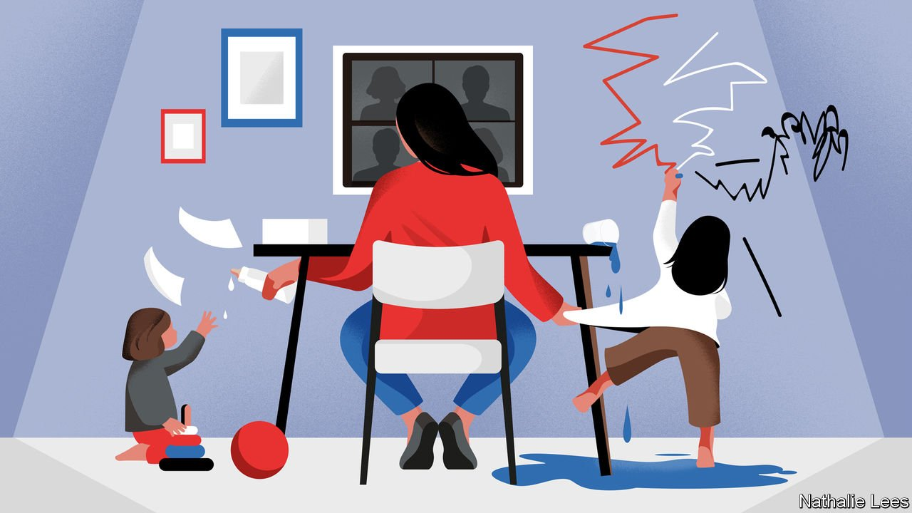
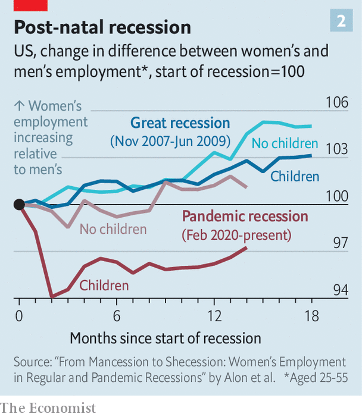
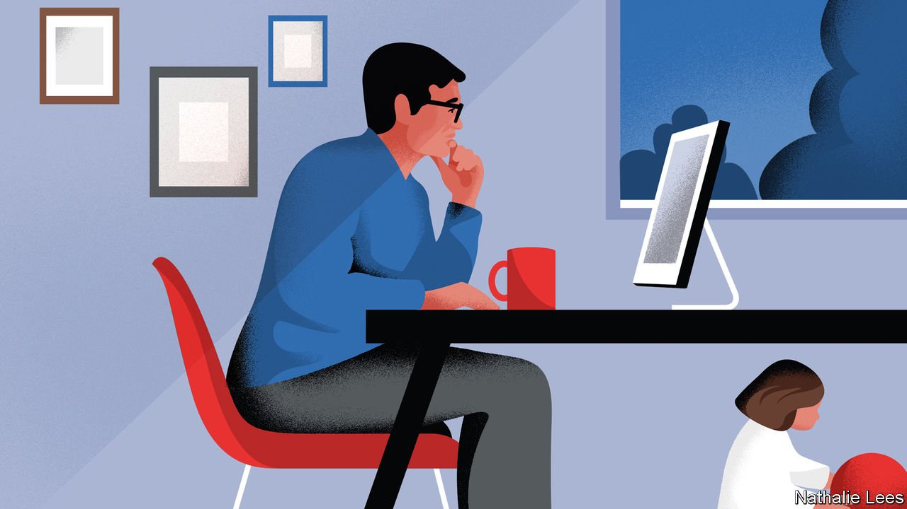

###### Take Your Child to Work (Every) Day

# How the pandemic has upended the lives of working parents 

##### Women have the most to lose 

 

> May 22nd 2021 

“ON SOME DAYS everything gets totally out of hand,” sighs Katharina Boesche, a German self-employed lawyer and mother of three. Fourteen months of closures and semi-closures of her daughters’ schools have taken a toll. She mostly works late at night or between 4am and 8am—when the house is quiet. The girls have coped with online learning, she says, but the seven-year-old needs a lot of supervision. Their school, like most in Germany, is only welcoming them back part-time. Mrs Boesche is stressed and exhausted.

Since the start of the pandemic countries have on average closed schools for 29 weeks, 17 of them full-time, according to UNESCO, the UN’s cultural agency. Most have begun to open their doors once again. But life is far from normal. In Europe and North America only four in ten children live in a country where schools are open full-time and in person. Most students are still struggling with some degree of virtual learning—as are those taking care of them.


The past year will have lasting consequences for some working parents. It will also affect their families, their employers and the economy. Careerwise, mothers of young children are particularly at risk of being left behind, either because they have stopped working outside the home or because the pandemic has forced them to step back professionally. By January 2021 in America 1.5m fewer mothers with children under 13 were in work than a year earlier, an 8% drop. This was far worse than the figure for women in general (5.3%), men (5.1%) or fathers with similar kids (5.6%).


Since then some mothers (and plenty of fathers) have returned, but mothers of small children who do not have a bachelor’s degree remain more likely than any other group to have lost their job. If an “office gap” develops, with dads going back to the office and mums largely staying at home, disparities that have emerged during the pandemic will widen.

Today most children in America and Europe grow up in dual-income homes. Around a fifth live with just one parent. Even before the pandemic such households often struggled to juggle child care with paid work. The daily free child care of school helped a lot.

Covid-19 whipped it away. By April 2020 parents in couples in Britain were each doing on average an additional 3.5 hours of child care and 1.7 hours of home schooling a day, according to the Institute for Fiscal Studies, a think-tank in London. Before the pandemic by 7pm on weeknights seven in ten parents were enjoying some time off; by March 2021 fewer than three in ten were able to relax. In America Latina and black mothers, who are more likely to be single or have a partner working outside the home, were almost twice as likely as white mothers to take on all child care and housework once covid-19 hit, says McKinsey, a consultancy.

The upheaval has affected parents’ mental health. The American Psychological Association (APA) found that parents were significantly more likely than non-parents to be diagnosed with a mental-health disorder during the pandemic. Before covid-19 Britons living with children were at no greater risk of mental-health issues, says Elise Paul of University College London. But during the pandemic they have struggled with higher levels of anxiety, loneliness, stress (including financial) and symptoms of depression.

Taking charge of their children’s education while working was a large part of this. “Am completely, utterly fucked off with ‘home schooling’,” wrote one poster on Mumsnet, a British parenting forum, one evening in February. Her home computer could run Teams but lacked a camera; her iPad had a camera but could not run Teams; she needed her company laptop for work and it could not run the right programmes either. Dozens of similarly exasperated parents responded. At quarter to midnight another mother, sitting up with an anxious 10-year-old, summed up their collective feelings: “I am clutching at my sanity.”

With each announcement of school closures the Mumsnet “swearometer”—which measures the number of obscenities in posts—spiked (see chart 1). In January, at its pandemic peak, over seven in ten Mumsnetters said they were failing both their employers and their children. Nine in ten concluded that working while looking after young kids was impossible.

 


The reopening of schools has provided some relief. By May, when in-person teaching had resumed in Britain, the swearometer had calmed down. But the psychological scars of the past year, the fear that schools might suddenly close, and stresses about job security and child safety, mean that for many the struggle is not over.

A scolding from teachers about her son’s failure to complete his assignments tipped Hayley, a 29-year-old single mother from Lincolnshire in England, “over the edge”. She feels lonely, angry and anxious. She has received no help with her mental health from Britain’s National Health Service despite asking repeatedly. She lost her job as a waitress in August. Her youngest son is only at nursery part-time, which makes looking for a job even harder.

In an American study parents who lost their job and their income during the pandemic said that they were much more stressed and depressed than parents who lost their jobs but still had money coming in (often thanks to government support). They also said that they were more likely to yell at their offspring or lose their tempers. Psychological distress in parents can affect children’s behaviour, says Cathy Creswell, a clinical psychologist at Oxford who saw an increase in such traits as hyperactivity in children in the first lockdown.

Mothers have suffered most. Ben Etheridge and Lisa Spantig of the University of Essex found that in the first months of Britain’s lockdown women’s well-being dropped twice as much as men’s. That some friendships have withered and others have never bloomed could have a lasting impact on new mothers in particular, predicts Margaret Kerr of the University of Wisconsin-Madison.

“I never realised how much interactions at work, like going out for lunch or having adult conversations, fulfilled my social life,” says Alissa, a mother of three from Washington state. Throughout the pandemic she has had several tearful breakdowns and has snapped at her kids—unusual for her. She is most looking forward to “having alone time at work so when I come home I can be a better mom.”

Mothers reported greater deterioration in their mental health but in the APA’s Stress in America survey fathers were more likely to say they boozed more, put on weight and slept poorly. One in two fathers with young children turned to alcohol to cope, more than any other group.

The working wounded

Careers are hurting too. Some parents have had to choose between leaving children unattended or quitting a front-line job. Others volunteered to take part in job-retention schemes, took leave, or were laid off. “The second wave broke caregivers’ backs,’‘ says Matt Krentz of BCG, a consultancy. In America, unlike during past recessions, women—especially those with children—bore the brunt of job losses (see chart 2), in part because of the sectors they work in. The global female workforce shrank by 3.3% in 2020, compared with a 1.7% decline for men, according to the International Labour Organisation.

 


Parents who could work from home tried to multitask their way through, often at the cost of their productivity, sanity or both. Dutch parents reported that about two-thirds of the time they were working at home they were also looking after children. In Britain mothers were twice as likely as fathers to be disrupted, mostly by their children, while working from home. In America those working remotely who also had child-care duties were three times more likely to turn down a big assignment than those who did not. Mothers were more likely than fathers to cut their hours.

Some damage to careers will come as a result of employers unfairly penalising parents, overlooking them for big projects, say. But those with children have also been less able to invest in their careers than those without. The 12 minutes a day that British parents spent studying before the pandemic plummeted to just one minute; for people without kids it fell from 16 to 12 minutes. Failing to learn new skills may mean parents miss out on future promotions and end up with smaller pensions.

Academics with young children have spent less time on their own research during the pandemic. The impact will last for years. Unless universities adjust their promotion policies, those with child-care responsibilities will be less likely to secure tenure. This affects women “a lot more than men”, says Matthias Doepke, an economist at Northwestern University.

Mr Krentz worries about women in middle management. Many have young children. If they fall behind professionally, the already small pool of potential female bosses will shrink. This could reverse some of the “tenuous progress” women have made in the workplace, he fears.

Highly educated women, who tend to be able to work from home, have struggled to juggle their jobs and child care. Mothers who cannot work remotely have been far more likely to drop out altogether. In America the imbalance in job losses between men and women has been almost entirely driven by women who could not work remotely, according to a working paper, co-authored by Professor Doepke and published in April by the National Bureau of Economic Research.

South Korea offers a grim example. Schools there closed for only five weeks last year, but since then 10- to 18-year-olds have spent several days a week learning virtually at home and there have been sporadic local closures. Kim Na-yeon, a mother of two, says the hardest part is the ongoing uncertainty. Nearly two-thirds of Korean parents polled in March said they struggled to find child care. Of those, three-quarters of women and nearly half of men had considered resigning. The army of South Korean housewives, which had in previous years been decreasing, grew by 5% in the year to February 2021.

Even before the pandemic, access to affordable care was a problem for employers, with child-care-related absences and increased staff turnover costing companies billions a year, according to the US Chamber of Commerce Foundation. But covid-19 is making the problem worse. In America more than three-quarters of health-care employers who saw workers leave during the pandemic say that child care was a factor. Half of parents who had not returned to work by November last year cited child care as a reason. “If I were an employer I’d find a way to get people back without it having to be 100 hours a week,” says Emily Oster, an economist at Brown University.

Some are trying. Mercer, a consultancy, says the fourfold increase in child-care-related inquiries it saw during the pandemic shows no sign of slowing down as schools reopen. Many employers tout “flexible working” as a perk. But support for working parents—such as paid leave and help with child care—is still a rare privilege.

Zalando, a German fashion platform, boasts of its new initiatives for parents, including online emergency tutoring for their children. It does not offer such benefits to its warehouse workers. The New York Times found that in America 29% of high-income workers with a postgraduate degree had been offered paid time off during lockdown; just 9% of those without a college degree did. One in five highly educated workers received payments from their employers towards child care or tutoring; only one in 20 less-educated workers did.

Better when we’re together

There have been silver linings. Parents and children have spent more time together, shared more hugs and played together more, according to Equitable Growth, a non-profit organisation in Washington, DC. In Britain working-class parents—who were more likely to lose their jobs or be furloughed—spent slightly more time helping their children with home schooling than middle-class parents. In America mothers who lost their jobs but retained their income reported better relationships with their children. Some families even thrived. “They have become so independent,” beams Catherine, an American mother of five, vowing that she will henceforth give her children more freedom.

It is too soon to tell whether all this will cause a shift in parenting styles. Some experts hope it will reduce the amount of “helicopter” parenting. Sheer exhaustion has lowered expectations and relaxed attitudes to screen time, at least temporarily.

 


Perhaps the biggest question is how the past year will affect the way parents divvy up responsibility. Early in the pandemic men stepped up. When schools first shut British fathers were almost as likely as mothers to be involved in home schooling. But by late January 2021 only half were educating their offspring, compared with two-thirds of mothers. In March 2020 mothers did one-and-a-half times more child care than fathers; by September they were doing twice as much. Couples seem to be reverting to an old-fashioned form of specialisation, with men bringing home the bacon and women frying it—while listening to a Zoom call with a baby on their hip.

From a couple’s perspective, such a division of labour can make sense. Women tend to earn less than their male partners, partly because the men are often older and so likely to earn more. So the loss of their (future) income will cost their families less. The lower-earning partner is also more likely to abandon work when children have to self-isolate.

But what makes sense for couples could widen the gap between the sexes. Some researchers speculate about a “conservative shift”, where societies faced with a big threat—such as a terrorist attack or economic collapse—revert to traditional roles. Anne Boring and Gloria Moroni of Sciences Po and Erasmus University found that in France attitudes towards gender regressed during the country’s first lockdown, particularly among the parents of under-12s, men and poorer households. Men became more likely to say that men make better political leaders. Both men and women with young children became more likely to believe a woman’s job is to look after the family. Such norms are linked with lower levels of female workforce participation. And once women drop out of the workforce they are slower to return than men.

One thing has improved undeniably. For parents whose jobs can be done anywhere with a computer and a Wi-Fi connection, work has become unimaginably more flexible. This has been a boon for millions of mothers. If all workers take advantage of these new freedoms, the pandemic could mark the start of a better chapter for working parents (of the white-collar variety at least). Women are less willing to endure lengthy commutes, so remote working may open a wider range of jobs to them.

Curb your enthusiasm

But employers are less keen to talk about another scenario. What if videoconferencing becomes an excuse not to fix inadequate child and social care? What if remote working turns offices into “man-caves”, as one academic puts it, as mothers feel under pressure to work from home because they can? What if “flexibility” leads to a two-tier workforce with insiders, who can work whenever and wherever needed, and outsiders who can’t? “If women specialise in working from home and men in office work, there is a risk that decades of progress in reducing traditional gender roles are reversed,” says Claudia Hupkau, an economist at CUNEF University in Madrid.

A forthcoming paper by Abi Adams-Prassl of Oxford University finds that among Britons searching for a new job, women are 29% more likely than men to be doing so because they want to work from home more. In America surveys by Nick Bloom and colleagues at Stanford University show that working mothers of young children want to spend the most time working from home after the pandemic. Working fathers want to spend the least, even less than men without kids. “Perhaps they want to avoid the noise?” suggests Professor Bloom (a father of four).

In Washington Alissa’s children are back at school—some of the time. They go four days a week from 8:30am to 11:25am and then come home to study online. She is grateful that her work schedule is flexible. She is trying to stay positive. “It’s slowly getting better but I don’t think it will ever go back to how it used to be.” That may or may not turn out to be a good thing. ■

Dig deeper

All our stories relating to the pandemic and the vaccines can be found on our . You can also listen to , our podcast on the race between injections and infections, and find trackers showing ,  and the virus’s spread across  and .

