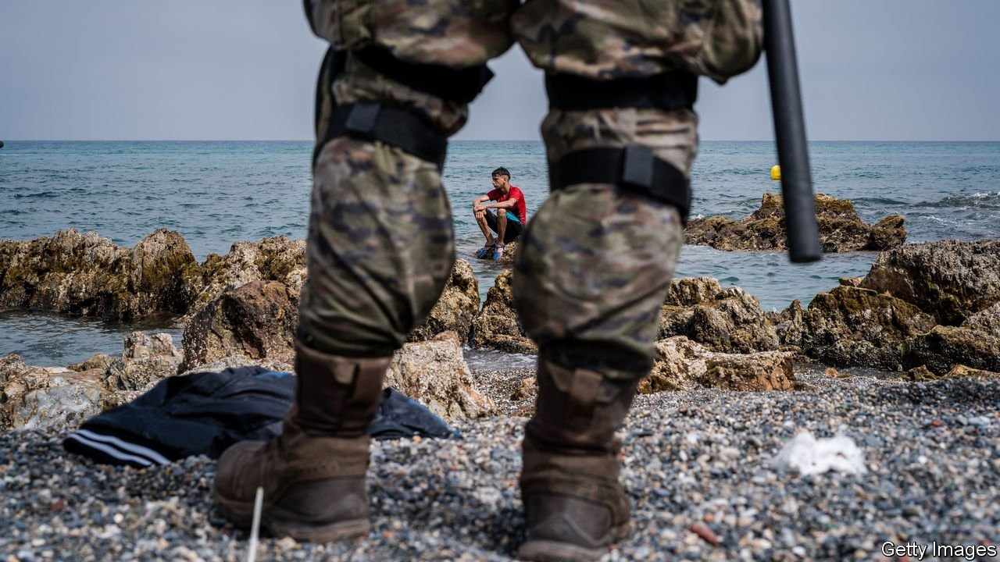
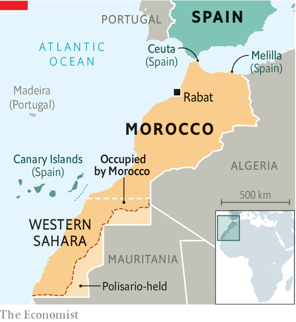

###### Testing the floodgates

# King Muhammad of Morocco weaponises migration 

##### He wants Spain to accept Morocco’s occupation of Western Sahara 

 

> May 22nd 2021 

THEY CAME in their hundreds, swimming around the border fence that protects the Spanish city of Ceuta, or walking across the beach at low tide under the permissive eyes of Moroccan border guards, who would normally stop them. In 36 hours this week, 8,000 would-be migrants descended on Ceuta, an enclave of 85,000 people (see map). For the Spanish authorities, coping with this influx was an immediate humanitarian headache. And Morocco’s weaponisation of migration also puts the government of Pedro Sánchez, Spain’s prime minister, in a longer-term bind.

Clearly rattled and caught by surprise, Spain deployed 3,000 troops with armoured cars from the garrison in Ceuta and sent 200 police reinforcements. Mr Sánchez himself flew to the city, vowing to defend its “territorial integrity”. Spanish officials recall the “Green March” of 1975, when Hassan II, then Morocco’s king, mobilised 350,000 civilians to occupy Western Sahara, to the south, as Spain gave up its colony.


Although Morocco claims Ceuta and Melilla, another Spanish enclave, the aim of this week’s incursion was more limited. The government is furious that Spain recently admitted Brahim Ghali, the leader of Polisario, a group which has fought for Western Sahara’s independence since colonial times, for treatment for covid-19. Spain failed to inform Morocco of an action it says was purely humanitarian. “Actions have consequences,” said Morocco’s ambassador to Madrid this week.

 


Having made its point, Morocco closed the border with Ceuta again on May 18th. Spain has sent back most of the migrants, but under international law it cannot easily deport some 1,500 unaccompanied minors. Spanish officials stress that Morocco is a partner with which they value close ties and co-operation. They have been careful not to stoke further confrontation. But this week is unlikely to mark the end of months of growing tension.

Morocco’s current king, Muhammad VI, felt empowered by the decision in December of Donald Trump, then America’s president, to break the international consensus and recognise Morocco’s sovereignty over Western Sahara in return for its recognition of Israel. Morocco wants Spain to follow suit. That is hard for two reasons. As the former colonial power, Spain feels a responsibility to support United Nations resolutions which require Morocco and Polisario to negotiate. In fact, there is almost no chance of the dispute being settled. Moroccan control is a reality; Polisario holds only 20% of Western Sahara, deep in the desert interior. The second reason is that Spain depends on Algeria, Polisario’s main backer, for a third of its imports of natural gas.

Yet Morocco is a vital partner for Spain, especially in controlling migration and terrorism. “They say we help you on issues that are existential for you and I have an existential issue [Western Sahara] and you don’t help at all,” says José Ignacio Torreblanca of the European Council on Foreign Relations, a think-tank.

Does King Muhammad risk overplaying his hand? His recognition of Israel is unpopular at home. It was surely no coincidence that the Ceuta operation came as . The pandemic has interrupted years of steady economic growth. Many younger Moroccans, better educated than their parents and with relatives in Europe, are itching to leave. His government, whose understanding of Spanish politics is better than the other way round, knows that sending unaccompanied minors to Ceuta is grist for Vox, a far-right nationalist party that would be a hostile neighbour.

The European Union, which is an important source of trade and aid for Morocco, was quick to stand behind Spain this week. After the Syrian crisis, the rest of Europe understands that uncontrolled migration is an “enormous potential factor of political destabilisation, especially when used as a weapon,” says Mr Torreblanca. But that hasn’t stopped Turkey’s ruler, Recep Tayyip Erdogan, from using migrants in that way. At the other end of the Mediterranean, King Muhammad may reckon he can continue to do the same. ■

