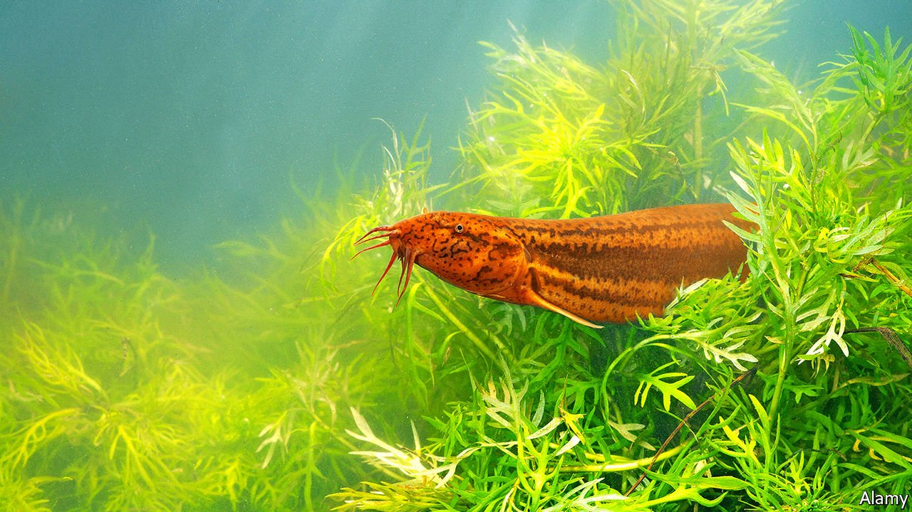

###### Medical ventilation

# Anal oxygen administration may save lives 

##### Inspired by fish, researchers are planning oxygen enemas 

 

> May 20th 2021 

FISH BREATHE through their gills. But some also breathe through their bottoms. Vertebrate guts are abundantly supplied with blood vessels, to enable them to absorb digested food. That means they can, in principle, absorb oxygen, too. And this is precisely what happens in species such as the weather loach (pictured).

As far as is known, no land vertebrate can perform this trick. But, in a paper just published in Med, Takebe Takanori of the Cincinnati Children’s Hospital, in Ohio, describes how terrestrial animals might, with a bit of assistance, be enabled to do so. So far, Dr Takebe and his colleagues have turned mice, rats and pigs into bottom-breathers. If they can extend the trick to people, it could offer an alternative to tracheal intubation as a means of keeping those with breathing difficulties alive.


The notion that intestinal oxygen might be medically beneficial surfaced briefly in the mid-20th century, though experimental evidence swiftly crushed it. But Dr Takebe observed that the experiments in question had failed to consider a crucial fact. Mammalian rectums are lined with layers of mucous which could limit the exchange of gases. To test the intestinal-breathing hypothesis properly, this mucous would need to be removed, to grant oxygen direct access to the intestines’ wall.

To begin with, Dr Takebe and his colleagues tried this with mice. After anaesthetising their subjects, they scraped away the mucous linings using toothpicks. They then fitted the animals with masks, to restrict their air supply, and pumped oxygen into their intestines. Control mice, masked but not so perfused, survived for less than quarter of an hour. Those receiving rectal oxygen lasted 50 minutes.

Buoyed by this result, the team sought a less traumatic means of delivering the gas. They settled on perfluorocarbons. These are liquids that can absorb large amounts of oxygen. They are often used as a blood substitute, or to assist the ventilation of premature babies. The quantity of oxygen they can carry, combined with the extra pressure a liquid applies to the intestinal lining, means scraping away the mucous is no longer necessary.

After administering oxygenated perfluorocarbon enemas to anaesthetised mice with intact rectal linings, the researchers put them in chambers with a restricted oxygen supply, to see what would happen. They found that mice dosed with perfluorocarbons retained high levels of oxygen in their blood for over an hour—more than four times longer than control animals not so treated. What is more, says Dr Takebe, the rodents’ subsequent behaviour did not seem to be affected by the time they had spent in low-oxygen conditions.

Following the success of these experiments, the researchers moved on to rats and pigs, and found that the technique worked with them, too. In light of this Dr Takebe hopes to start trials on healthy human volunteers next year.

Though Dr Takebe began this project before the appearance of covid-19, the pandemic has thrown into sharp relief the need for better means of medical ventilation. And, while rectal ventilation sounds uncomfortable, it might actually be easier on the body than the traumatic process of intubation. Whether perfluorocarbon enemas would deliver enough oxygen, and whether the weakened bodies of patients with respiratory failure could absorb it, remains to be seen. But in the face of a ventilation crisis, as John Hurst, a respiratory specialist at University College, London, puts it, “anything that is innovative is immediately attractive as a solution.” ■

A version of this article was published online on May 14th, 2021

