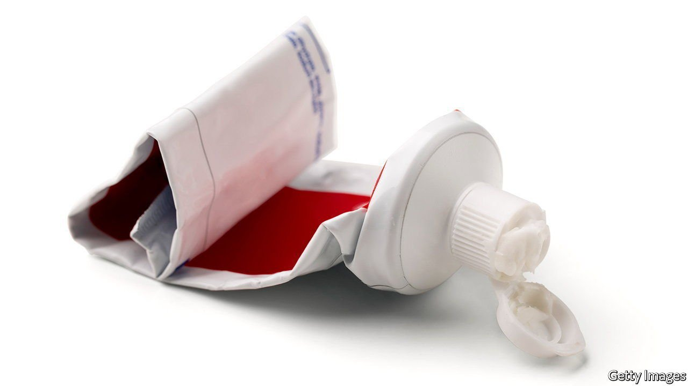

###### Every last drop

# How to get all the toothpaste out of the tube 

##### With a super-slippery surface 

 

> May 20th 2021 

A GNARLED TOOTHPASTE tube, squeezed and twisted out of shape in a vain attempt to extract its remaining contents, haunts many a bathroom. But not, perhaps, for much longer. Colgate-Palmolive, an American consumer-goods giant, has taken up an invention by a pair of experts in super-slippery surfaces to produce toothpaste tubes that promise to deliver every last scrap of their contents.

In 2012 Kripa Varanasi, a professor at the Massachusetts Institute of Technology, and Dave Smith, his PhD student, set up a company called LiquiGlide to commercialise their work on making liquids flow more easily through pipes and out of containers. What caught many people’s imaginations at the time was a demonstration of how this could be used to empty a ketchup bottle without shaking it vigorously.


So far, ketchup-makers have not embraced the idea. But the health and beauty industry, where products tend to be pricier than ketchup, is interested. Mibelle Group, a Swiss producer of health-care and beauty products, employs the technology to lessen the amount of material left stuck to the insides of pipes and vessels in its factories when it is time for a clean-up. LiquiGlide’s deal with Colgate is, though, the firm’s first big break into a consumer business.

The new toothpaste, called Elixir, comes in three varieties: a formula for whitening teeth, one for gum and enamel care and a “detox” version which, it is claimed, removes impurities from the mouth. All are packaged in plastic tubes that can be emptied with ease. Elixir has gone on sale in Europe, though no decision has yet been made about whether it will be sold elsewhere.

To produce their slippery pipes and containers, Dr Varanasi and Dr Smith first impose a microscopically textured pattern on them and then apply a suitably formulated liquid. This fills the gaps in the texture, creating a surface across which gooey substances slide easily. Any risk of contamination can be eliminated by making the liquid in question from materials also employed in the product.

Besides pleasing customers who like to get their money’s worth, the new, slippery toothpaste tubes should help with recycling. Existing tubes are rarely recycled, not only because they have residue left inside them but also because they are usually made from a laminate of plastic and aluminium foil. Mixed materials of this sort are hard to recycle, and therefore end up being dumped in landfill, or incinerated.

Despite their success with toothpaste, Dr Varanasi and Dr Smith have not given up on food producers. Besides ketchup, their slippery surfaces also aid the dispensing of products such as mayonnaise, and may help, too, with things like hummus and soured cream that have a thicker consistency and which usually come in tubs. They have, for instance, carried out a trial putting cream cheese into a squeezy bottle with a slot-shaped dispenser. “You get this perfect strip of cream cheese right on your bagel,” enthuses Dr Smith. ■

A version of this article was published online on May 17th, 2021

