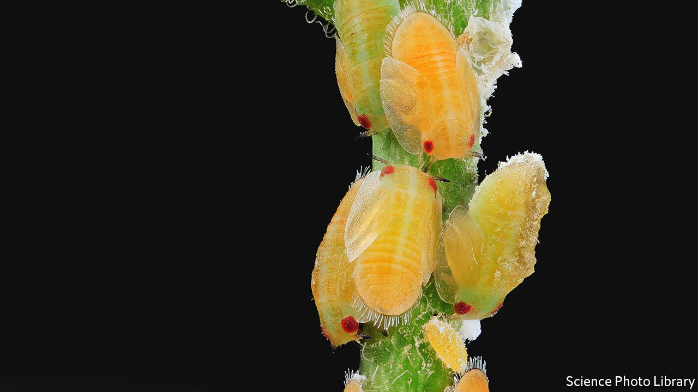

###### Pomology

# How to save the world’s orange groves 

##### A bacterium threatens them. RNA may be their saviour 

 

> May 20th 2021 

CITRUS-GREENING disease is a bacterial infection of citrus-fruit trees, spread by insects called psyllids. It was first recorded a century ago, in China, and it has since spread widely. It can be extremely harmful. Within a decade of its arrival in Florida, for example, it had wreaked $4.6bn-worth of damage and reduced yields by 74%. If its spread continues, says Georgios Vidalakis of the University of California, Riverside, who directs California’s Citrus Clonal Protection Programme, citrus fruits risk becoming niche products.

The problem is less the bacteria than the host plant’s reaction to them. They are injected when the insects feed on sap-carrying phloem tissues—the parts of a plant’s internal plumbing responsible for transporting sugar around. To stop the bacteria spreading, the plant mounts an immune response which thickens the walls of phloem cells with callose, a polymer made of sugar molecules. In the case of citrus-greening disease this response is overenthusiastic, and the phloem tubes get blocked.


Attempts to control the psyllids have proved futile. Nor is any way known to halt or reverse infections. Anne Simon of the University of Maryland, though, thinks she may have an answer. Her approach is based on a discovery made by Dr Vidalakis and his team in 2013. This is that a harmless discolouration sometimes seen in the veins of citrus trees is caused by molecules of so-called independently mobile infectious RNA (iRNA). iRNAs are about the simplest self-reproducing structures imaginable. Though virus-like, they have no proteins of their own. Instead, they encode an enzyme called RNA-dependent RNA polymerase, which then churns out copies of the RNA they are composed of.

They do, however, need to be able to move from cell to cell in order to spread. To that end, they  that let them pass through the passages connecting neighbouring cells. Dr Simon wondered if that mobility might be exploited to carry other molecules around as well. In particular, she has in mind to yoke the iRNA in question to a specially designed string of RNA that would interfere either with the manufacture of the pathogen’s proteins or with proteins involved in manufacturing callose.

To develop this idea commercially, she has started a firm called Silvec Biologics. Should it prove successful, which will probably take a decade to determine, she thinks other trees will benefit too. The iRNAs seem capable of tunnelling between cells in trees of all kinds, so they could one day be used to protect woody plants with similar problems, including grape vines, olives and cacao.

A version of this article was published online on May 19th, 2021

