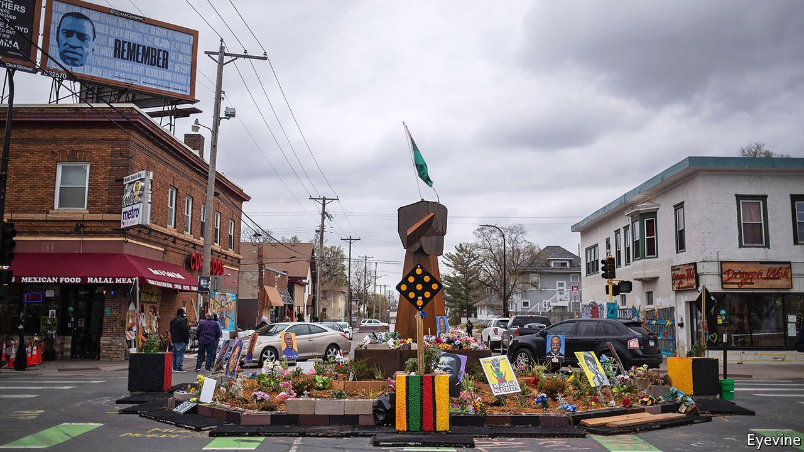
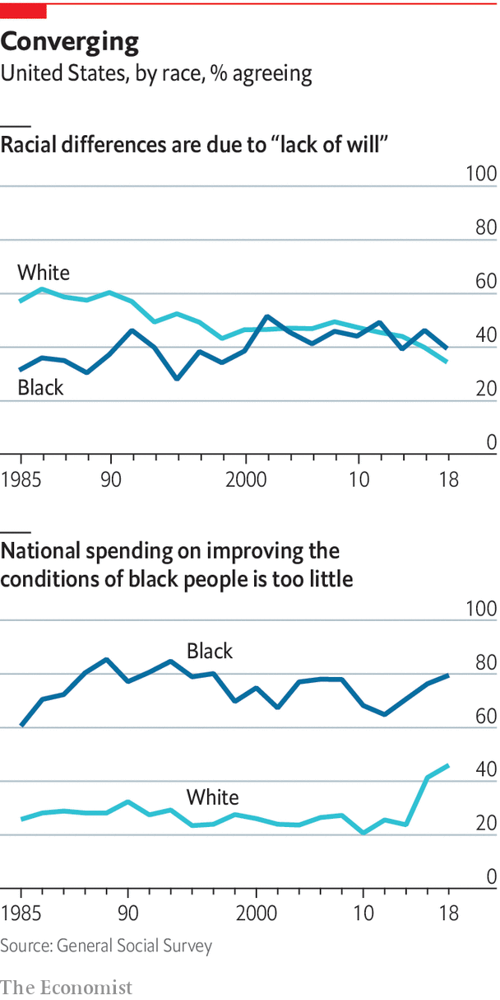

###### Race in America

# America is becoming less racist but more divided by racism 

##### How it confronts ethnic divisions matters to multiracial democracies everywhere 

 

> May 22nd 2021 

: Twelve months on from the killing of George Floyd, The Economist is publishing a  of articles, films, podcasts, data visualisations and guest contributions on the theme of race in America. We begin our coverage with the publication of a special report by our US editor.

WHEN DEREK CHAUVIN knelt on George Floyd’s neck at the corner of 38th and Chicago on a warm, cloudy night in Minneapolis a year ago, there was little unusual about the scene. Not for Mr Floyd, who had been arrested before. Not for Mr Chauvin, who had been disciplined twice for misconduct and had 17 complaints against him. And not for America, where police kill over 1,000 people a year—three-quarters of them, unlike Mr Floyd, armed. Sorted by race, more whites die like this than any other group. But black Americans (13% of the population) are over twice as likely to be killed by the police. In this, as in many other ways, African-American men who are poor are at the bottom of the heap. To find someone else’s knee on their throat is, sadly, unsurprising.

The reaction to this murder was a shock, though. Mr Floyd’s death, which was filmed by a bystander, sparked the biggest civil-rights protests in America’s history. Some 20m Americans took part, flouting covid-19 restrictions. There were 7,750 protests in over 2,440 places, in every state. Beyond America, Black Lives Matter protests were staged in Brazil, France, Japan and New Zealand, among others. Companies around the world have been busily examining whether, through their hiring, buying and selling, they play a part in perpetuating racism. A year on, footballers in England’s Premier League, who play in a country where just 3% of the population is black, still take a knee before games, a gesture that is broadcast to 188 countries. Thus America’s struggle to defeat racism shapes other societies too.


The image of a white-skinned man, wearing a uniform that reads “To Protect With Courage, To Serve With Compassion”, kneeling on the neck of a dark-skinned man evokes the worst of America’s past so strongly that there seems little doubt what killed Mr Floyd. Police violence was part of it, as was poverty. But the real culprit was racism. The jury that on April 21st, after a short deliberation, convicted Mr Chauvin of murder seemed to agree.


For many African-Americans, watching a constant stream of death videos, combined with the country’s still racialised politics, feels like “drowning in the news”, according to Eddie Glaude of Princeton University. “I never really had faith in the United States in the strongest sense of the word,” he writes in “Begin Again”, a book about James Baldwin published after the protests. “I hoped that one day white people here would finally leave behind the belief that they mattered more. But what do you do when this glimmer of hope fades, and you are left with the belief that white people will never change—that the country, no matter what we do, will remain basically the same?”

Drowning in the news makes it easy to miss the profound improvements in racial attitudes in America that have taken place just in the past generation, a change reflected in the scale of outrage about Mr Floyd’s murder (and the rare conviction of a police officer for it). When Bill Clinton became president, a majority of Americans disapproved of interracial marriages. Cynthia Duncan, a sociologist who worked in the Mississippi Delta during the 1990s, observed that “when blacks describe a white who does not seem racist, they say, ‘she treated me like a person’, repeating the phrase to emphasise how rare and remarkable the encounter had been.” And this was 30 years after the passage of the Civil Rights Act and the Voting Rights Act.

Now another 30 years have passed, 90% of Americans approve of mixed-race marriage. Measuring changes in racial attitudes is fraught, because as people become more conscious that prejudices they hold are no longer widely accepted, they may become more reluctant to admit them. Yet changes in behaviour suggest the shift is real, not just what people believe they should say to pollsters. More than 10% of babies born in America are now mixed-race. Research drawing on data from dating apps suggests that one in three couples who meet online are too. This is part of a demographic transformation. Since 2019, white, non-Hispanic children have been in a minority in America.

 


African-Americans, whose opinion on the matter ought to count, think there is less racial discrimination than there was. In 1985 three-quarters of African-Americans thought that the fact that whites had better jobs, better wages and better houses was mainly down to discrimination. By 2012, less than half thought this was the case (a share that rose after Donald Trump was elected). And yet among the general population, racism is rated a more important issue in Gallup’s polling than health care, poverty, crime, the environment or national security.

How can the country have become both less racist and yet more worried that the prevalence of racism is growing? And if racism is indeed declining, why do so many African-Americans still seem to be so stuck?

Racism and awareness of racism are related but distinct. Sometimes they move in opposite directions. In the old South, where people were denied the right to vote for a century after the abolition of slavery because of the colour of their skin, it was a cliché for whites to claim not only that they were not racist but also that they understood African-Americans better than did those progressives in northern cities. Similarly, many whites who may have been unaware of racism when it was far more prevalent are more conscious of it now, as the protests after Mr Floyd’s murder showed.

Guess who’s coming to dinner

Since Barack Obama’s election in 2008, left-leaning white Americans have undergone what Matt Yglesias, a journalist, dubbed a Great Awokening on race. R.T. Rybak, a former mayor of Minneapolis, calls it “reality therapy”. The Trump-powered birther movement, which asserted that the country’s first black president was a foreigner, the well-publicised killings by police of Freddie Gray in Baltimore and Eric Garner in New York, a mass-shooting at a black church in South Carolina: all these made people realise that racism was more widespread than they had thought. And then Mr Trump was elected president.

The share of whites who thought black Americans had worse jobs, lower incomes and crummier houses because of discrimination shot up. The share of whites who thought government should give no special treatment to black Americans shrank by a third in six years. In the year Mr Obama was elected, half of white Americans thought racial differences in incomes and wealth were caused mainly by lack of will. By 2018 that share had fallen by 15 points. Now black respondents are slightly more likely to blame African-Americans for their circumstances than whites are.

Understanding race and racism in American means grasping a set of contradictions. Despair at the slowness of improvement can be a sign of progress. Racial attitudes have changed, but black and white Americans are as segregated as they were in the era of James Brown and John Denver. As a true multiracial democracy, America has existed for less than the span of a lifetime. It is home to the biggest black middle class in the world, but also to a large black underclass that has made little economic progress since the 1960s. Writing about race is normally shorthand for writing about African-Americans, Hispanics or Asians. But as they are becoming more aware, whites are a race too.

In a multiracial democracy, emphasising race can be a recipe for zero-sum competition for public resources. Partly for this reason, the French government largely bans collection of data on race. But ducking the issue can mean that racial inequality persists. In 1967, another time of despair at racist violence, James Baldwin wrote that he wanted black Americans “to do something unprecedented: to create ourselves without finding it necessary to create an enemy.” America’s task now is to make multiracial politics work without setting groups against each other. No other big, rich democracy is as multiracial, but plenty will be one day. So America is once again a testing-ground for a great democratic experiment. For it to work, the first thing to understand is why it was Mr Chauvin’s knee that was on Mr Floyd’s throat, and not the other way around.■

Full contents of this special report

* Race in America: What it means to be an American


Editor’s note: Twelve months on from the killing of George Floyd, The Economist is publishing a series of articles, films, podcasts, data visualisations and guest contributions on the theme of race in America. To see them visit our 

