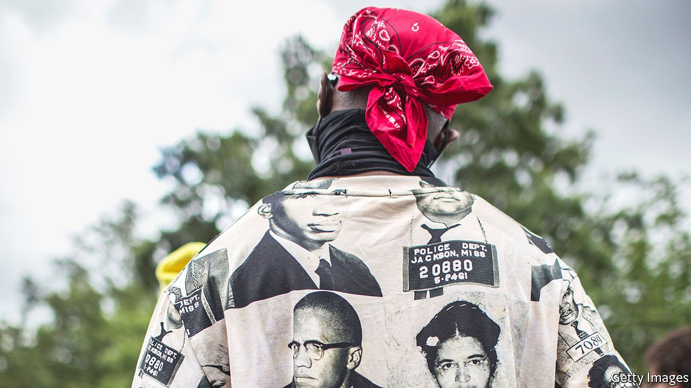
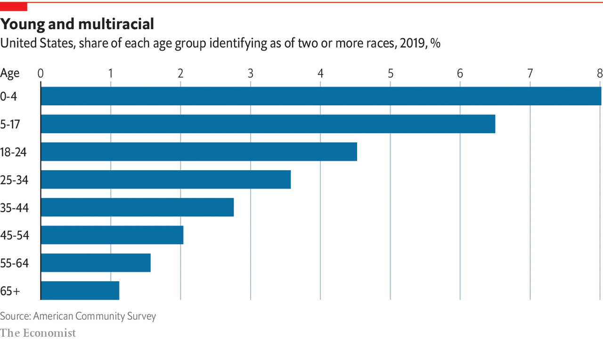

###### Racial categories

# Racial categorisation has grown more complex in America 

##### But for race to become less significant, it may first need to matter more 

 

> May 22nd 2021 

OF THE THREE officers with Derek Chauvin at the corner of 38th and Chicago, one identifies as African-American. In left-leaning media, James Alexander Kueng was described as Black, after a recent move to capitalise skin tone. Depending on the political leanings of the audience, his presence was proof either that the killing of Mr Floyd was not racist, because one of the officers was black, or that racism is so omnipresent that black officers stand by while white colleagues murder their kin. Yet Mr Kueng’s racial self-identification, which was core to this speculation, is a peculiarly American phenomenon. In Brazil, home to more descendants of African slaves than America, he might call himself white.

Racial categorisation still bears marks of how white Americans thought in the 18th and 19th centuries. The first census in 1790 had three categories: free whites, other free persons and slaves. The 1890 census was obsessed with measuring the African blood in each American: octoroons (one-eighth black) had one box, quadroons (one-quarter black) another. In 1990 respondents were allowed to identify their own racial group (before 1960 census enumerators knocked on doors and decided for themselves the race of the person who responded). But they could choose only one.


This was hard for multiracial Americans, and a headache for the Census Bureau. In the 1960 census people unsure of their race were told to pick the same one as their father (there was no guidance for what to do if that was uncertain). A decade later the bureau decided that, in ambiguous cases, the mother’s race was more reliable. It was not until 2000 that Americans were given the option of choosing more than one race. When filling out the 2020 form they had a choice of white, black/African-American, American Indian/Alaska Native, Asian, Native Hawaiian/Pacific Islander and Some Other Race—or any combination of these.

Asked to fill out the form, a geneticist might tick all the boxes. The classification of races by Europeans began in earnest in the 18th century, and came with generalisations about each race’s characteristics from some of Europe’s most brilliant minds. “In the hot countries the human being matures earlier in all ways but does not reach the perfection of the temperate zones,” wrote Immanuel Kant. The author of the “Critique of Pure Reason” went on to explain why weather meant Indians had less talent. These categorisations, if not the prejudice that goes with them, are still reflected in census categories that divide Asians, Europeans, Native Americans and so on. But the notion that race and ethnicity can be separated goes against how most geneticists think about race.

The genes controlling physical traits that correspond, more or less, with contemporary racial categories (such as eyelid shape, skin tone and nose shape) do not correspond with much else. Attempts to link particular races to desirable characteristics, such as intelligence or athleticism, are becoming rarer. In 2019 James Watson, co-discoverer of the double-helix structure of DNA, had his name removed from his laboratory in Cold Spring Harbour, Long Island, after scientists became exasperated with his repetitions of stereotypes about African-Americans, Jews and so on. The laboratory acknowledged his contribution to research, but condemned his “misuse of science to justify prejudice”.


Such views return in guises like the “human biodiversity” movement, which exists mostly on Reddit, an online messageboard. Reddit is home to a fringe genre in which white supremacists take DNA tests and either discover they are not, in fact, pure bloods, or boast of the percentage of European in them. Richard Spencer, an organiser of the rally at Charlottesville for neo-Nazis, turns out to have Mongolian and north African ancestors from the 19th century. Mankind’s family tree makes this inevitable. “Every white supremacist has Middle Eastern ancestors,” writes Adam Rutherford, a geneticist and author. “Every racist has African, Indian, Chinese, Native American, aboriginal Australian ancestors, as well as everyone else, and not just in the sense that humankind is an African species in deep prehistory, but at a minimum from classical times, and probably much more recently.”

Multiple choice

While geneticists have been breaking down racial categories, more Americans are choosing more than one box in the census. In the first one where multiple options were allowed, 6.8m declared they were multiracial. In the second, the number had risen to 9m. When the 2020 results come in it will surely increase again. Given the effort many white Americans have put into drawing a clear colour line, this ought to be something for anti-racists to celebrate.

Keeping categories separate is one thing Southern segregationists and the Nation of Islam agree on. Even well-meaning activists pursuing racial equality stray towards it. Ibram X. Kendi, a populariser of “Critical Race Theory”, a way of thinking about race in American academia that borrows from French post-modernists and American legal scholars, frets that merging black culture and society into a dominant whiteness will rob black Americans of the identity they need to fight racism. According to this view, integration, the aim of so many civil-rights activists, is suspicious. Mr Kendi accuses “integrationists” of “lynching black cultures”.

For race to become less significant, which would be what most geneticists think and earlier civil-rights activists desired, it may need first to matter more. James Baldwin, who saw black identity politics as a means to the end of race mattering less, grasped this paradox early. “We find ourselves bound, first without, then within, by the nature of categorisations,” he wrote. This is at the core of the disagreement between Mr Kendi and his generation and an older generation of intellectuals, like Glenn Loury of Brown University. Both agree that race is not real as a biological category. But one side favours what Mr Loury calls “transracial humanism”, while the other worries that attempts to make race less defining may be just another form of white supremacy.

 


Such debates may seem distant from practical questions such as how to organise hiring at large firms or allocate capital. But the distance can be short. In 1989 Kimberlé Crenshaw published a paper on the disadvantages faced by black women working at General Motors in the 1960s and 1970s, who were subject to both sexist and racist discrimination. Thinking about disadvantage or oppression in “intersectional” terms has since become commonplace. Earlier this year Goldman Sachs announced plans to invest $10bn in 1m black women. The idea of micro-aggressions, or daily slights against non-whites revealing underlying prejudice, has moved from academia to mainstream in under a decade.

Such ways of thinking about racism can be helpful. Ms Crenshaw’s paper urged people to be more subtle. Mr Kendi’s Critical Race Theory began as an attempt to persuade legal scholars to think about how American society really works, rather than assuming discrimination had ended when laws were passed in the 1960s. But they can also lead to absurdities like the LGBT People of Colour Micro-aggressions Scale. Not every black woman is oppressed, just as not every white male is privileged. Such a mechanical approach gives the false impression that the key to fixing racism is to seek out the most oppressed perspective possible. To the alarm of some and the delight of others, this view is now close to orthodoxy for many students.

It also shifts attention from poverty towards identity. Some black women may face double oppression, but they still graduate from college and earn higher incomes more than black men. African-American college professors often face maddening slights, reminding them of the country’s racist past. In her book about caste in America, India and Nazi Germany, Isabel Wilkerson writes of feeling uncomfortable while flying on airlines, for example. But these incidents are trivial compared with the macro-aggression of a policeman kneeling on the neck of an unarmed suspect until he dies. What can be done about that?■

Full contents of this special report


* Racial categories: The all-American skin game


