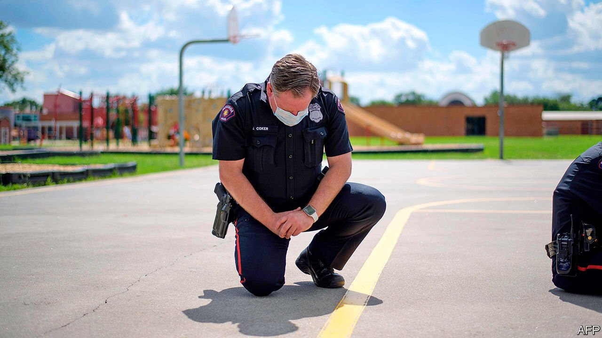
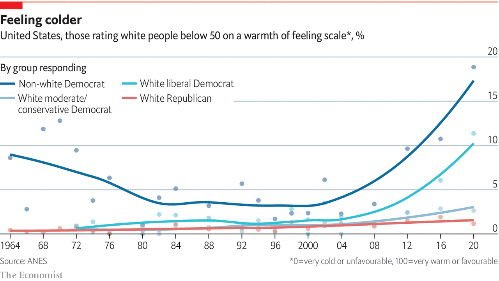

###### White Americans

# White Americans are beginning to realise that they too belong to a race 

##### Anxiety about their country’s demography is fuelling the politics of racial backlash 

 

> May 22nd 2021 

DEREK CHAUVIN was born three years after George Floyd, and grew up in Cottage Grove, a suburb of the Twin Cities 20 miles from the corner where one man killed the other. Cottage Grove is a place of detached bungalows, private yards and public driveways connected by shared lawns. Several houses have large pick-up trucks parked in front. Some fly outsized American flags from their flagpoles. This is not a rich place, but it is several rungs above Cuney Homes, the complex of apartments in Houston’s third ward where Mr Floyd was raised. A boy born in Cottage Grove 30 years ago could expect to grow up in a household with an annual income of $55,000 (the median for America is $68,000). At the latest census, 85% of the inhabitants were white.

The story of race in America is usually about African-Americans and, more recently, Hispanics and Asians. But it is also about whites. Mr Chauvin’s parents divorced when he was young. He did not graduate from high school and worked at a McDonald’s for a while. He got his life on track via a traditional route of social mobility for working-class white youths: military service and the police force. In 2010 he married Kellie Xiong, a Hmong refugee, who had recently escaped an abusive marriage. A year and a half before the killing, she was crowned Mrs Minnesota in a beauty pageant. Stop his story in 2019 and Mr Chauvin, who had a medal of valour, a degree in law enforcement from a state university and a condo in Florida, seemed to have pulled himself up by his bootstraps.


Like most of the other 800 officers in Minneapolis’s police department, Mr Chauvin commuted to work every day from the suburbs. Before 2000 city police officers were obliged to live in Minneapolis. Now, as elsewhere, over 90% of them live outside it. Mike Elliott, mayor of Brooklyn Center, Minnesota, where Daunte Wright was killed by a white officer in April, said that none of his police officers lived in the city. This can give the police the appearance of an occupying force, moving in from largely white, well-off suburbs to enforce order in poor, non-white neighbourhoods, and then leaving. It also means that America’s great political divide between diverse cities and inner suburbs, which vote Democratic, and whiter exurbs and rural areas, which vote Republican, is mirrored in relations between the police and the policed.

Tribal concerns

In Minneapolis the police chief is appointed by the mayor, invariably a Democrat. But the chief’s ability to change the force is limited by the Police Officers Federation. The police union has support from Republicans in the state legislature, who represent rural, white districts and outer suburbs. At the time of Mr Floyd’s death, the head of Minneapolis’s police union, Bob Kroll, lived in Hugo, just outside Minneapolis. Hugo sits in Washington County, which like Cottage Grove is 85% white. Mr Kroll grew up in a blue-collar, union family in the city centre but moved out, one more case of white flight. He is an enthusiastic Trump supporter, even appearing on stage at one of the former president’s rallies in 2019. “Good evening patriots,” he began, before admonishing the Obama administration for “the handcuffing and oppression of the police” and praising Mr Trump for “letting cops do their jobs”.

When it comes to their own race, white Americans divide into two tribes. As left-leaning whites become more conscious of racism, they also think more about what it means to be white. Six months after Mr Floyd’s death, 30% of whites told a poll run by Ipsos that they had “personally taken actions to understand racial issues in America”. A new university field, Critical Whiteness Studies, has sprung up to examine white guilt, white shame and white “power evasion” (the denial that they are responsible for maintaining white supremacy). Yet this way of talking has limited traction beyond left-leaning redoubts. More widespread is a feeling of some responsibility for the plight of African-Americans. Between 2014 and 2019, the share of whites who thought the government should spend more money on improving the conditions of African-Americans increased from 24% to 46%.

The second white tribe is different. Over the past decade, according to calculations by Bill Frey of the Brookings Institution, a think-tank, the number of Americans who describe themselves as Latino or Hispanic, Asian, African- or Native American (plus those who identify as from two or more races) has risen by 53%. Over the same period America’s white population grew by less than 1%.

 


When he was running for the Senate in Texas in the mid-1960s, George H.W. Bush opposed the 1964 Civil Rights Act because it “was passed to protect 14% of the people”. He said “I’m also worried about the other 86%.” Ronald Reagan took the same line when running for governor of California. Richard Nixon, while pushing policies that benefited African-Americans, said that minorities were “undercutting American greatness”, a familiar refrain. An unease over demographic transformation now plays a similar role in politics to the backlash against civil rights 50 years ago.

By 2005 the Republican Party had disowned its “southern strategy” of prising white Southerners away from the Democrats. “Some Republicans gave up on winning the African-American vote, looking the other way or trying to benefit politically from racial polarisation,” the party chairman told the NAACP pressure-group. “I am here today as the Republican chairman to tell you we were wrong.” Three years later America elected its first black president. Michael Tesler of the University of California, Irvine, notes that Barack Obama’s victory set off a fresh exodus of whites away from the Democrats. “It took the election of the first black president for some white Americans to work out that the Democratic Party is the party of non-whites,” he says. By 2020 the Republican Party’s lead among white men without a college degree was huge: they backed Mr Trump by a margin of 40 points.

These voting patterns did not reflect only fondness for tax cuts or a dislike of immigration, the most recognisable bits of Mr Trump’s pitch. They also reflected a view of race. According to Ashley Jardina of Duke University, 30-40% of whites say their racial identity is “very important”. This is far lower than the share of black or Hispanic Americans saying the same. But this group of race-conscious whites, who also say they have “a lot” or “a great deal” in common with other whites, numbers about 75m people of voting age. That makes them more numerous than any minority.

White racial solidarity has a murderous past. Recently it has been associated with tiki torches, neo-Nazis and the Unite the Right rally in Charlottesville, Virginia, in 2017. Yet only a tiny fraction of white Americans share such extreme views. The sense of solidarity among whites described by Ms Jardina is broader. In her book “White Identity Politics”, she says that “white identity” is not a polite way of saying “dislike toward other racial or ethnic minorities”. White racial consciousness comes out instead in such beliefs as the evil of reverse discrimination—whites being discriminated against because of the colour of their skin. Such views are not racist in the classic sense of white superiority. Those who hold them reject anti-black stereotypes. But they are likely to discount the effects of past racism, and to believe that African-Americans would catch up with whites if only they worked harder. Like Mr Kroll, the police-union boss, who complained that Democrats accuse those who disagree with them of being racist, or Mr Trump, who claimed to be “the least racist person anywhere in the world”, many are acutely sensitive to accusations of racism.

As America becomes more multiracial, and whites lose the status of dominant group, their sense of racial solidarity may grow and the taboo against white pride may fade. A recent attempt to launch an Anglo-Saxon caucus by Republican House members could be a portent. Already many rural and suburban whites, who in Minnesota might have defined themselves as Swedes or Germans as well as Americans, define themselves as white. They, not Minnesota’s African-Americans, now live in the most racially segregated places of all.

This second white tribe thinks more like a minority than part of the country’s biggest single group. Geographic separation can lead to a reflexive bias that is different from racism in the 1950s but still lethal. Perhaps Mr Chauvin carried such instincts as he left his white suburb for work in Minneapolis. Perhaps he believed that, as the husband of an Asian woman, who also had many non-white colleagues, he treated everyone the same. After all, wasn’t that what diversity training programmes at work asked of him?■

Full contents of this special report


* White Americans: The souls of white folk


