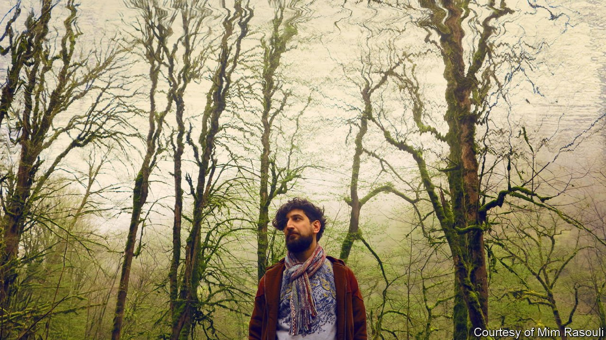

###### Persian music

# Niche services are connecting Iranian artists and listeners 

##### They flip the business model of streaming on its head 

 

> May 29th 2021 

THE WORK of Mim Rasouli, a musician based near Tehran, is rich in Persian and Western influences. In “Fastalgia”, one of his best-known tunes, Mr Rasouli mashes up songs by Seyyed Javad Zabihi, a muezzin from the time of the shah; Mohammad Reza Shajarian, one of Iran’s greatest cultural treasures; Archive, an alt-rock band based in London; and Arms and Sleepers, a trip-hop group from Boston. The result is a dreamy, nostalgic track meant to evoke a time when the Ramadan fast began with Zabihi’s call to prayer and the iftar, or fast-breaking evening meal, was accompanied by Shajarian’s thundering voice.

Zabihi was murdered two years after the revolution of 1979; before he died last year Shajarian boycotted state radio to show support for pro-democracy protesters. Listeners can still stream their music on Spotify and similar services. But “Fastalgia” itself is not available. Nor is anything else by Mr Rasouli, or indeed any Iranian musicians living and working in Iran.


The reason is simple. Sanctions prevent Western companies from engaging in commercial relationships with Iranian entities or individuals. Mr Rasouli (pictured) says he would love to be on Spotify (itself not formally available in Iran), but instead puts his music online for nothing. His songs can be found on his personal website, YouTube, SoundCloud, Telegram and Navahang, a Persian-music streaming service. “I didn’t choose them,” Mr Rasouli says of this last outlet. Rather, after Navahang began posting his music of its own accord, he sent it more. He receives no payment in exchange.

Based in Finland, Navahang was set up in 2015 by Siavash Danesh, a refugee, with an app built in India. With roughly 2m users, it is a small outfit that focuses on the Iranian underground scene and female artists. The service is free; registration is not required. It carries advertising, but its size, and the fact that many listeners are in unprofitable Iran, mean revenues are modest.

To survive, Navahang flips the traditional business model of streaming. “Unlike other services like Spotify where you are getting subscriptions and paying artists,” says Mr Danesh, “we get money from the artists themselves.” Since Iran is not a signatory to assorted copyright treaties, platforms like Navahang can use some Iranian work without paying. Many musicians, including Mr Rasouli, are delighted with the exposure. Those in the diaspora who want Navahang to promote them, for example on the homepage, pay for the privilege. Navahang also produces music for some Persian artists based outside Iran. Mr Danesh reckons 90% of its income comes from these two sources.

Navahang is a relatively new entrant on the Persian-music streaming scene. The biggest and best-known service is Radio Javan, set up in Washington, DC in 2004. Its app has been downloaded more than 5m times on Google’s Play Store, many more than Navahang’s. Running a service aimed at Iranians is expensive, confirms Hamed Hashemi, Radio Javan’s founder. Not only are most users in Iran, but the lack of copyright protection cuts both ways. His company has a production arm, too, but it is hard to pursue claims when its music is bootlegged in Iran. Radio Javan alighted on the same strategy as Navahang. “We are a promotional company,” says Mr Hashemi. “We promote music.”

Think of it as targeted advertising. Persian musicians want to reach Persian-speaking listeners to secure record deals and gig bookings, in Tehran or elsewhere. The likelihood of being discovered or making much money on a mainstream service—Spotify carries over 1m artists and pays a fraction of a cent per stream—is low. For musicians in Iran, it is impossible. Paying for promotion on Navahang or Radio Javan is a way to reach the right audience.

But the benefits go wider. Iranian artists have long engaged with overseas music, as Mr Rasouli’s shows. Free Persian streaming services let the curious in the rest of the world discover culture originating in Iran. “As an artist, I like my work being seen and heard,” says Mr Rasouli. The rewards, he adds, are spiritual rather than material. ■

