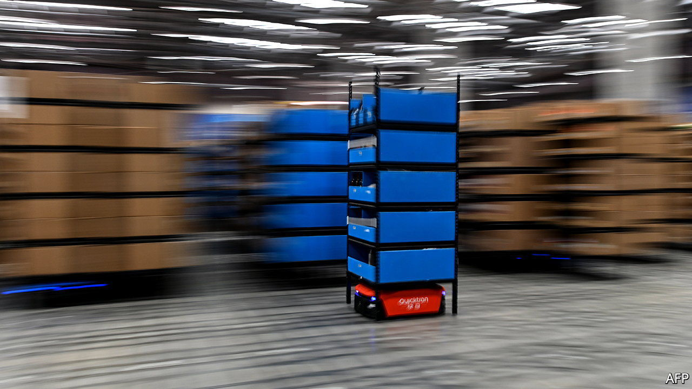

###### Formula races

# Alibaba v Tencent: the battle for China’s e-commerce deliveries 

##### When it comes to logistics, Chinese tech giants take divergent routes 

 

> May 26th 2021 

IN 2019 RICHARD LIU told couriers working for JD.com that the Chinese e-commerce giant he founded would cancel their base pay after a 2.8bn yuan ($438m) loss the previous year, its 12th consecutive one in the red. Riders would make only a commission on deliveries. If the company did not cut back on spending, Mr Liu warned, it would go bust in two years.

Far from collapsing, two years on JD Logistics, JD.com’s delivery division, is on a roll, fuelled by a boom in Chinese e-commerce (see chart). Its parent company’s revenues jumped by 39%, year on year, in the first quarter, to 203bn yuan. On May 26th Pinduoduo, an upstart rival that also offers customers delivery by JD Logistics couriers, reported quarterly sales of 22bn yuan, 239% higher than a year ago.

 


The State Post Bureau expects logistics companies to deliver more than 100bn parcels this year, twice as many as in 2018. Overall spending on logistics in China is projected to hit 16trn yuan in 2021 and surpass 19trn yuan by 2025. That would make it the world’s largest market. The logistics business has also avoided the worst of the , which has seen firms such as Alibaba and Tencent (which owns a large stake in JD.com) taken to task by the Communist authorities over their growing power.


Domestic and foreign investors have been pouring money into the industry, say lawyers working on deals involving such businesses. JD Logistics has attracted investments from big private-equity groups such as Sequoia China and Hillhouse Capital. The market buzz around the firm is as frenetic as the pace at which its 190,000 workers fulfil and ferry orders. On May 21st it raised $3.2bn in Hong Kong’s second-largest initial public offering this year. Its shares are scheduled to begin trading on May 28th. The company’s backers are betting that its Amazon-like approach of creating a fully integrated delivery network has more mileage than a similar offering from SF Express, a stodgier incumbent similar to FedEx, or a rival model championed by Alibaba, which has plumped for a more distributed system.

JD Logistics is the only large Chinese delivery service to grow out of an e-commerce parent. It became a separate entity from JD.com in 2017, in part so that it could take orders from other online retailers. It still delivers the bulk of JD.com’s packages but a large chunk of its revenues now comes from orders outside the group. By owning much of its technology, lorries and warehouses, and directly employing staff, the firm has been able to ensure faster delivery times while monitoring quality. It operates China’s largest integrated logistics system, covering a good’s entire journey and including a fully autonomous fulfilment centre in Shanghai and driverless vehicles. The system can also flip into reverse, sending customer feedback to product designers that, JD Logistics claims, helps it produce better products and bolster brands.

Contrast that with Cainiao, in which Alibaba has a controlling stake. It does not own many of the logistics assets in its network. Instead it allows around 3,000 logistics companies employing some 3m couriers to plug into its platform. Its aim is to integrate and streamline the vast delivery resources that already exist across China, rather than build its own. The company has teamed up with most large logistics services—and taken investments from them as well. Alibaba, for its part, has bought minority stakes in several large operators as a means of exerting more influence over the industry. Cainiao is not publicly listed and does not disclose many operational details or, for that matter, how exactly it makes money.

In terms of revenues, both JD Logistics and Cainiao trail SF Express. Similarly to JD Logistics, that firm operates its own network. It still leads the market in “time-definite” delivery, a service that requires couriers to pick up and drop off parcels on a rapid, predetermined timetable. Like FedEx in America but unlike JD and Cainiao, it did not emerge from the tech industry, so lacks its rivals’ technological chops.

Which model emerges victorious will ultimately depend on which best controls costs, thinks Eric Lin of UBS, a bank. JD Logistics may have to lower prices further as it tries to get more business beyond JD.com. Analysts predict it could lose a combined 12bn yuan over the next three years, and turn a profit only in 2024. SF Express is spending heavily to try to match JD’s and Cainiao’s tech prowess. Its share price has fallen by around half since it issued a profit warning in April; it is expected to record a net loss of at least 900m yuan in the first quarter. Jefferies, an investment bank, points to SF Express’s troubles as a clear sign of an ongoing price war.

In the long run Cainiao’s asset-light model may enable it to keep spending in check. But for the time being it, too, is thought to be having trouble containing costs. Like its rivals it must fend off new specialist competitors offering cut-price services in areas like cold-chain and last-mile delivery. Average delivery prices in America have increased by about 5% annually in recent years, according to Bernstein, a broker. In China they have been falling at an average rate of 10% for the past decade. As China’s online shoppers get their goods ever more quickly, investors may need to brace for longer waiting times before their logistics returns finally arrive. ■

A version of this article was published online on May 26th, 2021

