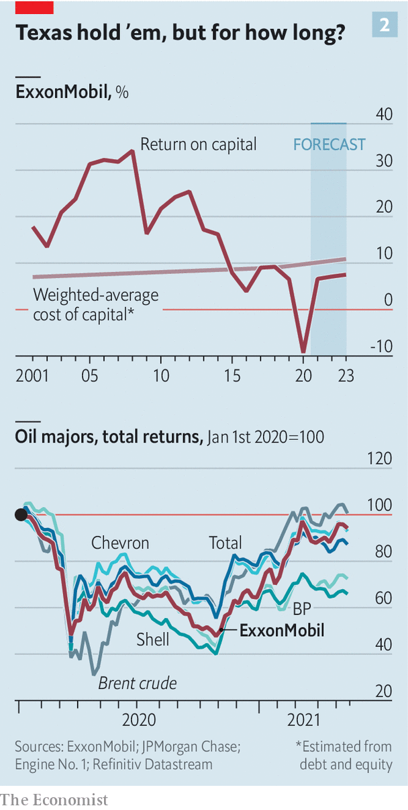
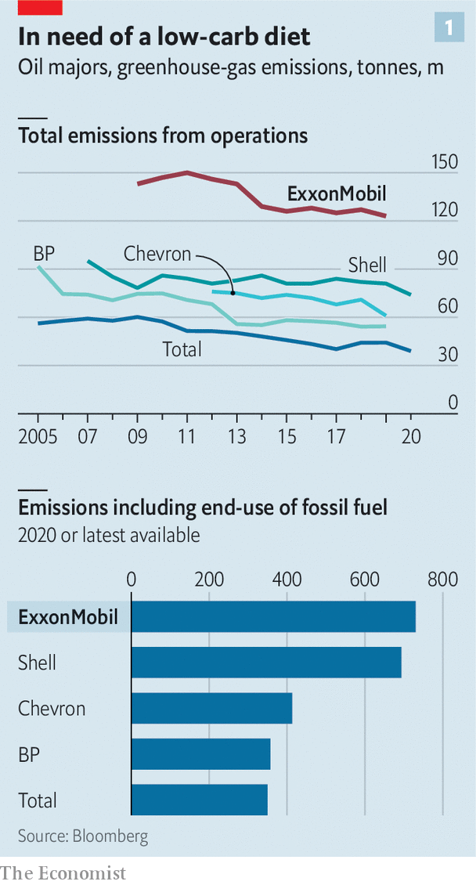

###### The little Engine that could

# ExxonMobil loses a proxy fight with green investors 

##### An activist hedge fund succeeds in nominating at least two climate-friendly directors to the energy giant’s board 

 

> May 27th 2021 

“THE STONE AGE did not end for lack of stone, and the oil age will end long before the world runs out of petroleum.” That battle cry animates critics of Big Oil, who dream of phasing out hydrocarbons in favour of cleaner fuels and technologies. Their bête noire is ExxonMobil, long the richest and mightiest of Western oil supermajors—and the most unrepentant in its defence of crude. Lee Raymond, a formidable former boss of the Texan titan, once told your correspondent to get out of his office after being challenged over his flagrant denial of climate science.

Darren Woods, who currently does Mr Raymond’s old job, does not deny that climate change is real. And he must now contend with the biggest rebuke to the firm’s management in living memory. At his company’s shareholder meeting on May 26th a coalition of activist investors led by Engine No.1, a small hedge fund, managed to put at least to promote a lower-carbon strategy of the sort espoused by European supermajors such as BP, Royal Dutch Shell and Total. As The Economist went to press the fate of a third activist nominee had yet to be determined.


Engine No.1 didn’t quite get its way: it had put forward four candidates. But as David Larcker of Stanford’s Graduate School of Business observes, it is “extremely rare” for a company the size of ExxonMobil to elect even one dissident director, let alone two or three. Even one dissenting voice can make a big difference, says Charles Elson, a corporate-governance expert at the University of Delaware who has served as a courteous rebel on various boards. The result is thus an unprecedented attack on ExxonMobil’s carbon-addiction, which is greater than any other supermajor’s (see chart 1).

 


The campaign succeeded thanks to the backing of powerful allies. CalPERS and CalSTRS, pension funds representing, respectively, California’s public employees and its teachers, have between them over $700bn in assets under management. Two giant funds representing New York’s state and city employees, with another $300bn or so in assets, joined them in supporting Engine No.1’s effort. Together they hold less than 1% of ExxonMobil’s shares. But as large asset managers, their actions sent a strong signal to the broader market.

The market received it. Institutional Shareholder Services (ISS) and Glass Lewis, a proxy-advisory duopoly which counsels investors on such matters, recommended the election of three and two of Engine No.1’s directors, respectively. In a report published on May 14th ISS declared that the hedge fund “made a compelling case that additional board change is needed to provide shareholders with sufficient confidence” in ExxonMobil’s prospects. The majority of shareholders agreed, almost certainly including some big asset managers.

The vote itself was as odd as the result. ExxonMobil’s management refused to announce the results, which should already have been tabulated, at the scheduled hour, instead declaring a recess “to ensure all of our shareholders have the opportunity to express their views”. This unusual move fuelled rumours that the firm was trying to persuade large institutional investors to reverse votes cast for the dissident directors, especially those with the greenest profiles. If true, that would be a departure from ExxonMobil’s habitually strong corporate governance.

Whatever actually went on during the unscheduled break, the result was still a bombshell. When the meeting resumed, the firm announced that two of Engine No.1 candidates, Gregory Goff and Kaisa Hietala, had been elected. It said it needed more time to determine whether a third, Alexander Karsner, would join them.

ExxonMobil’s proxy defeat is the latest sign that outside pressure for the oil business to embrace the transition to a low-carbon future is mounting. On May 18th the International Energy Agency (IEA), an international forecaster not known for alarmism, warned that investments in all new fossil-fuel projects must stop now if the global energy sector is to achieve carbon neutrality by 2050.  wants America’s power sector to stop adding greenhouse gases to the atmosphere 15 years earlier than that.

So far it has been Europe’s oil giants that were pushed harder to go greener—by activists, consumers, regulators, investors and courts. Last year BP vowed to slash the carbon intensity of the products it sells by 50% in the next 30 years. This month Shell won shareholder approval for its plan to create a carbon-neutral business by mid-century, including emissions from the fuel burned by end-users. Though ambitious by industry standards, this was not enough for a judge in the Netherlands, who on May 26th ordered the Anglo-Dutch giant to cut emissions between 2019 and 2030 by 45%, in keeping with global climate accords; Shell is expected to appeal.

Now carbon-bashing is spreading beyond tree-hugging Europe.  activist badgering had already prompted ExxonMobil to unveil plans for a new “low carbon solutions” division, which will develop technologies to capture carbon and store it underground. It has also pledged to cut the carbon intensity of its own exploration and production operations by 15-20% by 2025. The same day as the ExxonMobil vote, shareholders of Chevron, its American rival similarly bullish on oil, voted for a proposal to reduce emissions from the end use of its products.

ExxonMobil’s new directors will now push for more aggressive emissions cuts. Engine No.1 points to the firm’s plans to spend merely $3bn or so in total over the next five years on its low-carbon effort, compared with around $20bn a year on dirtier traditional investments. Unlike Shell, the company has promised only to reduce emissions from its own operations, not the vastly greater ones produced when its products are used by consumers.

The big reason such arguments no longer fall on deaf ears is ExxonMobil’s once mighty reputation for being tightly run has slipped. Indiscipline has replaced historically prudent capital spending. The firm has torched billions in shareholder value in the past few years. The most eye-popping chart in Engine No.1’s 80-page manifesto shows its return on capital languishing at or well below its weighted-average cost of capital since 2015 (see chart 2).

 


Whereas Chevron spent less than $70bn on capital expenditure in total over the past five years, ExxonMobil splurged nearly $100bn, even as oil prices swooned. Its net debt has nearly doubled since 2015 to over $60bn. A mistimed and overpriced acquisition of XTO Energy, a gas firm, led it in November to write off $17bn-20bn—and S&amp;P Global, a rating agency, to entitle a scathing analysis of the incident “How not to do M&amp;A”. “Board refreshment is necessary due to the long-term financial underperformance at ExxonMobil,” says Anne Simpson of CalPERS.

Last summer, as ExxonMobil’s share price headed to a two-decade low and the company was knocked out of the Dow Jones Industrial Average after nearly a century in the blue-chip index, Ms Simpson’s argument would have sounded incontrovertible. To many it remains compelling. But deep down many investors may still worry that the green shift will destroy shareholder value. Thanks to dearer oil ExxonMobil has clawed back $110bn in market capitalisation since October, handily besting the European giants whose promised wind and solar projects are years away from profitability and could meanwhile eat into their dividends.

Crude prices are, of course, cyclical by nature. They will fall again at some point, in contrast to the carbon dioxide relentlessly accumulating in the air as more oil is burned. Mainstream investors now view climate risk as “a core component of long-term value”, notes Timothy Youmans of EOS, which offers stewardship services to owners of $1.5trn in assets and supports Engine No.1. This week’s shareholder battle is proof of that. Mr Woods and his successors should brace for more such fights. ■

For more coverage of climate change, register for The Climate Issue, our fortnightly , or visit our 

A version of this article was published online on May 23rd, 2021

