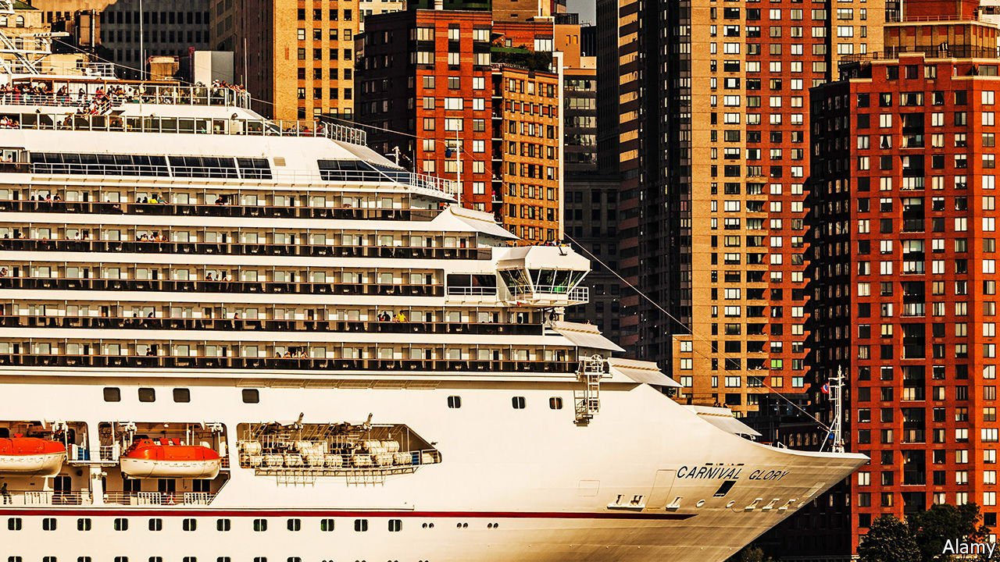

###### Cabin fervour

# The cruise-ship industry seeks to refloat 

##### But travel rules are holding up a restart in North America 

 

> May 29th 2021 

THE LATEST addition to the fleet of Carnival, the world’s biggest cruise operator, is the Mardi Gras. This ocean-going playground for 5,300 passengers comes complete with six different zones, including a “French Quarter”, two dozen restaurants and a rollercoaster. It is set to arrive at its base in Florida in early June. That is a year behind schedule—but possibly just in time for a revival of the industry, which has been hit harder than just about any other by the pandemic.

Holidays afloat gave an early hint of covid-19’s damage to international travel. Images of passengers stranded aboard modern-day plague ships prefigured lockdowns on land. Most pundits reckon cross-border tourism will not fully rebound until 2023. Yet cruising may steam ahead before then. “Where else can you go to bed at night and wake up every morning in a different, new, exciting place?” ventures Arnold Donald, Carnival’s boss.


A break at sea is a small niche of the global tourist industry. Of the 800m or so foreign holiday-makers in 2019, only around 30m ascended a gangway. It was, though, growing fast, adding over 10m more sea faring tourists in a decade. And before the pandemic drowned the business in red ink, it was lucrative. The three companies that transport three-quarters of all passengers—Carnival, Royal Caribbean and Norwegian Cruise Line—raked in combined operating profits of $6.6bn on revenues of $38bn in 2019.

With fleets mostly idle in the past year, cruise operators have been burning cash. Only a few of the world’s 270 large cruise ships are at sea with paying passengers. Luckily for Mr Donald, investors seem to share his belief that the industry will roar back full-steam ahead. Carnival has had little trouble raising $24bn of debt and equity over the past 12 months to tide it over; its rivals have also been able to tap the market.

Now demand is returning. Carnival’s bookings for 2022 are back at the higher end of historical trends, its boss reports. The industry continues to expand long-term capacity. Over 100 vessels are on order; none has been cancelled during the pandemic. Perhaps the biggest headwind is countries’ fast-changing rules for international travel, especially in America. Half of all tourist seafarers are North American, double the number of Europeans, the next largest group, with China and other emerging markets far behind for now. Since the pandemic no ship has been allowed to set sail from an American port.

Mr Donald hopes that will change soon. Big cruise firms are trying to move things along by lobbying governments to allow vaccinated passengers who test negative for covid-19 to come onboard. That makes recent efforts by lawmakers in Florida to ban companies from using vaccine passports rather unhelpful. The Sunshine State is home to not just the Mardi Gras but also to America’s largest cruise ports. ■

Dig deeper

Listen to our 

All our stories relating to the pandemic and the vaccines can be found on our . You can also listen to , our podcast on the race between injections and infections, and find trackers showing ,  and the virus’s spread across  and 

