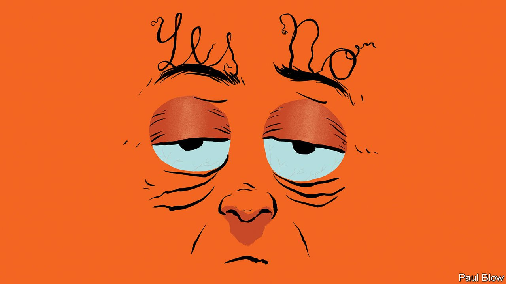

###### Bartleby

# The dangers of decision fatigue 

##### Taking a break can boost productivity 

 

> May 29th 2021 

“HAVE A BREAK” is a slogan associated with the popular chocolate snack, KitKat. But it may be pretty good advice for any manager or worker, minus the calories. The longer the shift, the less effective the employee may become.

In a new paper for Royal Society Open Finance, “Quantifying the cost of decision fatigue: suboptimal risk decisions in finance”, Tobias Baer and Simone Schnall examine the credit decisions of loan officers at a leading bank over the course of their working day. The academics write that decision fatigue “typically involves a tendency to revert to the ‘default’ option, namely whatever choice involves relatively little mental effort”. In other words, as you become tired, you get mentally lazy.


The study looked at proposals to restructure loans, with each credit officer analysing 46 requests per day. The approval rate was around 40%, so the default decision was rejection. Officers tended to start work between 8am and 10am, took lunch between 1pm and 3pm, and tended to leave at 6pm.

The researchers found that the approval rate declined significantly between 11am and 2pm, as lunch approached, then picked up again after 3pm before declining in the last two hours of work. The applications were distributed to credit officers by the bank’s automated system, so they were in effect allocated randomly. There is no sign that the loans assessed at lunchtime were of a different quality from those in the rest of the day.

What makes this study ingenious is that the authors were able to see whether or not the loans were subsequently paid back. They found that rejecting a restructuring request made it less likely that the loan would be repaid. So they calculated that decision fatigue, by causing more rejections, actually cost the bank money; around $500,000 over the course of a single month.

Similar patterns have been seen in other situations. A much-cited study of Israeli judges found they were less likely to grant parole as lunch approached, but became more lenient once their stomachs were full again. Other research found that doctors grew steadily more likely to prescribe antibiotics, even when these might not be necessary, over the course of their shift. In some areas of work, breaks are seen as a vital matter of safety. In the EU, lorry drivers are expected to take a 45-minute break after 4 hours 30 minutes behind the wheel.

Mental activity can result in physical exhaustion, as anyone who has spent a day in successive meetings can attest. In the middle of a business trip, nothing can seem more enticing than the solitary silence of a hotel room, with no clients to amuse or placate in sight. Breaks can also boost creativity. It is easy for the brain to develop tunnel vision when it is working hard. There are times when the mind needs to roam free. Kevin Cashman of Korn Ferry, a consultancy, and author of a book, “The Pause Principle”, reports that executives say their best ideas often come when exercising, taking a shower or commuting.

Taking a break by leaving the workplace, if only to go to the coffee shop, may be the sole practical way for workers to recharge mental batteries. Many people have hobbies—puzzles, crosswords, knitting—that are enjoyable because they engage only part of their conscious minds but still stave off boredom.

However, such pastimes are regarded as impermissible at the office. This is ironic since they are unlikely to disturb anyone else, whereas chatting with a colleague, which is all too likely to do so, is seen as a perfectly acceptable diversion. One of the nicest elements of working from home during the pandemic has been the ability to take breaks at the time, and in the style, of the employee’s choosing (subject to the tyranny of the Zoom conferencing calendar).

The lesson for managers is that what seems like “slacking” is actually a useful device for maintaining productivity. And the study of credit officers indicates that companies should look for ways to protect workers against decision fatigue.

One approach would be to give employees more breaks, of course. But another might be to monitor decisions at certain times of the day. The bank that was the subject of the study could have ensured that loan decisions made just before lunch, or at the end of the day, were subject to review. Software could be used to “nudge” employees with a message like: “Your decision-making seems to have changed, maybe you want to take a break and reconsider.” A pause should win applause.

