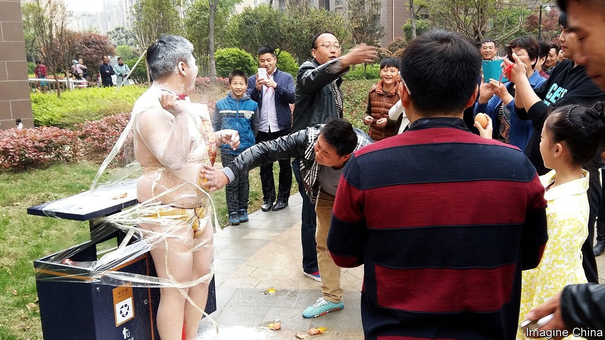

###### Will you mortify me?

# China wants to curb an old custom: the hazing of wedding couples 

##### It does not fit with the government’s plan to create “civilised cities” 

 

> May 27th 2021 

NERVES ARE common in the run-up to nuptials. Couples in some parts of China must brace for torment. In a ritual called naohun, or “disturbing the wedding”, guests haze them. Often this involves forcing the man to strip to his underwear and don stockings or a bra. Friends then tie him to something and slather his body with sticky substances such as soy sauce and eggs. Firecrackers, taped to flesh, are sometimes set off; injuries ensue. Women can be targeted, too. Naohun allows people to kiss the bride and bridesmaids and even to grope them.

Naohun rites were not always intended to humiliate. They began centuries ago with the aim of helping to put newlyweds—who often barely knew each other—at ease. Relatives would gently tease the couple in their bridal chamber, alluding to intimate acts. This served as a form of sex education. Rituals involving the groom’s father, such as making him carry his daughter-in-law on his back, were once cheered as a sign that she would be well-treated by her husband’s family.


But in recent times, naohun has become an excuse to be rowdy, lewd or even physically abusive. In 2017 NetEase, an internet giant, found 142 cases in the previous five years of hazing so outrageous that it had featured in stories in China’s media. Half of the incidents involved binding and beating. In 80% of them, grooms were the victims. Only five involved hazing of the bride, but cases of sexual harassment may often go unreported.

The custom has faded in big cities but remains popular elsewhere. In the NetEase sample, the provinces of Shandong and Yunnan accounted for 60% of cases. The practice upsets the government, which wants to create “civilised cities”. Last year it called for an end to “unhealthy marriage practices”. These included naohun, “extravagance and waste” at parties and “sky-high” caili—cash given by the groom to the bride’s family. In April the central authorities designated 15 areas in ten provinces as pilot zones for wedding reform.

Local governments have responded with a flurry of directives. In Inner Mongolia, in the north, weddings must now be hosted by local “red-and-white councils” run by Communist Party branches (red stands for weddings, white for funerals). In some provinces, newlyweds must sign a pledge to eschew “uncivilised” naohun. A county in Henan province has capped caili at 30,000 yuan ($4,600)—less than a third of the going rate. Others have limited the size of banquets to 30 tables. Fines have been specified for rule-breakers.

Even before the central government began its campaign, the city of Dali, a popular wedding spot in Yunnan, had begun stationing urban-management officers at well-known naohun locations. Yang Pinkang, a 26-year-old local who got married in October, had no naohun. “My friends were disappointed,” Mr Yang says. “But am I not meant to look my best for my wife on my wedding day?” He says residents have gone cool on naohun since the drowning of a groom who was thrown into a lake. Mr Yang recalls how his uncle set his aunt’s wedding dress on fire after friends dared him to crawl under it and light matches.

No more such recklessness in Shandong province, officials hope. “Let us all be more polite,” one city there, Zouping, decreed in March. “Help weddings go back to being warm and romantic.” Consider it a marriage demand, not a proposal. ■

