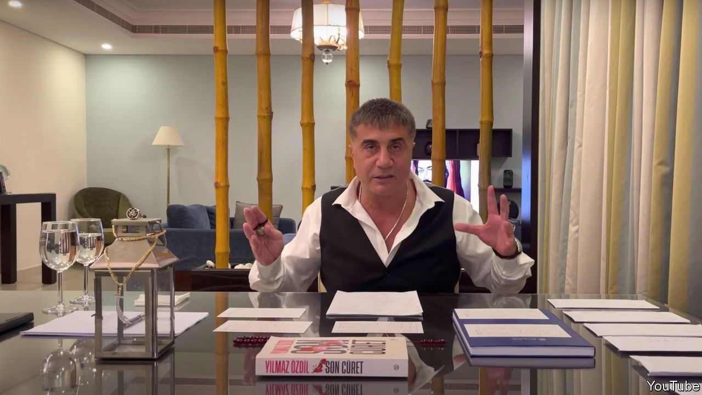

###### From an unknown location

# A mobster’s allegations rock Turkey’s government 

##### Turks are enthralled 

 

> May 29th 2021 

SEDAT PEKER, the man at the centre of one of Turkey’s biggest political scandals for many years, makes an unlikely YouTube celebrity. He slurs his words, possibly as a result of too many Botox injections, wears an unbuttoned shirt, and sits behind a desk adorned with prayer beads, pages of notes and an empty lantern. Over the past month, however, Mr Peker, a convicted mobster, has had millions of Turks glued to their screens as he has settled scores with President Recep Tayyip Erdogan’s government.

His allegations, which are unproven, are explosive. In a series of videos, Mr Peker has accused the son of Mr Erdogan’s former prime minister of drug trafficking and a ruling-party MP of involvement in the death of a young woman. He claims to have had another politician beaten up for insulting the president and takes credit for an attack on the offices of one of the country’s biggest newspapers. He also claims the country’s interior minister, Suleyman Soylu, offered him police protection.


The seven videos have been viewed at least 55m times. More of them seem to be on the way. Opposition politicians and even some members of the ruling Justice and Development (AK) party have called for an inquiry. What the allegations show, said Kemal Kilicdaroglu, the leader of the main opposition party, is that the mafia has become the government’s coalition partner. “If even a thousandth of these claims are true, this is a disaster,” said Cemil Cicek, an AK heavyweight.

Mr Soylu, meanwhile, denies the allegations. He has swatted away calls for his resignation, demanded that Mr Peker should be charged with slander and dared him to return home. He also called the allegations part of “an international operation” and accused America and the United Arab Emirates (UAE) of attempting to overthrow Turkey’s government. Mr Peker, who fled Turkey two years ago, is believed to be living in the UAE.

Mr Soylu has not been helping his cause. Late on May 24th a crowd of supporters swarmed around the minister outside a television station, breaking curfew rules Mr Soylu had personally signed into law. He warmly thanked them.

The scandal has revived memories of the 1990s, when the state regularly teamed up with criminal groups to go after opponents, from journalists to Kurdish leaders. Scores were killed. Some of that era’s unsavoury characters have now resurfaced, in part thanks to an amnesty last year.

Until recently, Mr Peker had been in the government’s good graces. The mobster, who has served time for leading a crime syndicate, extortion and kidnapping, met Mr Erdogan on at least one occasion, organised rallies in support of him, and earned an award as Turkey’s “most benevolent businessman”. When a group of academics penned a letter criticising a government offensive against Kurdish insurgents, Mr Peker swore to “shower in their blood”. He fell out of favour, he claims, when Mr Erdogan’s son-in-law turned against him.

The videos are also embarrassing Turkey’s media and judiciary, which no longer dare to look into high-level corruption or probe top officials, much less members of Mr Erdogan’s family. A reporter for Turkey’s state news agency who asked a minister a pointed question about Mr Peker’s claims lost his job the next day. The biggest previous corruption scandal in the Erdogan era was largely the work of bureaucrats loyal to a religious sect, who dug up evidence of bribery and money-laundering by government ministers. Today, the task of holding the powerful to account seems to have fallen to a mafioso. ■

