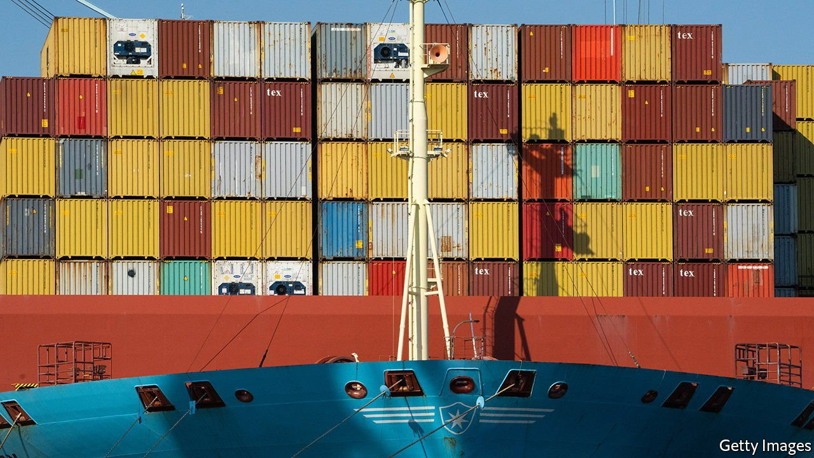
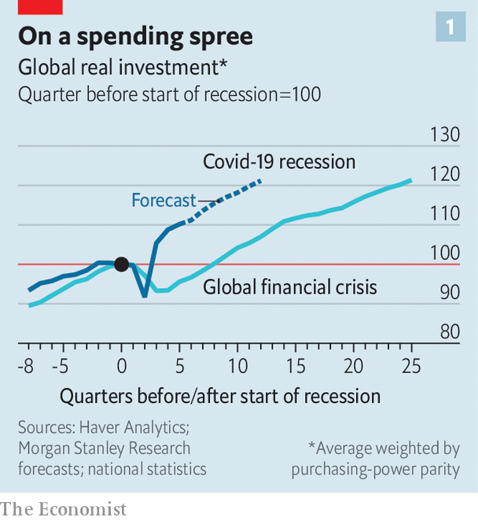
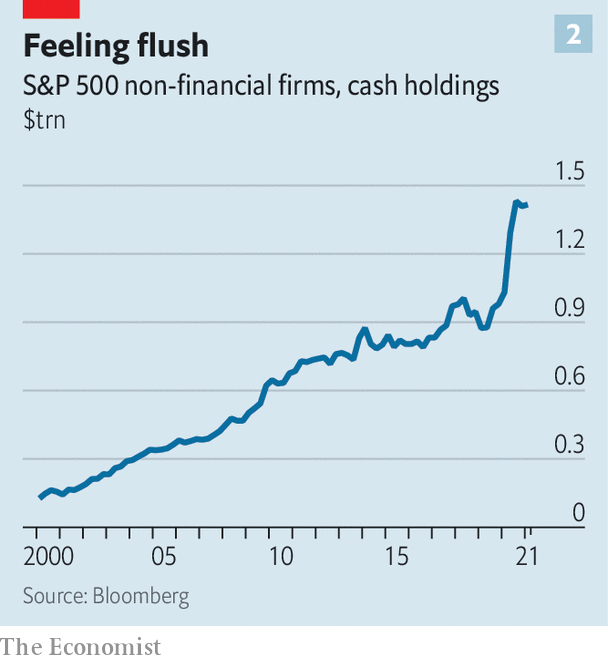

###### Capex carnival

# An investment bonanza is coming 

##### Firms across the world are spending big. We analyse their capital-expenditure plans 

 

> May 25th 2021 

AS LOCKDOWNS LIFT across the rich world, people are going out and spending. Australia’s restaurants have been crammed for months. America’s shopping malls are filled with people splurging stimulus cheques. Cinemas in Britain, which were allowed to reopen in mid-May, are packed once again. Yet behind the scenes another, potentially more significant, spending bonanza is just beginning.

Businesses are starting to invest in huge numbers. In America capital spending (or capex) by companies is rising at an annual rate of 15%, both on the hard stuff, such as machines and factories, and intangibles, like software. Firms in other parts of the world are also ramping up spending. Forecasts for business investment have never looked so rosy. Analysts at Morgan Stanley, a bank, predict a “red-hot capex cycle”. Overall global investment, they reckon, will soar to 121% of pre-recession levels by the end of 2022 (see chart 1). Oxford Economics, a consultancy, argues that “the time looks right for a boom in capex”, while IHS Markit, a research firm, forecasts that global real fixed investment will rise by more than 6% this year.

 


Today’s optimism marks quite a change from the pre-pandemic norm. In America gross domestic business investment, as a share of GDP, had been sluggish since the early 1980s. After the financial crisis of 2007-09 it took more than two years for global investment, in real terms, to regain its previous peak. By contrast, although investment fell more steeply at the start of the pandemic, it has been quicker to bounce back this time. The prospect of surging capex holds out promise that the global economy will not face a repeat of the 2010s, when growth in productivity and GDP stayed stubbornly below pre-crisis trends. Investment in new products, technologies and business practices is, after all, the foundation for higher incomes and a better quality of life. So what is behind the capex cheer—and could it last?


To understand why analysts are so upbeat, consider the firms included in the S&amp; P 500, America’s main stockmarket index. Together they account for about one dollar in seven of total rich-world corporate capital formation. In a recent report Bank of America analyses these companies’ earnings calls since 2006, and concludes that executives are at their most bullish about capex. The Economist has looked at the biggest 25 non-financial firms in the S&amp; P 500 and found that analysts’ expectations for capex in 2021 have risen by 10% in the past year.

For now the investment recovery is concentrated in a few industries. We find that global tech firms are expected to boost capex by 42% this year, relative to 2019. Apple will invest $430bn in America over a five-year period, an upgrade of 20% on previous plans. Taiwan’s TSMC, the world’s largest semiconductor-maker, recently announced that it would invest $100bn over the next three years in manufacturing. Analysts reckon that Samsung’s capex will rise by 13% this year, having gone up by 45% in 2020.

Tech companies are spending so freely in part because the pandemic has created new demands. More shopping happens online. Remote work is on the rise. New equipment and software is needed for these to run smoothly. Recent research by Nicholas Bloom of Stanford University and Steven Davis and Yulia Zhestkova of the University of Chicago finds a big rise in the share of patent filings for work-from-home technologies. UBS, another bank, reckons that shipments of computers for commercial use will rise by nearly 10% this year, an acceleration even over the last.

Tech firms are not the only enthusiastic spenders. Firms in the S&amp; P 500 that focus on discretionary consumer spending boosted capex by 36% year-on-year in the first quarter. Companies such as Target and Walmart, two retailers, are trying to keep up with the online giants that are eating their lunch. Marks &amp; Spencer, an august British retailer, recently announced that it had launched 46 new websites in overseas markets from Iceland to Uzbekistan.

Other retailers are spending frantically to expand capacity, having been caught out by the surge in household spending. Everything from sofas to hot tubs is in short supply. Earlier this year Peloton announced “substantial incremental investments” in expediting the transport of its exercise bikes from Taiwan. Maersk, a shipping firm, recently said it would buy more containers to ease bottlenecks. The global order-book for enormous container ships has risen from 9% of the existing fleet, in October, to over 15% in April.

The big question is whether the emerging capex boom augurs a broad and lasting shift away from the weakness of the 2010s, or is simply an enthusiastic but temporary response to reopening. Not everyone is boosting capex: our analysis suggests that about half of the companies in the S&amp; P 500 are not expected to invest more in 2021 than they did in 2019. Global oil-and-gas firms are cutting back by a tenth relative to pre-pandemic levels, possibly in response to lower expected demand for their planet-warming fare. Airline operators are also dialling down spending, perhaps because they expect it to be a while before people can travel freely again. Many executives, including those from raw-materials and industrial-goods firms, continue to preach capital discipline. It may be quite a leap for them to go from a decade of austerity to boom time.

Another worry is the trend towards greater consolidation in industries from hotels to mining, which seems unlikely to have been reversed by covid-19. Research by the IMF suggests that companies with market power may be less keen on investing. In the five years before the pandemic, for instance, American business investment in hotels was barely higher than it was in the five years before the financial crisis, even though demand was far higher.

 


Set against that, though, economic conditions today could convince reluctant companies to loosen the purse-strings. In contrast to the post-financial-crisis period, . A more decisive fiscal and monetary response this time has also allowed firms to load up on cash (see chart 2). Bond issuance by investment-grade-rated American companies jumped to a record $1.7trn in 2020, up from $1.1trn in 2019, according to S&amp; P Global Market Intelligence, a research outfit.

Moreover, the economic reallocation provoked by covid-19, and its investment implications, will be felt for some time. Managers in certain industries, especially semiconductors, already accept that they went into the pandemic with too little spare capacity, and are promising multi-year projects to make up for it. Perhaps most important, the pandemic is leading to an era of greater technological optimism. The rapid deployment of entirely new business models when covid-19 struck, not to mention vaccine discovery, may have reminded bosses of the payoff to investing. All that might explain why the expectations for capex by S&amp;P 500 firms in 2022 are even more ambitious than those for this year. The investment boom may only be getting started. ■

A version of this article was published online on May 25th, 2021

