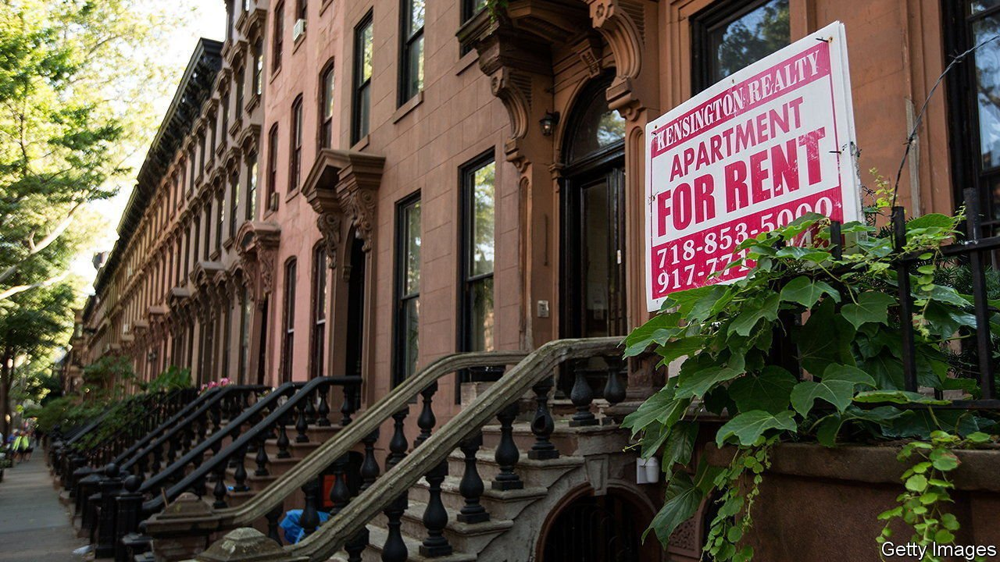
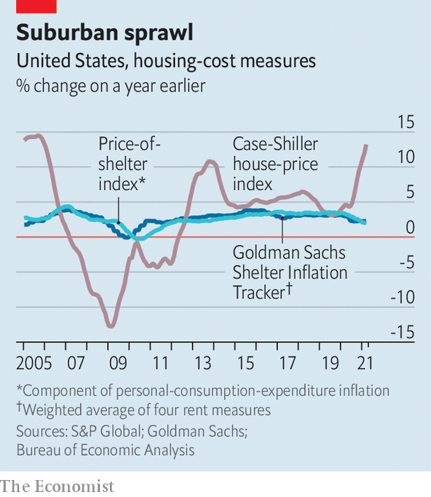

###### Hot properties

# What America’s hot housing market means for consumer prices 

##### A bounceback in rents would have a big effect on inflation statistics 

 

> May 24th 2021 

THE AMERICAN economy last year may have suffered its deepest downturn since the Depression, but you would not know it from house prices. The Case-Shiller national house-price index is rising at an annual rate of 13%, its fastest for more than 15 years (see chart). Lower interest rates have encouraged people to take out bigger mortgages, and trillions of dollars of fiscal stimulus have let people spend more on housing.

Yet as prices have breezed ahead, rental growth, which usually follows suit, has sharply slowed. And whether rents catch up or not matters, because they play an outsize role in America’s consumer-price inflation statistics. In a recent note analysts at Goldman Sachs, a bank, ranked housing costs among their three main “upside” risks to inflation, together with wages and inflation expectations. Alan Detmeister of UBS, another bank, went further, arguing that “it is only a small exaggeration to say that there is no single variable on which global financial markets depend more this year than US rents.” The behaviour of rental inflation could influence the Federal Reserve’s decision to withdraw its support for the economy—which would in turn affect everything from the strength of America’s recovery to the valuations of an array of assets.


America’s statisticians, like those across the rich world, do not include house prices in inflation metrics: the thinking runs that house purchases are in large part an investment, rather than purely a consumption good. Instead they focus on two other measures of housing costs. One is the rents actually paid by tenants. The other is an estimate of what homeowners would need to pay in order to rent their house. Despite boomy prices, rents are rising at just 2% a year, about half the pace seen just before the pandemic.

 


Economists puzzle over this divergence. Americans’ growing fondness for homeownership means more competition for owner-occupied properties but less for tenancies. Renters are more likely than homeowners to have lost their jobs in the past year, and may thus have negotiated rent holidays or discounts. Some landlords in San Francisco are so desperate for new tenants that they are even offering bonuses to people who sign a lease.

Over the long run, however, economic theory suggests that rents and prices should move in tandem (ie, the ratio of house prices to rents should be stable). If rental growth catches up with prices, that could have a big effect. Rents make up one-fifth of the basket used to calculate “core” personal-consumption-expenditure (PCE) inflation, which excludes food and energy—the gauge most closely watched by the Fed. If annual rent inflation rose to 4% a year—not far off where it was shortly before the pandemic—overall core inflation would rise by 0.5 percentage points.

Could this happen? As the economy recovers, landlords may hope to make up for lost time. “We expect a rental-market resurgence in 2021,” said Zillow, a property firm, in a report in December, “with rents increasing...and demand for rental housing strengthening.” A recovery in low-wage employment should boost rents: housing-cost inflation tends to rise when the unemployment rate falls. A survey by the New York Fed in April found that households expected rents to rise by 10% in the coming year, up from expectations of 5%, on average, in 2020.

Rental inflation is thus likely to rise in the coming months. But by how much is another question. There are reasons to think the price-to-rent ratio could settle at a permanently higher level. When interest rates are so low, for instance, people are willing to pay more for the right to a given stream of income. American price-to-rent ratios are higher today than in the 1980s, which coincides with declines in real interest rates.

A slower pace of housing construction may also keep price-to-rent ratios higher, suggests a new paper by Christian Hilber of the London School of Economics and Andreas Mense of the University of Erlangen-Nuremberg. In thriving areas where the supply of housing is constrained, buyers may be willing to bid up prices in the expectation of strong rental growth in the future. In recent years America has become worse at building new houses, in part because of tougher land-use regulations.

American price-to-rent ratios could of course adjust in another way—through prices falling, rather than rents rising. Just as share prices are more volatile than dividends, house prices are more up-and-down than rents. And Mr Detmeister’s historical analysis suggests that two-thirds of any adjustment in price-to-rent ratios tends to fall on prices. In other words, America might be able to have either a strong housing market or quiescent inflation—but not both. ■

A version of this article was published online on May 24th, 2021

