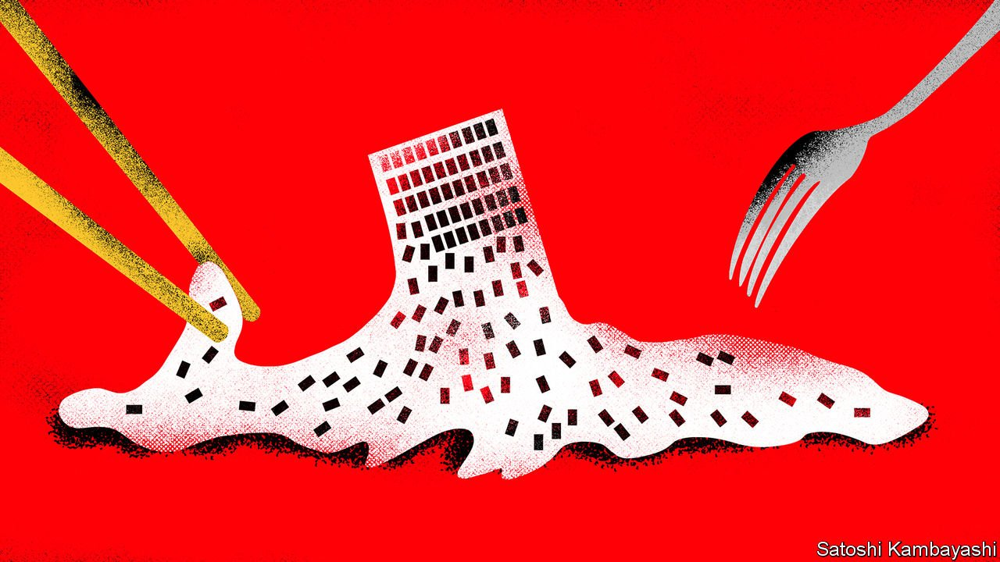

###### Reset to default settings

# What it means to invest in Chinese offshore assets could be changing 

##### Enforcing cross-border claims was often futile. Perhaps for not much longer 

 

> May 27th 2021 

DISSIDENTS, SMUGGLERS and rogue executives have been hiding out on either side of the 40km border between Hong Kong and China for generations. Despite being part of the same country since 1997, the two jurisdictions have separate legal systems with limited interaction. Chinese companies have crossed the border in droves since the 1990s to access global capital markets. Investors, trusting in Hong Kong’s independent legal system, have met them there, cash in hand. But when Chinese groups struggle to repay their debts, investors seldom attempt to chase them back over the border, where the bulk of the companies’ assets are located. Enforcing cross-border claims has been excruciatingly difficult and often futile. That could now be changing, with important consequences for creditors both at home and abroad.

Global investors have long accepted the tenuous links between their money and Chinese assets. Take, for example, the legal structures known as variable-interest entities (VIEs) that have been used to connect hundreds of billions of foreign investors’ dollars with Chinese-issued shares, despite having scant legal recognition in China. In the debt markets so-called keepwell deeds have thrived as a way of keeping offshore investors’ nerves under control. They are a type of promissory note that obliges parent groups to help pay back investors should an offshore subsidiary default. But no investor has ever successfully used these notes, which back some $90bn in dollar-denominated bonds, to force onshore companies to pay offshore debts. Creditor committees have been used to restructure debts that span the border. But more broadly it is rare that a Chinese court dealing with an insolvency case has recognised proceedings launched outside the mainland, including in Hong Kong.


The recent turmoil unleashed by Huarong Asset Management, a state-owned Chinese financial firm with $22bn in offshore debts, could cast a harsh glare on the disconnect between courts in China and Hong Kong. Huarong is the largest Chinese issuer of dollar-denominated debt, and the largest user of keepwell deeds. The Beijing-based group has not published its financial statements for 2020, leading to speculation that it will be restructured. Its troubles have sent yields on other state-backed debt soaring. Given the size of its borrowings and the scope of investors exposed to Huarong, a default by the group would force asset managers and hedge funds to rethink how they invest in state companies.

One question is whether keepwell deeds live up to their name. In January administrators in Beijing rejected creditors’ cross-border claims on Peking University Founder Group, a tech company linked to one of China’s top universities, because its keepwell deeds were based on English, not Chinese, law. The decision does not bode well for Huarong’s creditors. Investors fear that any restructuring will prioritise onshore bondholders over those sitting just south of the Chinese border. “Keepwells will either go away or be redefined,” says Alaa Bushehri of BNP Paribas Asset Management. Huge losses stemming from Huarong could even damage Hong Kong’s reputation. “Cross-border investors may not find enough protection in Hong Kong, which may hurt its role as a fixed-income offshore centre for Chinese firms,” Natixis, a French bank, noted in a research report.

Keepwells may not be a ticket across the border. But a parallel test of the legal firewall between China and Hong Kong is also playing out this year. On May 14th courts on both sides of the border said they could begin to mutually recognise some insolvency cases. The pilot project will help courts in Shanghai, Shenzhen and Xiamen acknowledge restructuring or liquidation orders from Hong Kong courts that involve assets in the three mainland cities.

The scope for the test is narrow. Claimants must prove that the company’s “centre of main interests” is in Hong Kong. This could be tricky; most Chinese firms listed in Hong Kong are incorporated in offshore centres such as the Cayman Islands. Over time, though, as courts on both sides of the border become more familiar with each other, it could “potentially break down the high barrier” between mainland China and Hong Kong, says Look Chan Ho, a barrister in Hong Kong who helped design the pilot. That could take years, warns another lawyer, who sees the pilot as largely symbolic.

Nevertheless, cross-border recognition for insolvency cases has taken on a new urgency for Chinese courts. It is not just foreign investors who are anxious for recourse. In recent years Chinese groups have fanned out across the globe, hoovering up flashy assets. Many, notably HNA, an airlines-to-finance conglomerate, have fallen on hard times. State creditors are eager to recover their losses by making claims on foreign assets, but may need recognition from foreign courts to do so. Reciprocity could help the Communist Party clean up the corporate mess.

China has not adopted the UN’s framework on cross-border insolvency, which is widely used for international restructuring. But its courts are seeking recognition abroad. In 2019 a bankruptcy case under Chinese law received recognition by an American court for only the second time. That ruling stopped other claims on the Chinese firm’s assets in America. In 2020, a Hong Kong court recognised a Chinese insolvency case concerning CEFC Shanghai International, part of a failed conglomerate that had gone on a spree in former Soviet republics. Both cases show that traffic between China and the rest of the world is increasingly two-way—leaving troubled executives with nowhere to hide. ■

