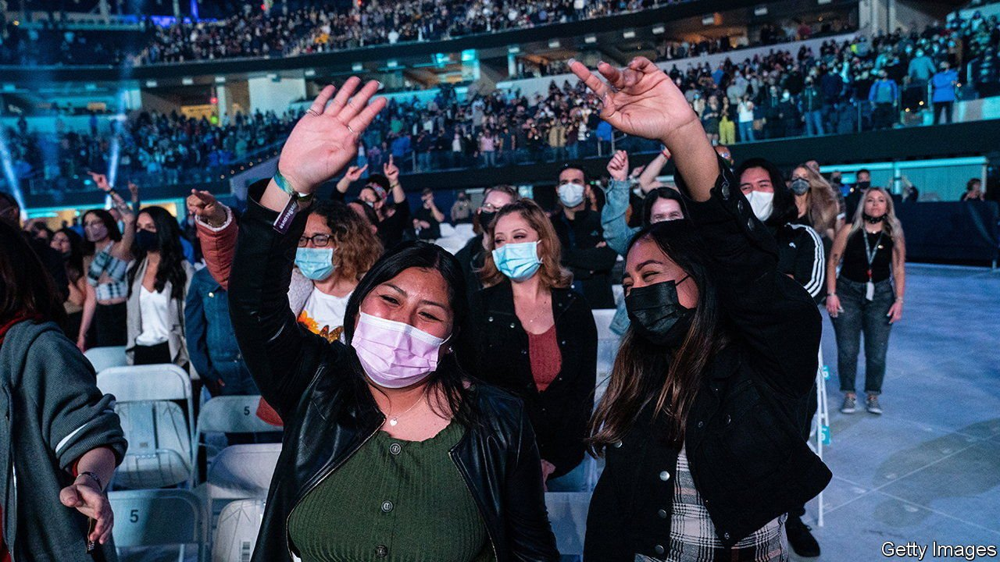
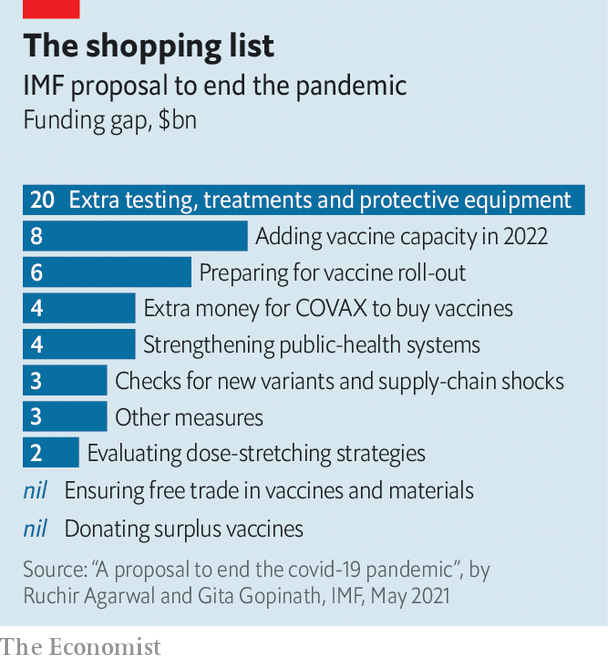

###### The best public investment ever

# What will it cost to end the pandemic? 

##### $50bn, says the IMF 

 

> May 29th 2021 

ON MAY 2ND thousands of masked nurses, doctors and others who have battled against covid-19 watched Jennifer Lopez and other stars perform in the flesh at the “VAX live” concert in Los Angeles. Outside the venue, visitors could get their jab from the comfort of their own vehicles, while watching H.E.R., a singer-songwriter, perform the song “Glory” in the car park, surrounded by schoolkids stomping their feet. A live concert was possible only because many Americans (50% of adults) are now vaccinated. But a charity event of this kind was necessary only because most of the world is not.

What would it take to close the gap? In a paper published in April, Ruchir Agarwal of the IMF and Tristan Reed of the World Bank argued that it might be possible to end the “acute phase” of the pandemic early next year by vaccinating 60% of the population of every country. Will there be enough shots to go round? In principle, yes. According to Airfinity, a life-sciences data firm, vaccine-makers could produce as many as 11.1bn doses this year, enough to inoculate more than 75% of the world’s population aged over five. The manufacturers themselves say they will produce many more.


Some of this capacity is already spoken for. But rich countries have hogged less of it than many people fear. Mr Agarwal and Mr Reed calculate that rich countries have placed advance orders for about 2bn courses (many of which comprise two shots). At the same time, the developing world already has dibs on more vaccines than some people assume, thanks to deals struck by organisations like the African Union and COVAX, a vaccine-sharing initiative. Mr Agarwal and Mr Reed calculate that 91 developing countries (with a combined population of over 2.5bn people) need to order only another 350m courses between them to vaccinate 60% of their population. India faces a bigger shortfall. But it also has the dollars and domestic manufacturing capacity to reach the target eventually.

 


Mr Agarwal and Gita Gopinath, the IMF’s chief economist, have now turned this insight into a broader $50bn “proposal to end the covid-19 pandemic” (see chart). Only $4bn of the headline total is necessary to buy the 350m extra vaccination courses. The rest is earmarked for other tasks, such as helping countries get vaccines into people’s arms, keeping a lookout for new variants, expanding testing and treatment, and adding another 1bn doses of vaccine-making capacity next year as insurance, in case anything goes wrong. Not everything on their wishlist is costly. The two economists reckon the developing world could vaccinate almost 40% of its population by the end of 2021 if rich countries donated even half of the surplus vaccines they are likely to amass this year.

The proposal is ambitious. But circumspection will only make the problems posed by the pandemic harder to fix. Without firm commitments to buy vaccines, manufacturers will have less reason to resolve any bottlenecks in their supply chains. A scarcity of shots will encourage counterproductive bans on exports of vaccines and materials. If poor countries do not know when vaccines will arrive, they will find it harder to prepare a successful roll-out. And slow vaccination will make new variants more likely.

Conversely, an early end to the pandemic could add as much as $8trn (at market exchange rates) to global GDP spread over the next few years, according to the IMF, and raise tax revenues in the rich world by $1trn. “Funding this proposal”, the authors argue, “may possibly be the highest-return public investment ever.” Glory, indeed. ■

Dig deeper

All our stories relating to the pandemic and the vaccines can be found on our . You can also listen to , our podcast on the race between injections and infections, and find trackers showing ,  and the virus’s spread across  and .

