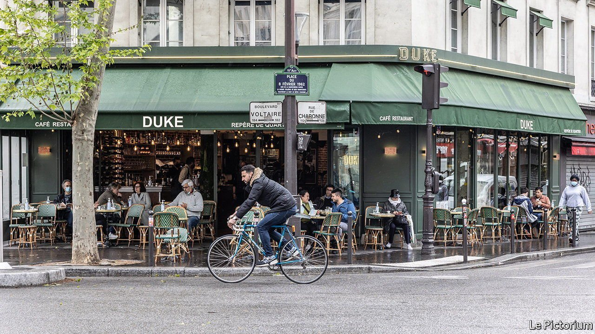
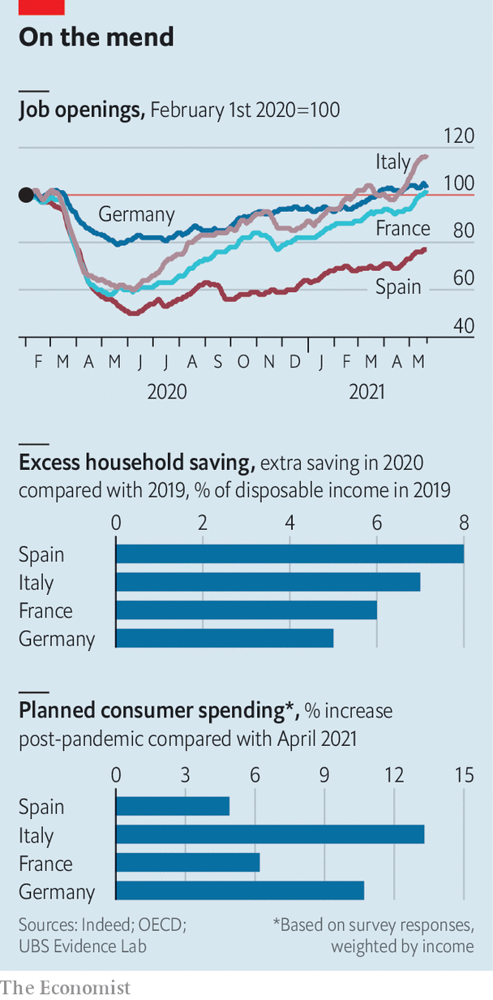

###### Dividing lines

# Which euro-zone economies are bouncing back quickest? 

##### Activity is surging as lockdowns end. But the recovery will be unequal 

 

> May 27th 2021 

KNOCKED BACK by several bouts of covid-19, Europe’s economy is now finding its feet. Its vaccination drive is charging ahead, and lockdown restrictions are easing. On May 17th Italy’s curfew moved from 10pm to 11pm, and on May 19th Parisians were allowed to return to their beloved cafés, after six months without. German companies are at their most optimistic in two years, according to figures released on May 25th, and wider economic sentiment is surging. The relief is widespread. The recovery will be less so.

Europe went into the covid-19 crisis with scars still unhealed, as northern countries, such as Germany, outperformed southern ones, such as Spain and Italy. The pandemic rubbed salt in the wounds. Between the final quarter of 2019 and the second quarter of 2020 household consumption in Spain and Italy fell by 30% and 20% respectively, compared with just 11% in Germany. Punishing lockdowns and a drought in tourist revenues have prolonged the pain. By the end of 2020, consumption in Italy and in Spain was more than a tenth below its pre-crisis peak, compared with a shortfall of 6% in Germany and 7% in France.


Some indicators suggest that the worst-hit countries are bouncing back faster. Mobility data from Google from mid-May suggest that travel for recreation and retail was returning to normal more quickly in Italy and Spain than in France and Germany, perhaps because they reopened earlier. Others indicate divergence. Figures from Indeed, a job-search platform, suggest that the recovery in vacancies posted by employers in Italy is well ahead of those in France and Germany, let alone Spain (see chart).

 


Beyond the immediate bump associated with fewer restrictions at home, three factors will influence the evenness of the recovery. The first is the extent to which external constraints ease. Looser travel restrictions are important for Spain, where revenues from tourism made up 12% of GDP before the pandemic. The strength of Germany’s industrial boom, meanwhile, relies on bottlenecks along the supply chain being resolved.

The second factor is the extent to which consumers spend their accumulated cash. Their larger piles of “excess” savings could help harder-hit countries catch up. Compared with the French and the Germans, Italians and Spaniards stashed away much more in 2020 than they did in 2019. That does not mean they will spend all of it, though. A survey of 5,000 European consumers by UBS, a bank, suggests Spanish consumers plan to splurge less than others. Given the sorry state of the labour market, that caution is hardly surprising. In March the unemployment rate was 15%, three times that in Germany.

The third factor influencing the recovery is the strength of governments’ fiscal response. A fear of divergence has already motivated the EU’s recovery fund. This will direct more cash to Italy and Spain, and could boost growth there by more than twice as much as in France and Germany, reckons S&amp;P, a rating agency. But at a meeting on May 21st-22nd economists from Bruegel, a think-tank, warned European finance ministers that they might need to go further. Given that many forecasters expect the EU not to reach its pre-pandemic level of output until 2022, another round of stimulus could help tackle the other inequalities that have arisen during the pandemic, such as the extra burdens borne by the young and the less educated.

Look beyond the immediate recovery, and the prospects for convergence seem limited. Support from the recovery fund notwithstanding, the IMF’s latest forecasts suggest that Italy’s economy will shrink by 0.1% between 2019 and 2023, while Spain’s expands by a paltry 1.9%. France and Germany, meanwhile, are expected to grow by 2.9% and 3.5% respectively. Without more support, the economies that were lagging behind even before the pandemic will see their recovery slow to a crawl. ■

