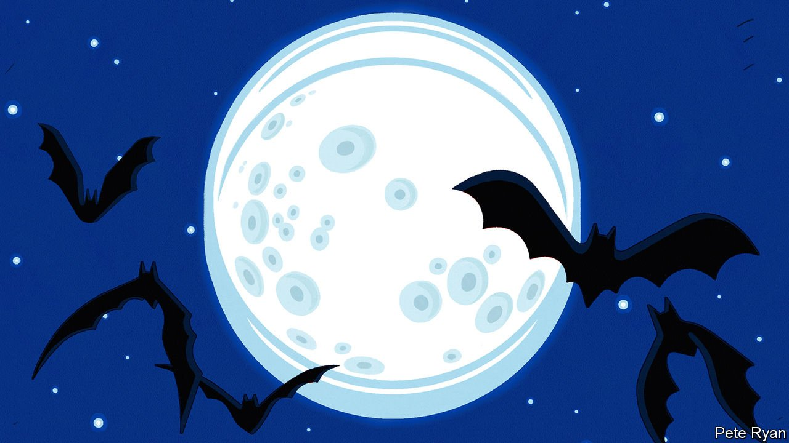
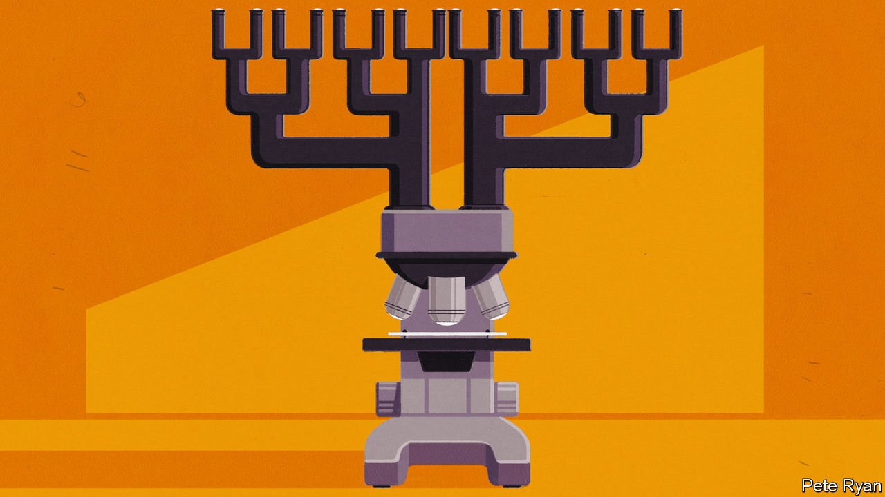

###### Possible, but far from proven

# Assessing the theory that covid-19 leaked from a Chinese lab 

##### The evidence so far is circumstantial 

 

> May 29th 2021 

IT IS POSSIBLE that the chain of infections which spread SARS-CoV-2 around the world began, as most new diseases do, when an animal virus found its way unaided into humans, whether in field or farm, cave or market. It is also possible that the chain began in a Chinese government laboratory. These two possibilities have been recognised by many of those studying the covid-19 pandemic for a long time. But the fact that two things are both possible does not mean they are equally likely.

For most of 2020 scientists and the media tended to treat the likelihood of a leak from a lab as a very small one, with everyday contact—“zoonotic spillover”—overwhelmingly more probable. That has now changed. Tedros Adhanom Ghebreyesus, director-general of the World Health Organisation, said in March that assessment of the laboratory hypothesis had not yet been extensive enough. On May 26th President Joe Biden ordered America’s intelligence agencies, which have not as yet reached a conclusion either way on the subject, to go away and .


The escape artists

The place most strongly tied to the emergence of SARS-CoV-2 is a fish and animal market in the Chinese city of Wuhan. China’s wildlife markets and the trade which supplies them with their civets, rats, pangolins and badgers are viral melting pots brimming with opportunities for zoonotic spillover. In the 2010s a study in Vietnam showed that animals acquire coronaviruses from each other as they make the journey to restaurant or market; there is no reason to think Chinese supply chains more salubrious. In February last year China announced a ban on wildlife consumption and trade in recognition of the risks involved. It was a big step, and a costly one.

The first flutterings of lab-leak concern were prompted by simple geography. That market is just 12km away from the Wuhan Institute of Virology (WIV), a global centre for coronavirus research. The Wuhan Centre for Disease Control and Prevention (CDC), which also worked on bat coronaviruses, is closer still: a mere 500 metres. A worker or workers in one of these labs could have been infected with a coronavirus being used in research, thus providing that virus with passage to the outside world. A related idea is that the virus came directly from a bat, or another animal, either inside a lab or as part of research-associated field work. An avid collector of wild bat viruses works for the CDC.

If one of these possibilities were to prove true it would be deeply and disturbingly ironic. Ever since the outbreak of SARS, a respiratory disease caused by another coronavirus, in the early 2000s, coronaviruses have been seen as having a worrying propensity for pandemics. That is what made them of particular interest to the researchers in Wuhan; their work on coronaviruses was carried out in the name of reducing the threat they posed.

Pathogens escape from institutions working on them with depressing frequency. The last known death from smallpox was the result of a laboratory leak in Britain in 1978. SARS-CoV-1, the virus which causes SARS, escaped from labs twice as it spread round the world in 2003, once in Singapore and once in Taiwan; it leaked out of a Beijing lab on two separate occasions in 2004. In December 2019 more than 100 students and staff at two agricultural research centres in Lanzhou were struck with an outbreak of brucellosis, a bacterial disease usually caught from livestock.

Most alarmingly, the H1N1 strain of influenza which started spreading around the world in 1977 is now known to have been released from a north-east Asian lab—possibly in China, possibly in Russia. Some Western observers suspected this at the time, but they made little fuss about it, perhaps afraid that doing so would lead to China and/or Russia pulling out of international flu-surveillance efforts, or spark a backlash against virology.

Biosecurity at the WIV was known to be spotty. American diplomats who visited it in 2018 reportedly flagged issues of concern, making specific mention of coronaviruses and pandemic risk. In February 2020 the Chinese ministry of science and technology issued new rules requiring laboratories to improve their biosafety, indicating unease with the status quo.

Charles Darwin, detective

The idea of a laboratory leak was apparently not unthinkable to those involved. When Shi Zhengli, a coronavirus researcher who is the director of the WIV’s Centre for Emerging Infectious Diseases was interviewed for Scientific American in early 2020, she said one of her first concerns was whether the virus could have come from her own lab. After searching records of all the viral sequences that they had worked with, she concluded it had not. Yet the Chinese government has rarely been hesitant to suppress any information that does not suit it, and Dr Shi may not be able to say otherwise. It is also possible that the virus came from work outside her purview.

Dr Shi’s group at the WIV has spent years trying to understand mutations that would allow bat viruses to spill over into human populations. In the pursuit of such questions they conducted research designed to make coronaviruses more infectious to humans. In work published in 2015 they reported a chimera created from a bat coronavirus and a mouse coronavirus that was able to replicate efficiently in human airway cells.

Some proponents of the lab theory have speculated about what other animals the laboratory might have used in this work. They point out that the virus looks very much like a cross between a pangolin virus and a bat virus with an additional genetic sequence that makes the virus far more infectious to humans. This “furin cleavage site” is not found in other closely related viruses; perhaps it was put there, they say.

There are various counterarguments to the specifics of these speculations. There is also a more overarching caveat based on the insights of Charles Darwin: natural selection can come up with all sorts of subtleties which look like irrefutable evidence for intelligent design to those who start off believing in a designer.

What of evidence from the spread of the disease? According to the Guardian, a British newspaper, when the WHO sent scientist Peter Ben Embarek to China in July 2020 his subsequent report to the agency stated that the Chinese had done “little…in terms of epidemiological investigations around Wuhan since January 2020”. Some infer that China is not looking because it knows, or perhaps just fears, the answer.

That lack of zeal adds to lab-leak suspicions. One of the reasons offered for the increased interest in such ideas is that only limited further evidence for zoonotic spillover has come to light; no one has found anything close to a “smoking bat”. When the lab-leak story seems to have momentum and the zoonotic story appears to just sit there it is natural for people to get the feeling that the lab hypothesis is becoming more likely. But it is not strictly logical. It is also important to remember that the relatively quick progress made on the origin of SARS in 2003 is not necessarily a reliable guide to how fast such sleuthing normally gets results.

While some data are absent, others are simply not being shared. During the WHO visit early this year the Chinese authorities refused requests to provide key epidemiological data on the 174 earliest known cases of covid-19 in the city in December 2019.

 


These data are crucial. Not all the early cases of covid-19 were from the market. Rather than being the source of the outbreak, it could simply have been a place where the virus was amplified. That speaks to the need to look at other possible sources, and that requires individualised data on every early case. The lack of such data meant that the WHO team was unable to do a standard epidemiological investigation, Dominic Dwyer, an Australian microbiologist, told the Wall Street Journal at the time. These early cases of covid-19 could point clearly in the direction of either an animal or laboratory source.

Excitement about the latter possibility has been stoked by the re-emergence of claims that three workers from the WIV got sick with something a bit covid-like in November 2019, claims first aired by the state department in the dying days of the Trump administration. But these reports lack corroboration, sources or details of where in the lab the people involved actually worked. That means they do nothing to move the story along.

The evidence to date shows that the circumstantial assumptions on which the idea is based—that there was coronavirus research and that it could have leaked—are true; it does not provide direct insight into the outbreak proper. As Ralph Baric, an American researcher who helped set up the WIV’s coronavirus work, told the Wall Street Journal, “more investigation and transparency are needed to define the origin”; he himself continues to see zoonotic spillover as the more likely possibility.

Ideally, China would help such investigations unearth new evidence. That can hardly be counted on. It is possible that the dogged work of America’s intelligence services may turn up compelling arguments for or against regardless, or that the many scientists poring over details of the virus’s genome and structure may come up with something. But there is no guarantee that the question will be solved soon.

Was it worth it?

For observers such as Filippa Lentzos, a biosecurity expert at King’s College London, the uncertainty underlines the need for more discussion about the risks that the world is willing to take in the name of science. More facilities for pathogen research are being built around the world, and even the most sophisticated biosecurity measures may sometimes leak.

That means the research needs to be carried out in ways that allow scrutiny and accountability, that the knowledge sought needs to be worth the risks, and that that knowledge, once gained, should be used and made useful. There is no compelling evidence that the presence of the WIV in the city where the covid-19 pandemic began was anything other than a coincidence. But neither is there evidence that the WIV’s coronavirus research, justified in the name of pandemic preparedness, did anything to lessen this pandemic’s toll.■

Dig deeper

All our stories relating to the pandemic and the vaccines can be found on our . You can also listen to , our podcast on the race between injections and infections, and find trackers showing ,  and the virus’s spread across  and .

