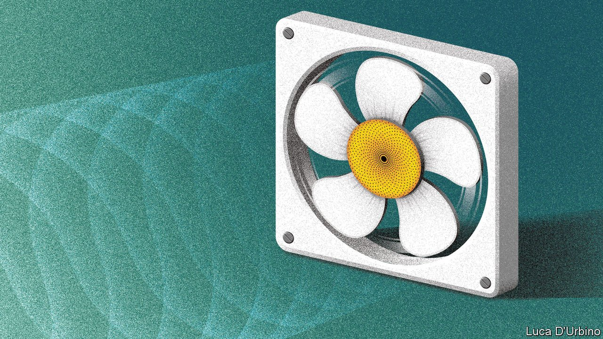

###### Ventilation and public health

# It is time to clean up the air in buildings 

##### Fresh thinking about fresh air 

 

> May 29th 2021 

IN 1842 EDWIN CHADWICK, a British social reformer, published his “Report on the Sanitary Condition of the Labouring Population”. By documenting evidence of social and geographic inequalities in health, Chadwick showed that poor sanitation was associated with poor health. The report eventually led British cities to organise clean water supplies and to centralise their sewage systems, in turn reducing the prevalence of infectious diseases, in particular cholera. Similar reforms around the world in the 20th century tackled food safety and outdoor-air pollution. Now a new public-health priority is becoming apparent: making indoor air cleaner.

Take schools. They are “chronically under-ventilated”, according to the Lancet covid-19 commission. A study of 100 American classrooms found 87 with worryingly low ventilation rates. Across Denmark, France, Italy, Norway and Sweden, researchers found that indoor-air quality in 66% of classrooms fell short of healthy standards. In America nearly one child in 13 has asthma—a condition triggered by allergens often found in schools. Outdoor-air pollution can penetrate inside buildings—childhood exposure can affect neurodevelopment and academic performance, and cause cancer.


The problem extends well beyond classrooms. Many people spend more than 90% of their time indoors. Researchers have linked under-ventilated spaces in buildings to a range of ailments—headaches, fatigue, shortness of breath, coughs, dizziness, nausea, and irritation of eye, nose, throat and skin. Poor ventilation has been blamed for increased absences from work, decreased productivity and asthma.

The pandemic has brought a new urgency to the matter. The virus which causes covid-19 spreads between people less by close contact and infected surfaces and more by hitching a ride on aerosol particles from people’s lungs that can linger in the air of an .

Indoor-air quality has attracted little government attention. But achieving clean, pathogen-free air in buildings and indoor public spaces is possible. The first step is to give people more information on how well-ventilated their air is. Carbon-dioxide concentrations are a good proxy for ventilation, and cheap sensors to detect this gas in rooms could provide occupants with useful data on when to open windows or upgrade their air-conditioning systems. National indoor-air-quality standards would help. One way to enforce them could be through ventilation certificates for buildings, similar to food-hygiene certificates that already exist for restaurants.

The bill for all this need not be huge. A recent study found that raising the standard of ventilation in all American elementary and secondary schools to the minimum level would cost less than 0.1% of the country’s typical public spending on education. President Joe Biden’s American Rescue Plan assigns $123bn to improving school infrastructure and mentions ventilation as a priority. Other countries should follow suit.

More investment would be money well spent. Better indoor air boosts academic performance—maths and reading scores go up, and pupils are measurably more attentive in class. Office-workers benefit, too. Researchers have found the cognitive scores of people in well-ventilated offices are 61% higher than those of workers in conventional office set-ups.

Ventilation is the forgotten part of the agenda for improved public health. Chadwick’s report on sanitation lifted people’s expectation that the water coming out of their taps would be clean. Covid-19 should lead policymakers to ensure, belatedly, that the same is true for the air in people’s buildings. ■

