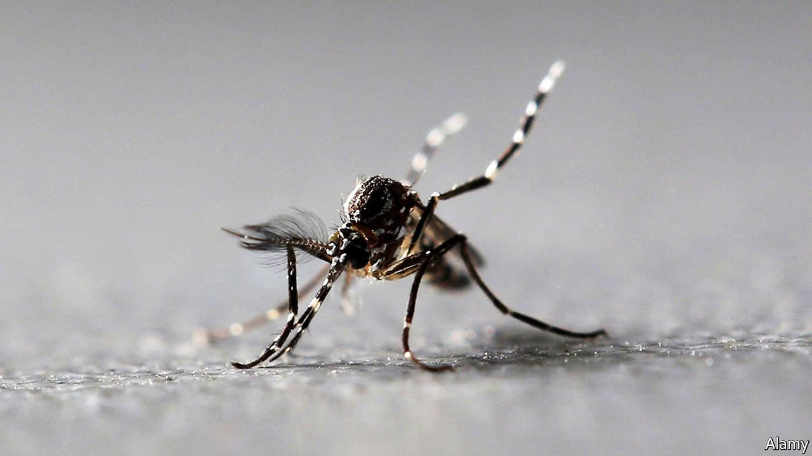

###### Pest control

# Genetic engineering may help control disease-carrying mosquitoes 

##### It produces fit and healthy eunuchs 

 

> May 26th 2021 

EVERY YEAR, hundreds of millions of people catch mosquito-borne diseases like malaria and dengue fever. Hundreds of thousands die. Drug treatments are imperfect. And, despite decades of effort, vaccines have, for many of these diseases, proved tricky to develop.

Better, then, to stop those infections happening in the first place, by exterminating—or at least suppressing—the mosquitoes that carry the diseases. In a paper just published in the Proceedings of the National Academy of Sciences, a team of researchers led by Craig Montell, of the University of California, Santa Barbara, describe how , a new and powerful genetic-engineering process, could help to do just that.


Dr Montell and his colleagues used CRISPR to boost an existing control method called the sterile insect technique (SIT). This involves releasing lots of sterilised males into the wild. Females that mate with these males produce no offspring. Repeated releases can reduce populations dramatically. SIT has been used in North America to eliminate screwworm flies, an agricultural pest, and to suppress several species of crop-munching fruit flies.

It has been tried on mosquitoes, too, but with less success. One reason seems to be side-effects of the procedure. To sterilise them, males are zapped with radiation or exposed to toxic chemicals. This works, but it damages them in other ways, too. The result can be sickly individuals that struggle to compete in the mating game with their wild counterparts.

Dr Montell and his colleagues hoped that CRISPR might offer an alternative. Their first step was to look for genes which, when disabled, would render male mosquitoes infertile. They began their hunt in fruit flies, a stalwart of genetic research. They focused on a gene that, when removed, made male fruit flies sterile—and which was present in a similar form in their target mosquito species, Aedes aegypti, which is the vector of, among other illnesses, yellow fever, dengue and Zika virus. Disabling the equivalent gene in male Aedes likewise left them infertile.

Crucially, the genetic tweak involved did not appear to hinder the modified mosquitoes in any other way. On every measure of healthiness they performed as well as their wild counterparts. And even though they were firing blanks, they were still able to mate with females in the laboratory.

Although the details are not fully understood, says Dr Montell, once female mosquitoes have mated a few times, they become less receptive to doing so again. Mating with an infertile male is therefore not only fruitless in itself, but should also leave a female less interested in unmodified males in future. Sure enough, a series of experiments conducted in cages suggested that releasing between five and six genetically modified males for each wild male was enough to cut the number of reproducing females by half. Upping that ratio to 15:1 dropped it by 80%.

There is more work to do before field trials, says Dr Montell. But having established the principle, he is excited to see where the work might lead. That the target gene is found in both fruit flies and Aedes suggests it is likely to exist in other disease-carrying mosquitoes, too. And that the engineered males leave no offspring means fewer worries about any unintended consequences which might arise from releasing millions of genetically modified organisms into the environment.

More speculatively, the team is pondering whether it might be possible to create males which can outplay their un-engineered cousins at the mating game, despite being infertile. Improving on millions of years of evolution would usually be hard. Even if researchers could find an alteration that improved a male’s attractiveness, it would probably reduce the animal’s overall fitness. Such a genetic tweak would ordinarily be winnowed out by natural selection over subsequent generations. But because each generation of males is created anew in a laboratory, says Dr Montell, there is no long run to worry about. If the team can find the right mutation, such genetically engineered hommes fatales could give mosquito-suppression efforts an even bigger boost. ■

A version of this article was published online on May 26th, 2021

