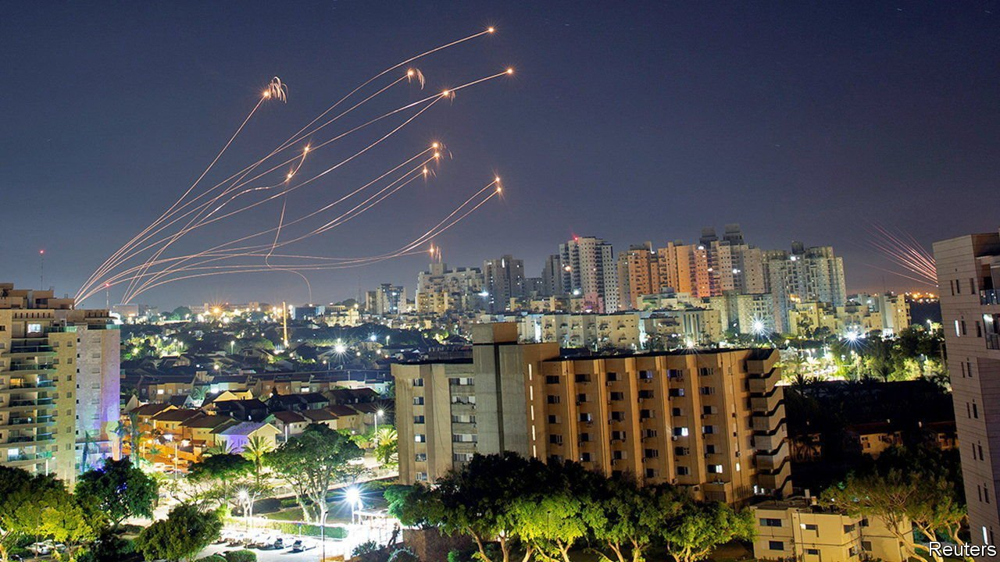

###### Autonomous weapons

# The fog of war may confound weapons that think for themselves 

##### Some states want a ban. But would it be respected? 

 

> May 26th 2021 

THE SKIES of Israel have lit up in recent weeks with the sinuous trails of interceptors colliding with thick volleys of rockets fired from Gaza. These spectacular aerial duels show autonomous weapons at work. For, though each launcher of Iron Dome, Israel’s missile-defence system, is manned by soldiers, only a computer can keep up with the most intense barrages. “Sometimes in large salvos, you can't have men in the loop for every rocket,” says one Israeli soldier. It is largely an algorithm that decides where and when to fire.

Iron Dome is a defensive system that attacks physical objects (the incoming rockets) in an aerial battle-theatre devoid of immediate civilian bystanders, albeit that falling debris could injure or kill someone. But one day similar latitude might be given to offensive weapons which fire at human enemies on the ground, in more crowded places. A new report by the United Nations Institute for Disarmament Research (UNIDIR), a think-tank, explains why that will be far harder than knocking rockets out of the sky.


 rely on artificial intelligence (AI), which in turn relies on data collected from those systems’ surroundings. When these data are good—plentiful, reliable and similar to the data on which the system’s algorithm was trained—AI can excel. But in many circumstances data are incomplete, ambiguous or overwhelming. Consider the difference between radiology, in which algorithms outperform human beings in analysing X-ray images, and self-driving cars, which still struggle to make sense of a cacophonous stream of disparate inputs from the outside world. On the battlefield, that problem is multiplied.

“Conflict environments are harsh, dynamic and adversarial,” says UNIDIR. Dust, smoke and vibration can obscure or damage the cameras, radars and other sensors that capture data in the first place. Even a speck of dust on a sensor might, in a particular light, mislead an algorithm into classifying a civilian object as a military one, says Arthur Holland Michel, the report’s author. Moreover, enemies constantly attempt to fool those sensors through camouflage, concealment and trickery. Pedestrians have no reason to bamboozle self-driving cars, whereas soldiers work hard to blend into foliage. And a mixture of civilian and military objects—evident on the ground in Gaza in recent weeks—could produce a flood of confusing data.

The biggest problem is that algorithms trained on limited data samples would encounter a much wider range of inputs in a war zone. In the same way that recognition software trained largely on white faces struggles to recognise black ones, an autonomous weapon fed with examples of Russian military uniforms will be less reliable against Chinese ones. “AI systems tend to be very brittle against anything that wasn’t covered in their development or testing,” says Mr Holland Michel. An autonomous system effective against one country might be unusable against a foe with superior camouflage, for instance.

Despite these limitations, the technology is already trickling onto the battlefield. In its war with Armenia last year,  Israeli-made loitering munitions theoretically capable of choosing their own targets. Ziyan, a Chinese company, boasts that its Blowfish A3, a gun-toting helicopter drone, “autonomously performs...complex combat missions” including “targeted precision strikes”. The International Committee of the Red Cross (ICRC) says that many of today’s remote-controlled weapons could be turned into autonomous ones with little more than a software upgrade or a change of doctrine.

The limits of autonomy

On May 12th the ICRC published a new and nuanced position on the matter, recommending new rules to regulate autonomous weapons, including a prohibition on those that are “unpredictable”, and also a blanket ban on any such weapon that has human beings as its targets. These things will be debated in December at the five-yearly review conference of the UN Convention on Certain Conventional Weapons, originally established in 1980 to ban landmines and other “inhumane” arms. Government experts will meet thrice over the summer and autumn, under UN auspices, to lay the groundwork. “There is momentum now towards a decision,” says Neil Davison, a scientific and policy adviser at the ICRC. Even among states who oppose new rules, he says, there is greater discussion of the limits that might need to be placed on autonomous weapons.

Yet powerful states remain wary of ceding an advantage to rivals. In March a National Security Commission on Artificial Intelligence established by America’s Congress predicted that autonomous weapons would eventually be “capable of levels of performance, speed and discrimination that exceed human capabilities”. A worldwide prohibition on their development and use would be “neither feasible nor currently in the interests of the United States,” it concluded—in part, it argued, because Russia and China would probably cheat. ■

A version of this article was published online on May 26th, 2021

