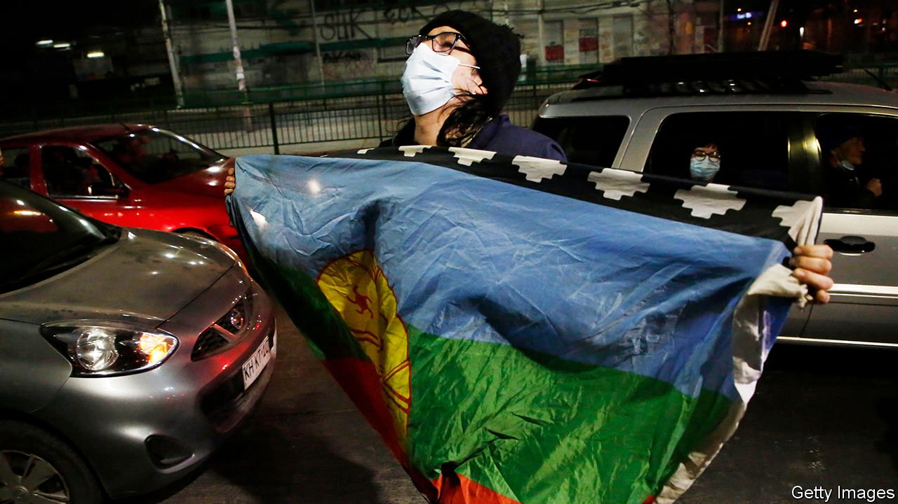

###### New faces galore

# An electoral surprise in Chile may produce a left-wing constitution 

##### Anger about inequality drove voters to pick independents for a constitutional convention 

 

> May 29th 2021 

IN CHILE THE covid-19 pandemic has had many victims, but for a while the government was not among them. In late 2019 and early 2020 the country was rocked by protests in which 30 people died. It seemed likely that the unrest would topple the centre-right government of President Sebastián Piñera. But he held on by agreeing to draft a new constitution to replace the one introduced in 1980 by Augusto Pinochet, a military dictator who ruled Chile from 1973 to 1990. Mr Piñera was helped by the pandemic, which took people off the streets and caused the protests to fizzle.

On May 15th and 16th, however, Chileans used the ballot box rather than the street to express their rage. Independent candidates (some, confusingly, affiliated to party lists) grabbed 88 of the 155 seats in the convention to draft a new constitution. With the seats reserved for indigenous people, roughly 68% of participants will be independent, more than the two-thirds majority needed to approve the wording of the new constitution. Mr Piñera’s coalition failed to win the third of seats it expected, depriving it of a veto.


Corruption scandals and anger about inequality caused the landslide. “People can’t stand it any more,” says Cristina Dorador, a biologist elected as an independent for Antofagasta region, the country’s mining heartland. “People wouldn’t talk to us about our campaign until we said we were independents.”

For decades, Chileans benefited from a strong economy and falling rates of poverty, thanks to free-market policies. But many felt left out. Pensions and health care are most generous for those with good jobs. Those in informal work, 27% of the labour force, are much worse-off. Other public services are often mediocre.

Only 2% of Chileans trust political parties, according to a recent poll by the Centre for Public Studies, a think-tank in Santiago, the capital. The members of the newly elected convention include midwives, a mechanic, teachers and students. By law, half are women—unlike Congress and the top ranks of the main political parties, which are dominated by men. “The convention is a much better reflection of Chile than Congress,” says Juan Pablo Luna, a political scientist at the Catholic University.

It is also more left-wing. Many of the independents’ manifestos called for a constitution that requires a more generous welfare state and limits the private-sector’s role in providing public services. Most Chileans seem to want more protection for the environment, too. This may lead to curbs on mining such things as copper and lithium. Chile’s private, inherited water rights are widely disliked as well. Whether the new constitution will create more entitlements than taxpayers can pay for remains to be seen.

Though the independents have a super-majority, they are not united. Those elected on party lists may toe party lines. A plebiscite to approve the new constitution is expected to be held in the second half of next year. Chileans will be obliged to vote.

Yet even if the convention founders, Chilean politics will have been shaken up. Presidential and parliamentary elections are due in November. Political parties will include more independents in their lists of candidates. Some independents may even form their own political parties in order to run. Everything is up for grabs. ■

