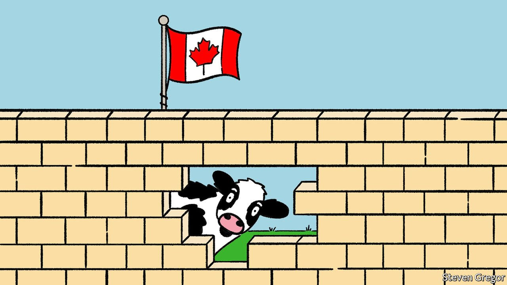

###### Udder absurdity

# Canadians are in a flutter about butter 

##### Protectionism stops the spread of dairy goodness 

 

> May 29th 2021 

IT WAS AT the beginning of Canada’s lockdown last spring that Julie van Rosendaal, a pastry chef in Calgary in Alberta, first noticed that her room-temperature butter was not as soft as it should be. At first she thought she was imagining it. But she tracked her observations across the year. In December she reached a conclusion. The consistency and texture of Canadian butter had changed. In February she aired her findings on social media.

Ms van Rosendaal believes that butter has become harder because farmers are feeding more palm-oil products to cows. (Palmitic acid can help them produce more milk.) Thousands of Canadians share her suspicion. The media have dubbed it “buttergate”. The Dairy Farmers of Canada, an industry group, at first tried to palm off critics with denials. But under pressure it switched to grovelling. It called an expert panel to assess the claims, and urged farmers not to use palm products. It is not just bakers who are cheesed off. The British Columbia Milk Marketing Board has also noted complaints from coffee shops about “non-foaming milk”.


Lockdowns are partly to blame. Like people everywhere, Canadians trapped at home by covid-19 have taken to baking. Demand for butter soared by 12% last year, according to the farmers. However in Canada the dairy industry is protected by high tariffs, so imports could not fill the shortfall. Farmers also must stick to a “supply management” policy, meaning they cannot simply buy more cows when demand soars. Somehow, they had to make each cow produce more milk. Hence the palm oil.

With lockdowns now easing, Canadians may start baking less. But the farmers have other problems. In the US-Mexico-Canada Agreement, a trade deal which took effect last July, Canada agreed to reduce certain barriers to American exports of dairy products. In December American dairy farmers filed an enforcement action, claiming that quotas remain a problem. If Canadians can buy more American dairy products, they will surely be better off. But as ever with trade deals, the benefits are thinly spread across millions of households. The losers are few, but require endless buttering up.

