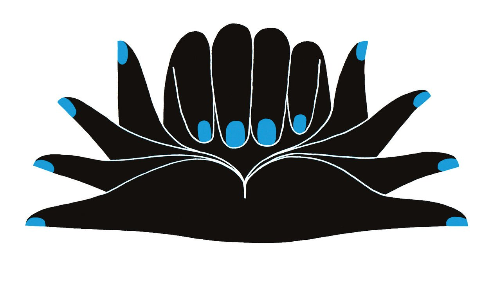

###### Noise pollution

# Humans are imperfect, inconsistent decision-makers 

##### In their new book, Daniel Kahneman, Olivier Sibony and Cass Sunstein offer strategies for improvement 

 

> Jun 5th 2021 

Noise. By Daniel Kahneman, Olivier Sibony and Cass Sunstein. Little, Brown; 464 pages; $32. William Collins; £25

NOISE IS UNWANTED variation in judgments that should be identical, which leads to inaccurate and unfair decisions. It is all around people all the time, though individuals fail to notice it. To get a sense of how it happens, perform a “noise audit” right now: open your phone’s stopwatch app and practice counting ten seconds. Now, with your eyes closed, count several times, hitting the lap button each time you believe ten seconds have elapsed.


Your answers weren’t perfect but noisy: slightly above or below the ten-second mark. And if they were consistently wrong in one direction, then there is bias too, which is a different form of error (you counted too quickly or slowly).

The problem of bias in decisions is well known and there are strategies that people can adopt to minimise it. For example, customers may be “anchored” on the first price they are presented with in a transaction, so they learn to consciously discard it before they negotiate. But noise is different precisely because it is less apparent. “It becomes visible only when we think statistically about an ensemble of similar judgments. Indeed, it then becomes hard to miss,” Daniel Kahneman, Olivier Sibony and Cass Sunstein write in their new book.

The divergences are stark. In a courthouse in Miami, one judge would grant refugees asylum in 88% of cases while another would do so 5% of the time. A large study of radiologists found that the false-positive rate ranged from 1% to 64%, meaning that two-thirds of the time, a radiologist said a mammogram showed cancer when it was not cancerous. Doctors are more likely to prescribe opioids at the end of a long day. Judges made harsher decisions leading up to their breaks and on hotter days. An insurance firm’s underwriters assessed premiums that varied by 55%, a difference that was five times greater than its management had imagined.

Not only do individuals differ with their peers, they often fail to agree with themselves. Wine experts tasting the same samples for a second time scored fewer than one in five identically. Four out of five fingerprint examiners altered their original identification decision when presented with contextual information that should not have been a factor in matching prints. In one medical study, assessing angiograms, physicians disagreed with their earlier judgments more than half the time.

Noise is sometimes good. When different investors size up a trade or book reviewers reach different assessments, the diversity of opinion is beneficial. But more commonly it creates problems. In law noise means unfairness. In business it can be costly.

Yet it can be reduced. The authors’ remedies include a “noise audit” to measure the degree of disagreement on the same cases, to quantify the variation that is usually invisible. They also call for better “decision hygiene” such as designating an observer for group decisions, to prevent common biases and noisy judgments. For example, they can ensure that participants in a team reach independent assessments before coming together as a group to aggregate their decisions.

Another solution is to dispense with people altogether. Statistical models, pre-determined rules and algorithms in many cases are more accurate than human judgment. The authors welcome artificial intelligence to make many decisions in society, but acknowledge that people are predisposed to resisting their answers, for lack of the personal, emotional quality in decision-making—even if it leads to inferior, or at least variable, decisions.

The trio speaks with credibility. Mr Kahneman is a Nobel laureate whose ideas on bias in human reasoning have reshaped economics and society; Mr Sunstein is a polymath scholar at Harvard and occasional government official putting his ideas into policy; Mr Sibony is a former McKinsey partner who teaches decision science at a French business school. Yet despite the book’s title, the authors struggled to extract the signal from the noise, so to speak, needing some 400 pages to make their case. A tighter argument would have enhanced the ideas they present. ■

