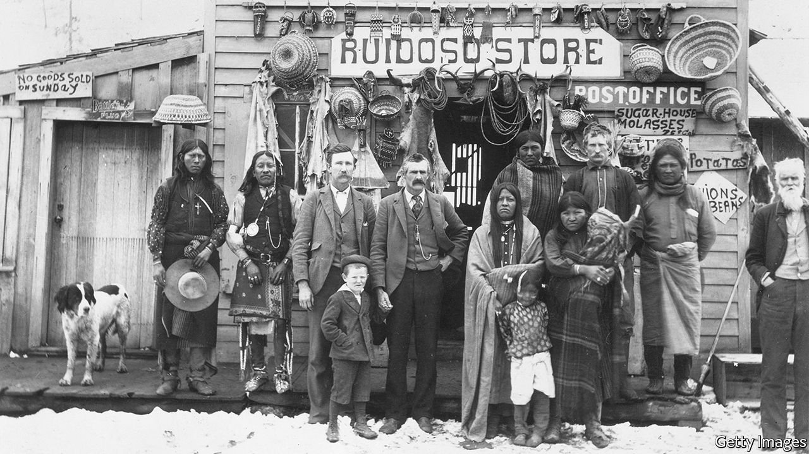

###### How the West was won

# The postal service enabled America’s westward expansion 

##### “Paper Trails” offers a timely reminder that the post has always been political 

 

> Jun 5th 2021 

Paper Trails. By Cameron Blevins. Oxford University Press; 248 pages; $34.95 and £22.99

BEFORE COLORADO was a territory, let alone a state, it had post offices. The first opened in 1859 in Auraria, a mining settlement founded by migrants from the South searching for gold. Life could be unpredictable west of the Mississippi. Gold failed to materialise, drought ruined farmers and settlers clashed with Native Americans. Soon Auraria merged with a rival company town—Denver City. Today a sprawling university campus stands on its location. Amid all the upheaval, argues Cameron Blevins, a historian at the University of Colorado-Denver, one feature remained constant: the postal service.


Rather than focusing on ideas that were spread by the post, in “Paper Trails” Mr Blevins considers the infrastructure of the agency itself. Using a database compiled by Richard Helbock, a postal historian, he charts the rapid opening and closure of post offices in the second half of the 19th century—thereby tracing America’s westward expansion.

The maps in the book are telling. In 1864 there were few branches on land controlled by Native Americans, which still accounted for most of the West. Over the next 25 years, as indigenous people were killed or forced onto government reservations, the dots representing post offices multiply exponentially (see map). Using these as a proxy for settlement, Mr Blevins regards colonisation of the West as a result of big government rather than rugged individualism. As federal subsidies and land grants coaxed easterners into the mountains, deserts and high plains of Indian Country, the post kept them connected.

 


In the mid-19th century the Post Office Department (as the United States Postal Service was formerly known) was far from a centralised bureaucracy. To keep up with migration patterns, postal services were grafted onto existing businesses. The federal government commissioned private stagecoaches to carry the mail, and granted short-term contracts to local businessmen (and sometimes women) to act as town postmasters. These flexible partnerships enabled the mail quickly to follow migrants, helping knit together far-flung parts of a vast country.

“Paper Trails” is a reminder that, long before the recent wrangles over postal voting, the post was political. Until 1971 the postal service was a cabinet-level department in the executive branch, and jobs within it were doled out as patronage. Of the 80,000 appointments submitted to the Senate for approval between 1829 and 1917, nearly 62,000 were for post-office jobs. The facilities themselves were often turned into de facto campaign headquarters where partisans wooed voters. Congressmen were frequently caught up in rows over who should be postmasters in their districts. A friend of Jules Sandoz, a Nebraska postmaster, voiced his exasperation with postal politicking: “Why did you have to spend your whole life fighting over stupid things like post offices, Jules?”

For all that, the existence of the 19th-century postal service was not itself divisive. Democrats and Republicans alike stuffed the department with supporters; to please constituents, congressmen from both parties sought more routes in their districts. Today the post remains popular: last year 91% of Americans viewed the agency favourably. Yet Donald Trump and Republican legislators were contemptuous of it, and of postal voting in particular.

One of the most striking aspects of “Paper Trails” isn’t in the book. Mr Blevins is a digital historian, meaning he uses data science to analyse historical trends. He built an accompanying website replete with interactive maps to show readers how, within a generation, the postal service helped colonise a continent. These online dispatches beautifully illustrate the formative power of snail mail. ■

