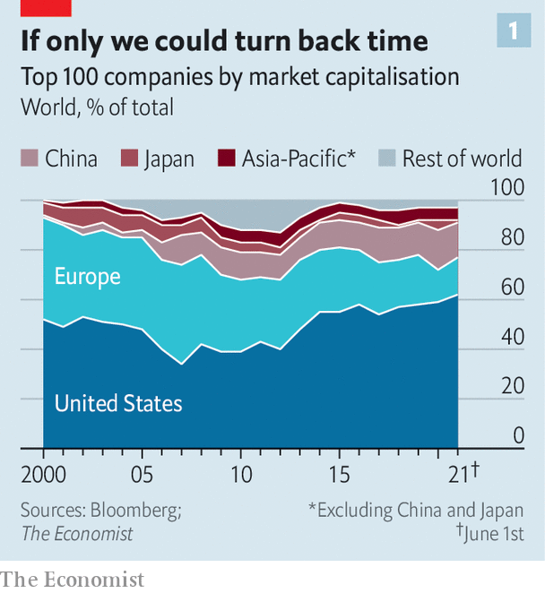
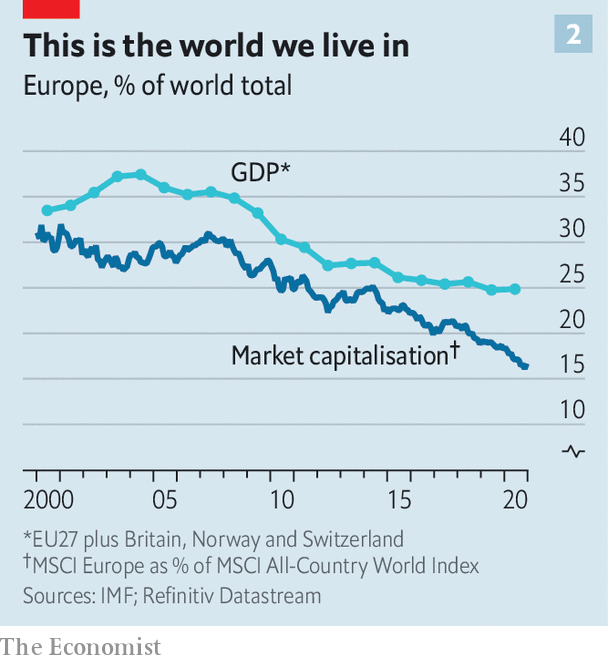
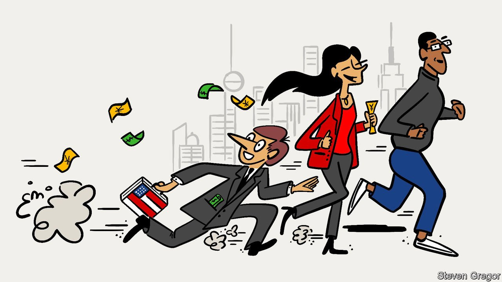

###### The land that ambition forgot

# Europe is now a corporate also-ran. Can it recover its footing? 

##### American and Chinese businesses have left their European counterparts in the dust 

 

> Jun 5th 2021 

IN 1984 A besuited 20-something American executive on a visit to France offered Europeans a few tips for corporate success. Entrepreneurs needed to be given a second chance if they failed and government bureaucrats made for lousy investors, he told a television interviewer. His advice was sage. But European companies ruled the global corporate roost alongside those of America and, occasionally, Japan. Why should they take advice from this uppity Californian newcomer?

Nearly four decades later the company founded by that young upstart, Steve Jobs, is worth more than the 30 firms in the German blue-chip DAX index combined. Its value is not far off that of all 40 companies in France’s CAC index. Apple’s success has been notable, but it is the decline of corporate Europe that is truly striking. At the start of the 21st century 41 of the world’s 100 most valuable companies were based in Europe (including Britain and Switzerland but excluding Russia and Turkey). Today only 15 are (see chart 1).


When it comes to business, Europe used to pack a punch. In recent decades companies such as Nokia, Nestlé or BP have been among the world’s ten biggest firms by market capitalisation. Now only on occasion does Europe have a firm in the top 20 globally. In 2000 nearly a third of the combined value of the world’s 1,000 biggest listed firms was in Europe, and a quarter of their profits. In just 20 years those figures have fallen by almost half. Europe is a place for companies such as Amazon and TikTok to find customers, not a base for local firms to conquer the world.

 


Some of Europe's lost stature is down to the rise of China. But American firms have reinforced their position at the vanguard of global business. European ones, alongside those from Japan, have not. In 2000 Europe had a share of corporate wealth commensurate with its roughly one-third of the world economy. That is no longer true (see chart 2).

 


Some Europeans might ask: et alors? Many on the continent are ambivalent about big business, preferring a dense collection of midsized firms, such as the German Mittelstand, to corporate goliaths. But if it continues, the waning of Europe’s business will bring consequences. Big firms invest in innovation, which boosts economic growth. Left to regulate only foreign groups, Europe’s ability to shape global business norms—on privacy, say, or the uses of artificial intelligence—will look weak. European policymakers’ cries for “strategic autonomy” will come to nothing without corporate backing.

Plenty of European companies still make consumers swoon. LVMH of France flogs Louis Vuitton handbags from Beijing to Buenos Aires; German cars and Swiss pharmaceuticals are sought-after around the world; and homes are stocked with products made by Unilever, an Anglo-Dutch giant and IKEA, a Swedish forest-feller. But look at who dominates the global corporate economy, and Europe’s geopolitical rivals now prevail.

When it comes to big business, America, the spiritual home of free-market capitalism, has been on top for decades. It is the ascent of Asia that has rejigged the global corporate landscape. China’s rapid economic growth has spawned corporate titans to match. Over 160 of the world’s 1,000 most valuable firms are now Chinese, a fourfold rise in two decades.

Ne me quitte pas

Assuming that Chinese firms would have gate-crashed the Fortune Global 500, which ranks the world’s biggest companies by revenue, in relative terms it was inevitable that some Western firms would be nudged out of the global elite. That left European firms vying with American ones to stay dominant. It is in this tussle that Europe has fallen by the wayside. In 2000 the 100 biggest firms in Europe were worth $4.6trn, rising to $8.9trn now. America’s equivalent companies started at $7.4trn but are now worth $26trn. (China’s top 100 firms are worth $8.8trn.)

How did European companies fall behind their American competitors? The first reason is that its firms seem to have been outmanaged. Look at firms competing in the same sector over the past 20 years, and incumbent American companies more often than not went on to churn out bigger profits and are better positioned for future success than their European counterparts.

There are many exceptions to this rule: Siemens of Germany has outshone its industrial rival General Electric, for example, and Airbus, based in France, has had fewer problems of late putting jets together than Boeing, its American foe. But by and large it has been better to bet on Nike of America over Adidas of Germany; JPMorgan Chase in New York over Credit Suisse in Zurich, or America’s Walmart over France’s Carrefour. Their advantage in terms of profits and sales growth is often small, but compounds over time.

A second reason Europe fell behind in recent decades is that its biggest firms are in the wrong industries. The sectors European firms dominated 20 years ago, such as insurance or telecoms, have grown at a glacial pace. Even if European firms did well, as many did, they mattered less as the world moved on. America, by contrast, had already made significant inroads into software and e-commerce, industries that would soon redefine the global economy and generate trillion-dollar valuations.

The third, and most striking, reason Europe has fallen behind is the lack of newly created firms in its blue-chip indices. Many of the biggest companies in America, such as Amazon, Netflix, Tesla or Facebook, are young enough to be run by their founders. In Europe old names prevail.

Of the world’s 142 listed firms worth over $100bn, 43 were set up from scratch in the past half-century, 27 in America and ten in China. Only one was in Europe: SAP, a German software group founded in 1972. Half of Europe’s richest ten billionaires inherited fortunes spawned long ago; in America nine of the top ten are wealthy solely because of companies they founded.

Many—but by no means all—of the American newcomers are in tech. That has led policymakers and business leaders in Europe to make light of the problem. The failure by France or Germany to build big new firms is regrettable, they concede, but America has merely stolen a march in the consumer-internet realm. Silicon Valley was the right place to be at the right time to build this new generation of firms: a felicitous nexus of universities and research institutes, venture capital and America’s consumer-first reflexes. When that bubble bursts, new business models will emerge that Europe will be ready to seize.

It’s more fun to compute

In fact, the absence of European tech giants is symptomatic of an entrepreneurial deficiency that transcends the world of apps and clicks. America’s nous at creating new companies—and Europe’s failure to match it—extends beyond Silicon Valley, argues Thomas Philippon of New York University.

A global chain of cafés might have been expected to hail from Italy, home of the espresso and barista. Instead Starbucks has overrun the world, despite America’s reputation for insipid coffee. A green car giant should have emerged from Europe, which has a proud engineering tradition and is at the forefront of environmental regulation. Yet it is an American newcomer, , that is now worth roughly as much as every other American and European carmaker combined. Why could Britain’s or Switzerland’s storied financiers not have created an asset-management giant to dominate the markets? Today it is BlackRock, set up in 1988, which manages $9trn of global investments from New York.

 


Each of these has found success in its own way. But a combination of factors helped propel them to global corporate superstardom. The ability to raise ample capital, from private investors to large pension funds, is a recurring theme in America that is all too often missing in Europe. So too is the belief that a company that develops a better product will, eventually, displace incumbents, however powerful.

The balance is unlikely to shift in Europe’s favour any time soon. The pipeline to become the world’s next trillion-dollar company is stuffed with firms from America and China, not Britain or Spain. According to PitchBook, a data provider, in the past decade venture capitalists have backed 661 companies that went on to be worth over $1bn. Only 78 of these “unicorns” are in Europe, worth 8% of the 661 firms’ over-$2.5trn total.

Disentangling the cause of Europe’s corporate malaise from its consequences is tricky. One reason frequently cited is the economy: how could European companies be expected to do well when the European economy fared so poorly since 2000? And indeed its share of global GDP has trended down (see chart 3) as emerging markets have grown faster. But that offers only a partial explanation.

 


In the past 20 years, in absolute terms Europe has added as much additional economic output as America—roughly $10trn each. (China added $14trn by growing at a faster rate but from a smaller base.) That is partly because of Europe’s larger population. European GDP per head is about two-thirds that of America. The figure has not fallen in the past 20 years thanks mostly to poorer eastern Europeans getting closer to Western income levels.

Looking at European GDP as a whole assumes firms there have access to the entire economic zone. Too often they do not. In theory the EU offers its firms and citizens a “single market” stretching across much of the continent (though no longer to Britain, one of the biggest economies). In practice it is a part-built edifice. It is still fiddly for a bank in Portugal to offer services in Finland—much harder than for a Californian bank to expand to Texas.

Beyond linguistic and cultural differences, legal complexities often get in the way. “When [European] companies think of their home market, they usually think of their home country, not of Europe,” says Carl-Henric Svanberg, chairman of Volvo, a Swedish lorry maker, and of the European Round Table for Industry, which represents large companies.

These internal barriers mean Europe has many smaller firms operating at national, not continental, scale. Each country tends to have its own banks, utilities, airlines and supermarkets. (Europe has over 100 mobile operators, compared with a handful in America or China.) These lack the economies of scale and opportunities to grow quickly enjoyed by firms plying the American or Chinese markets.

In the absence of easy opportunities at home, European firms have expanded overseas more zealously than their American counterparts. Firms in richer countries in Europe, the source of most of its multinationals, now generate over half their income elsewhere, up from just over a quarter in 1997, according to Morgan Stanley, a bank. That includes around a third from poor countries; large German firms now sell more to emerging markets than they do domestically. American groups generate over 70% of their income locally. That can make managing European companies a case of constantly putting out fires in far-flung subsidiaries.

At home, European companies complain that they face a less favourable business environment. Europe’s brand of capitalism is often softened by a stronger role for unions. That has its allure, as workers toil shorter hours and enjoy greater job security. It also means higher labour costs. The political protection afforded businesses—from hostile takeovers, say, which are rare in mainland Europe—is one reason their financial results are underwhelming.

Europe’s smaller firms now find themselves competing against global behemoths with inbuilt advantages. Large firms can afford to buy and try new technology, borrow at cheaper rates and absorb fixed costs more efficiently. They tend to spend relatively more on research and development. The dearth of big companies helps explain why European spending on research, at 2.1% of GDP, is below the average of the OECD, a group of mostly rich nations.

Que reste-t-il de nos amours?

Even as Europe has fallen out of business league tables, it has continued to play a role as a global regulator. Sometimes that has seemed its main contribution to the global business landscape: look at rules on privacy or combating climate change. Because standards set by the European Commission are often the most stringent in the world, and businesses want to build a single set of products for all markets globally, they often end up applying across the world. But EU rulemaking that applies in effect only to foreign firms—as does much of the tech regulation devised in Brussels—has increasingly been attacked as covert protectionism. Currently a rulemaker, Europe may risk losing that position.

European policymakers are well aware of Europe’s relative decline. They point to mitigating factors. Some corporate giants in America profit from areas which in Europe are the responsibility of the state—running hospitals or railways. Others such as airlines and mobile carriers are monopolies that bilk customers. And can profits or market capitalisation truly reflect the value of a company to society?

There has also been a return to European dirigiste reflexes. If the private sector has proved unable to grow firms that are a match for global titans, perhaps politicians can help? More overt intervention by the public sector in the economy—both helping European firms and stymieing their competitors—was increasing before covid-19. The pandemic has turbocharged it.

Under the banner of promoting Europe’s “strategic autonomy”, rules preventing takeovers of some European firms by foreign rivals have been bolstered. Proposals are being developed to hamper foreign companies backed by non-EU governments who wish to do business in Europe—a measure plainly aimed at China. Talk has grown of a “carbon border tax” to ensure European firms are not at a disadvantage when competing against challengers from places with less ambitious climate-protection policies.

France and Germany are among those who have demanded the EU stop blocking favoured mergers of big European firms into pan-continental champions, despite the scepticism of antitrust regulators. Politicians are willing to shovel public money into industry in the hope of guiding its priorities—the idea of “picking winners”, popular in the 1970s, has made a comeback. Myriad state-backed investments are happening in green technologies. France has revived the position of “high commissioner for planning”. Across the continent public funds are being invested in everything from startups to large listed firms.

Hast du etwas Zeit für mich?

Europe’s boosters see plenty of corporate life left there. From utilities to power majors, firms in Europe have gone further than others in greening themselves. Those in other parts of the world will have to follow suit at some point. European universities remain world-class. But Europe also has unique challenges. One is demography: the old continent is living up to its name. There are more over-65s than under-15s nowadays and populists across the EU make it hard to boost immigration.

That leaves few levers to pull to help Europe’s firms compete globally. The most obvious, deepening the single market, has fallen off the political agenda. Helping law firms and software designers sell across the continent seamlessly lacks the pizzazz of picking industrial winners. But stiffening competition in Europe is key to creating firms fit for corporate glory. The path to global business begins at home. ■

