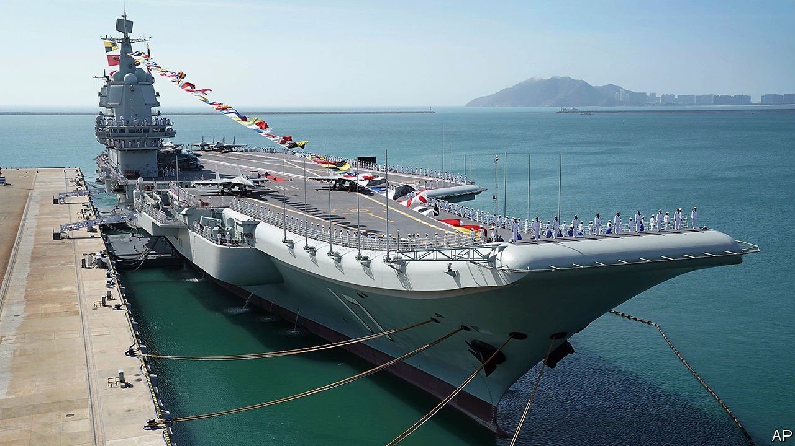

###### The best-laid battle plans

# America both helps and hinders China’s military-industrial complex 

##### Domestic demand for weapons is up. But American sanctions may hobble Chinese armsmakers’ tech ambitions 

 

> Jun 5th 2021 

JIANGHANG AIRCRAFT EQUIPMENT has struggled to tantalise investors with the fuel systems and detachable petrol tanks it builds for Chinese warplanes. The company, controlled by Aviation Industry Corporation of China (AVIC), the country’s biggest aerospace-and-defence conglomerate, had witnessed its share price slump by 50% since it went public in Shanghai last year. But in the first three months of the year demand for its wares has soared. On May 28th Jianghang said that net profit for the period nearly doubled, year on year. Trading in its shares subsequently had to be halted after their price rose by 10%, the maximum permitted one-day swing.

Jianghang is just one of dozens of military-linked companies on a high. Most are not publicly traded and disclose little financial information. State-owned builders of navy vessels have flotillas of listed subsidiaries. AVIC, the main group behind China’s fighter-jet programme with more than 1trn yuan ($157bn) in total assets, has 24 publicly traded divisions. To get a sense of the industry analysts track dozens of small military stocks. Citic Securities, an investment bank, covers 58. Everbright, a state-owned broker, follows 115.


The total weapons sales of China’s four biggest firms that make them—of which AVIC is the largest—have been flat at just over $50bn since at least 2015, according to the Stockholm International Peace Research Institute (SIPRI), a think-tank, even as those of foreign rivals have grown. But if the listed divisions are a guide, things may be looking up for the sector.

The combined operating income of firms followed by Everbright rose by 11% last year, to 475bn yuan. Citic reckons that net profits for the industry’s listed contingent grew by about 50% in 2020. As China’s economy boomed in the first quarter, especially compared with last year’s harsh covid-19 lockdowns, only agribusiness and miners of non-ferrous metals notched up faster year-on-year revenue growth than China’s military-industrial complex.

The main reason for this armsmaking bonanza is China’s increasingly chilly relationship with America. One note to investors from Huaxi Securities, a broker, was embellished with an image of two fists, draped in opposing American and Chinese flags, flying towards each other. America’s attempts to “lock China out of technological advancement”, Huaxi analysts say, is spurring new growth. Citic talks of “a period of volatility not experienced in 100 years” and predicts “a rare period of rapid development” in China’s military-industrial enterprise as a result. SIPRI noted in December that Chinese arms groups were benefiting from a programme aimed at modernising its armed forces.

The domestic market is becoming increasingly important for Chinese weapons companies. According to SIPRI, China’s arms exports declined by 8% between 2016 and 2020. At the same time, those of America, France and Germany grew. Chinese drones may be cheaper than Western ones but they are also seen as less capable.

Fusion firepower

In an effort to change that state of affairs, and bolster domestic armsmakers in the process, Chinese officials talk up “military-civilian fusion”. This long-standing project aims to bring cutting-edge civilian technologies such as artificial intelligence and semiconductors into military supply chains, in keeping with the Communist Party slogan that “civilians and troops are members of the same household.” The idea’s manifestations include Hikvision, a state-owned maker of surveillance kit, which made 2.2bn yuan in net profit in the first quarter, up by 45% from a year earlier.

Ironic, then, that the same Sino-American tensions that are boosting Chinese armsmakers may end up undermining this strategy. The idea of civilian-military fusion spooked Donald Trump’s administration and prompted it to bar American firms from supplying companies like Huawei, a giant maker of telecoms gear that is perceived as being close to the People’s Liberation Army (PLA). The result has been disastrous for Huawei. Its revenues fell for the second consecutive quarter earlier this year. It is struggling to procure chips and more Western countries are shunning its 5G mobile networks.

Blacklisting by America may also deprive some defence-adjacent Chinese firms of a source of capital. Foreign ownership of military-linked stocks was thought to be low. It may soon be non-existent. Since January American investors have been barred from owning shares in China Spacesat, a state-owned Fortune 500 firm that helps run the country’s space programme. The same month Fidelity Investments, an American asset manager, confirmed to its clients that it would sell some securities as a result of sanctions.

Mr Trump’s successor, Joe Biden, shows little intention of easing the restrictions. On June 3rd he tightened some of them once again on firms with ties to surveillance and defence groups. A recent paper from the Centre for a New American Security, a think-tank, noted that the Chinese leadership’s continued obsession with military-civil fusion reflects concerns that reforms to bring it about “have not progressed rapidly enough”. American military strategists would love it if China’s efforts to speed things along had the opposite effect. ■

: This article has been updated since publication. 

