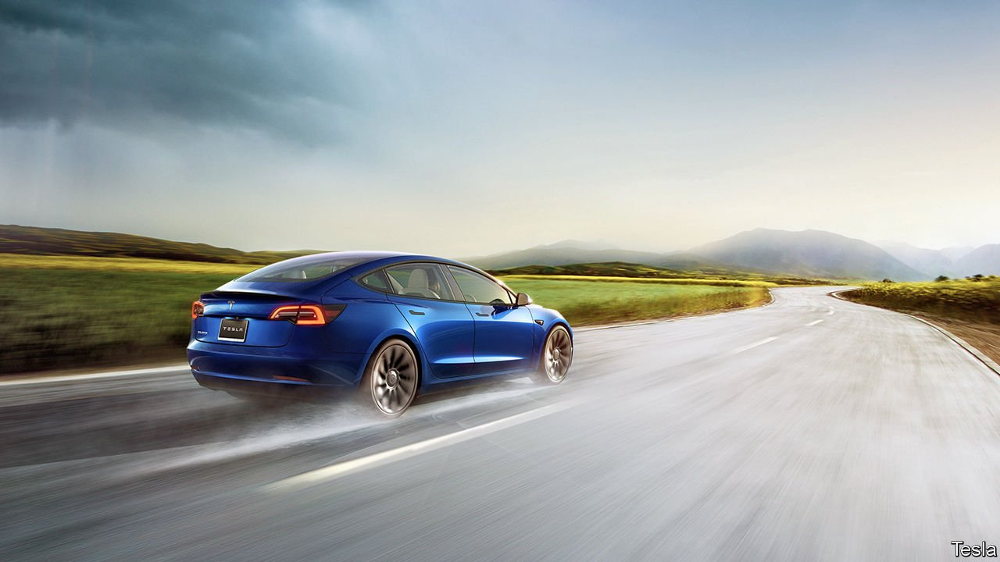
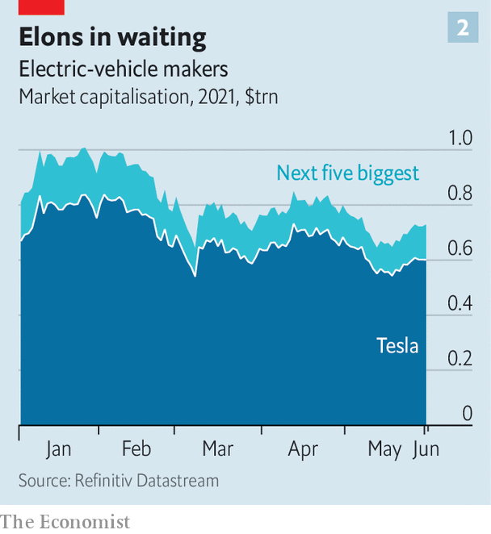

###### Electric shock of the new

# How to be the next Tesla 

##### A traffic jam of upstarts is vying to follow in Elon Musk’s tyre tracks. Does any stand a chance? 

 

> Jun 3rd 2021 

CARMAKING IS LITTERED with defunct marques, from Diatto and Hupmobile to Mercer and Whitlock. America spawned around 250 firms by the 1910s. As the 20th century wound to a close it had three that mattered: Ford, General Motors (GM) and Chrysler. In the past few years an electric version of the early American automobile boom is unfolding on a global scale.

Chinese startups like Aiways, Li Auto, Nio, WM Motor and Xpeng are already making electric vehicles (EVs) in their thousands. In Europe, Croatia’s Rimac and Spain’s Hispano Suiza are building hypercars, while Britain’s Arrival is manufacturing electric vans. American companies such as Canoo, Fisker, Lordstown, Lucid and Rivian hope to start full-scale production soon. Foxconn, a Taiwanese contract manufacturer better known for making Apple’s iPhones, may soon also be assembling  for others. As for Apple, its next gadget could be an iCar.


Most of the insurgents are loss-making. Some have yet to earn any revenue. But all see a chance to grab a slice of an industry that has turned decisively in the direction of battery power (see chart 1). Everyone wants to be the next , which has successfully used batteries and clever software to take on the internal combustion engine. In the process Elon Musk’s firm has become the world’s most valuable car company, worth more than the next three biggest carmakers combined.

 


Tesla’s $600bn valuation serves as a “torch at the front”, says Engelbert Wimmer of e&amp;Co, a consultancy. Now investors are looking for the next beacon. Nio listed in New York in 2018. Xpeng and Li followed suit last year. All are worth as much or more than many established carmakers. Arrival and several of the American firms have used mergers with special-purpose acquisition companies, or s, as a shortcut to public markets—and to valuations in the billions. Patrick von Herz of Lincoln International, an investment bank, calls it a “global feeding frenzy”. He Xiaopeng, Xpeng’s boss, has said he expects the market to swell to 300 or so firms before settling at around ten. How do the challengers avoid the fate of the forgotten?

The basic blueprint for survival involves three elements. The upstarts must first find a starting niche from which they can expand. They then need actually to produce cars at scale. Finally, they have to create a sales-and-distribution network. Most will fail at one or more of these steps. Ironically, those with the best odds of emulating Tesla’s success may be the ones that look least like it.

Start with picking your battlefield. That could be geographic. Philippe Houchois of Jefferies, another investment bank, reckons that the next Tesla will come from China. Consumers hungry for new tech and a government keen to support electrification have given China’s insurgents a head-start. Nio, the largest of the lot, made 44,000 cars in 2020. It is valued at $69bn. The market capitalisations of Xpeng and Li, respectively $28bn and $22bn, are also juicy. Rich access to capital helps fund expansion at home and abroad. Xpeng has already started selling cars in Norway, home to Europe’s most enthusiastic EV buyers. Nio is about to join it.

Even more important than geography is choosing the right market segment. Tesla was not the first to make EVs but it was the first to make big and pricey premium ones where the high cost of the battery could be absorbed. Many new firms are also aiming at premium SUVs and saloons where profit margins are fattest. But competition is hotting up from established carmakers such as Volkswagen’s Audi and Porsche brands, as well as Mercedes. In April Geely, a Chinese firm with global ambitions, launched a premium electric marque called Zeekr. The mass market, meanwhile, is likewise busy, with GM and Ford the latest to announce a big electric push.

Other segments may therefore be a better bet. One is light commercial vehicles, demand for which has been boosted by the . Alastair Hayfield of Interact Analysis, a consultancy, sees “no Tesla yet” for delivery vans. Carmakers are merely popping EV power trains into existing products—an unhappy compromise that affects performance. That leaves opportunities for firms like Arrival and Rivian. Another potentially lucrative niche is the hypercar. Wealthy petrol-heads seem willing to fork out $2m or so to add to their stables. Rimac and Pininfarina of Italy also see these cars as test-beds for EV technology to sell to other car firms. China’s Silk EV considers its Hongqi S9 hybrid as a gateway to the mass market.

Identifying the right segment may not be enough, however. Brian Gu, president of Xpeng, admits that the new firms must offer something truly different. For years the industry’s technologically stodgier incumbents “didn’t realise it was a tech race”, says Peter Rawlinson, who runs Lucid. As cars become more like personal electronic devices, being tech firms first and carmakers second may confer an advantage. Foxconn’s boss, Young Liu, has argued that the driving experience of the future will be “software-driven and software-defined”.

Novel intellectual property is a “good visiting card” for investors, says Pedro Pacheco of Gartner, a consultancy. But it is not enough to stick big touchscreens onto a standard electric power train, as many of the Chinese Tesla copycats are doing. The over-the-air software updates, proprietary charging networks and online direct sales pioneered by the American firm are now seen as table stakes.

So the newcomers are trying to stamp their own technological mark on the industry. Lucid’s techies have extracted range of up to 517 miles (832km) from its batteries. Nio offers a three-minute battery-swap service, to reassure Chinese buyers without access to home charging. Xpeng claims that its voice-activation system is the best in the business. Fisker and Canoo offer subscriptions that give motorists access to car use rather than ownership.

Ultimately, buyers will decide which of these are desirable features and which are gimmicks. But not before the new models are produced and sold. Making a few thousand cars a year is hard enough (though losing money doing so is easy). Actually selling hundreds of thousands at a profit is another matter entirely. “Production hell” nearly sent Tesla under. A lead on flashy software must be backed up with giant presses, paint shops and assembly lines. As such, manufacturing an EV is in many ways not much different to making a petrol car, according to Bernstein, a broker—and no less expensive. A new purpose-built car factory that can churn out 100,000 or so vehicles a year costs at least $1bn.

To get around this problem some of the challengers are instead repurposing existing factories, as Tesla did by acquiring a disused one in Fremont, California, for a song. Rivian has moved into an old Mitsubishi factory in Illinois. Other newcomers are teaming up with the old guard, with experience of maintaining long and complex supply chains. Baidu has entered into a partnership with Geely and Huawei with its domestic rivals, BAIC, Changan and GAC. Fisker and Nio are taking an asset-light route by using contract manufacturers of the sort used by big carmakers to make small runs of cars or those with finicky features such as folding roofs.

Arrival’s approach may be the most innovative. Where Tesla and others are going “giga”, the British firm says “micro”. Commercial vehicles do not require the styling or customisation of passenger cars, so it is eschewing production lines for “cell” assembly of composite panels. This can be done in small industrial units that cost just $40m-50m to buy and retool. These can produce 10,000 vehicles a year close to markets, adding scale with less risk.

The final hurdle is flogging the vehicles to consumers. The new EV-makers are mostly dispensing with traditional dealer networks in favour of Tesla’s model of online sales backed up with shops to show off their wares. That still leaves the challenge of creating a servicing network if anything goes wrong. Such networks, which car buyers have come to expect, can be as expensive and tricky to scale up as manufacturing is. Mr Pacheco of Gartner notes that even Tesla’s is still a work in progress. In America the big three Detroit carmakers have nearly 10,000 dealerships that will service cars; Tesla has around 135.

Many new firms won’t get that far. Several have already suffered setbacks. Dyson, a British firm better known for vacuum-cleaners, sank £500m ($640m) into an EV effort only to conclude in 2019 that it would never make money. The same year Nio teetered on the brink of bankruptcy until the local government in its home city of Hefei bailed it out. A bloodbath awaits China’s myriad smaller EV firms as they run out of ideas and money. Fisker is a reborn version of a firm that went bankrupt in 2013.

Attention, vehicles reversing

As the complicated reality of carmaking sets in, the hype is wearing off among investors (see chart 2). Lordstown’s value has fallen by 65% since peaking in February, after it lowered forecast production for its pickup truck and said it needed fresh funds. Canoo’s shares are worth less than half what they were when it went public in December, owing to growing doubts about its business plan.

 


In short, notes Aakash Arora of BCG, a consultancy, the new firms need to establish brands. So far, he says, only Tesla has done so. It can take years to gain a reputation for reliable products, while capital burns like petrol put to a spark. A new entrant needs a trusted name, deep pockets and a proven ability to come up with clever tech. One company that has all those in spades is Apple. The iPhone-maker has been working on an EV for several years. The latest chatter is that it will have one in production by the middle of the decade. Some of its potential competitors will by then be well on the way to oblivion. ■

A version of this article was published online on June 2nd 2021

