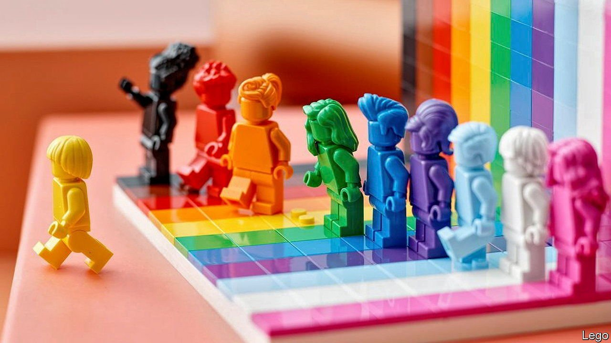

###### When to mind your business

# LEGO unveils its first LGBTQ set 

##### The promise and perils of marketing to the gay community 

 

> Jun 5th 2021 

“IT IS A branding message that fits into the moral confusion of our time,” thundered Albert Mohler, the high-profile president of the Southern Baptist Theological Seminary in Louisville, Kentucky, in one of his daily podcasts at the end of May. Christian evangelical leaders and pundits at Fox News, a conservative cable network, are up in arms about the international launch on June 1st, the first day of Pride month, of LEGO’s lesbian, gay, bisexual, transgender, queer, intersex, asexual and anyone who is not included ( LGBTQIA+) set. Will Cain, a conservative Fox News host, joked that the colour-coded segregation of the new diversity toy could have been designed by David Duke, a former Grand Wizard of the Ku Klux Klan.

Marketing gay-themed products can be a boon for consumer-goods companies—or a humiliating embarrassment. In the early 1980s Sweden’s Absolut vodka was one of the first consumer brands to go after the gay consumer (considered a trendsetter) by advertising in LGBTQ media outlets, sponsoring events such as the Pride parade and donating to charities. LEGO, which is Danish, waited another four decades to launch “Everyone is Awesome”, a 346-piece set of 11 monochrome mini-figurines in the colours of the Progress Pride Flag. Brown and black figures represent ethnic diversity; pale blue, white and pink reflect the transgender banner. Each comes with an individual hairstyle but no defined gender (except for the beehive bewigged purple drag queen).


“This is new territory for us,” admits Matthew Ashton, who designed the figurines as a “display” or “statement” for those aged 18 or over. (Hundreds of thousands of LEGO customers are adults.) In the past the company made a few subtle nods to gays, such as a little rainbow flag in a model of Trafalgar Square and a bride and groom sold separately. Mr Ashton initially created the set for his personal desk, but it soon attracted the attention of colleagues. He hopes it will start many conversations he wishes he could have had when growing up as a gay man in Britain in the 1980s.

Ian Johnson, chief executive of Out Now, a consultancy advising companies on the development of LGBTQ marketing strategies, says his initial reaction to the toy’s launch was dismissive. He thought LEGO was just another firm keen to make a quick buck at the start of Pride Month; the global spending power of gay consumers is around $3.9trn annually, according to LGBT Capital, a research firm. He changed his mind once he saw how LEGO made its new product very visible by, for instance, publishing a five-minute video on its website of Mr Ashton telling the story of his teenage struggles with his sexuality at the height of the AIDS epidemic.

Corporate rainbow-washing can occasionally backfire. The launch in 2019 of a LGBTQ sandwich (lettuce, guacamole, bacon and tomatoes) by Marks &amp; Spencer, a British retailer, provoked a backlash among gays enraged about being equated with a sarnie. Burger King, an American chain of fast-food restaurants, triggered a similar reaction when it wrapped its whopper in rainbow-coloured foil.

In January last year the chief executive of Hallmark Channel, an American television network specialising in family films, had to resign after pulling ads showing a same-sex couple marrying and kissing—and then reversing the decision following an outcry by consumers. This year Mondelez, a packaged-food behemoth, had to defend a British advertising campaign for its Cadbury Creme Egg in which a male gay couple passes a chocolate egg from mouth to mouth.

LEGO is aware of the need to tread carefully with cultural sensitivities and religious customs. The new set will not be sold in Indonesia, Kuwait, Malaysia, Qatar, Saudi Arabia and the United Arab Emirates, where displaying a sexual identity other than straight can be unsafe (though the firm may launch it in Russia next month, despite widespread homophobia there). Ultimately it is up to local toy shops to decide which LEGO sets they sell. Few are likely to boycott the popular blocks altogether. And the toy shop in Reverend Mohler’s parish can just give the new set a pass. ■

