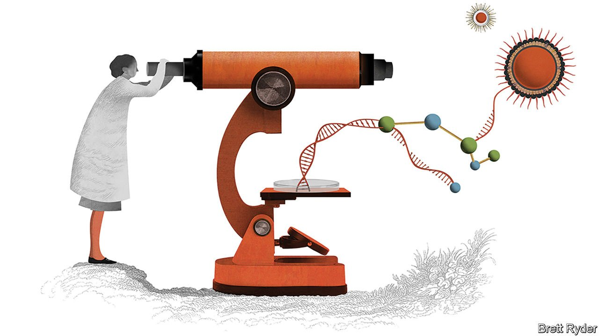

###### Schumpeter

# The big-pharma firm that saw the future 

##### Long ago Roche bet on personalised health care. Now its time has come 

 

> Jun 5th 2021 

ROCHE IS A strange entity. The Swiss giant is the world’s second-biggest drugmaker and one of big pharma’s most profitable firms. But its largest shareholding group, mostly descended from Fritz Hoffmann-La Roche, who founded the company in 1896, is led by André Hoffmann, a nature lover and sustainability advocate who believes that the purpose of business is not mainly to make money. Even its bosses are discouraged from making a quick franc. Severin Schwan, an Austrian who has led the company since 2008, is only Roche’s seventh CEO in 125 years. Much of his pay is tied up in company stock for ten years, giving him, as he puts it, “literally a vested interest” in its long-term future.

Another thing sets Roche apart from the crowd. For two decades it has nurtured an unflashy diagnostics division alongside its mainstay of drug production, in an effort to create more personalised health care. This unit, which accounts for almost a quarter of sales, has generated lower margins than pharmaceuticals, and puts off the sort of investors who yearn only for blockbuster medicines. Had it not been for the Hoffmanns’ patience, some suspect, activists would have forced Roche to sell it or spin it off long ago.


And yet in the past year or so the ability to diagnose a disease in its early stages has fully come into its own. The division has helped the company through the covid-19 pandemic. Roche was not one of the star vaccine producers, but its workaday PCR and antigen tests bolstered profits despite a slowdown in cancer treatments, its biggest business. Moreover, advances in gene sequencing and other techniques from molecular biology helped identify SARS-CoV-2, the covid-19 virus, as well as ways to fight it. That has highlighted the value of combining biotechnology and diagnostics. These are both fields in which Roche excels.

Far from shedding diagnostics, Roche is now doubling down on it, expanding into digitisation and advanced data analytics to create individually tailored cancer treatments. This is, says Tim Haines, boss of Abingworth, a biotech venture-capital firm, “the golden age of diagnostics”. Bets placed years ago are making the stodgy-sounding, Basel-based company look prescient.

Mr Schwan, whose background is in diagnostics, can barely contain his excitement. After a long conversation with The Economist, he came back for more a day later. As he explains, cancer is a panoply of diseases based on individual mutations. Diagnostics identifies genetic and other differences between patients, leading to the creation of more personalised treatments. The tailor-made market, by definition, is smaller than the one for blockbuster drugs, but if patients respond better to treatment, the value of drugs can be proportionally higher. Sifting through oceans of genomic data can produce yet more precision.

Accumulating reams of information on patients has long sat awkwardly with concerns about medical privacy. Less so now, Mr Schwan believes. He says the pandemic has helped change the mood in two ways. First, the use of data-crunching to speed up the fight against covid-19 has made health authorities, hospitals and doctors more amenable to the idea of sharing medical records—provided the information is anonymised. This is, after all, biotech, not big tech. “We are not in the advertising business,” he says. Second, regulators have shown what he describes as an “incredible” willingness to speed up drug approval by gaining access to clinical-trial data in real time. “Why should we not do the same for life-saving cancer medicines?”

Roche, which has recently fallen behind Merck, an oncology rival, in immunotherapy treatments, has been eagerly waiting for this digital tide to turn. Two American acquisitions in 2018 could prove particularly fruitful. One is Foundation Medicine, a gene-sequencing company that can identify cancers from DNA in blood samples, instead of from tumour biopsies. The other is Flatiron Health, a specialist in cancer-related health records that generates data on patients from the real world, supplementing clinical trials. Both produce what Roche calls insights on cancer. Like its diagnostics business, not only do they help it further its own drug development; they also sell services to rivals, making them businesses in their own right. They are not yet profitable, but one day, Mr Schwan says, the “insights” business could be a third pillar for Roche—as big, if not bigger, than diagnostics and pharma.

There are potential pitfalls. Biology is as messy and unpredictable as nature itself. Data analytics may not be as useful in biotech as in other industries. Roche will not have the field to itself. Silicon Valley tech giants are already muscling in. And Europe, where Roche is based, has long been squeamish about data-gathering and privacy. If that continues to apply to medicine, it will hobble the region’s health-care industry.

That said, Roche has a record of pulling off the unexpected. Stefan Schneider of Vontobel, a Swiss investment firm, notes that it has accomplished the rare feat of keeping profits ticking over even as patents on its three biggest cancer drugs, which had peak annual revenues of $21bn, have expired. Its immunotherapy drug, Tecentriq, has recently shown promising results in early-stage lung-cancer care, which may be a big breakthrough. And it has mastered the art of buying trendy biotech firms without spoiling their innovative fizz.

Black Schwan

Indeed, its success vindicates long-term thinking and shows that shareholders’ focus on notions like sustainability can co-exist with commercial success. For all the Hoffmann family’s influence, Mr Schwan is no softy. He defends high drug prices in America. He believes in strong intellectual-property protection. When America’s government this year threw its support behind patent waivers for covid-19 vaccines, he compared it to communist East Germany’s nationalisation of drugmakers. Roche may be unusual. As one of Europe’s few world-class megafirms, it is ballsy, too. ■

