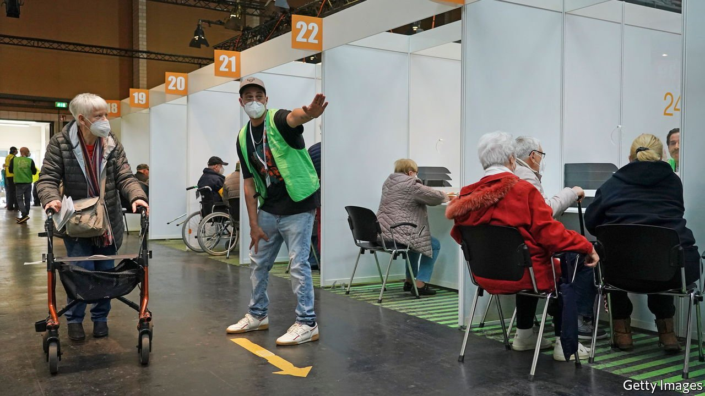
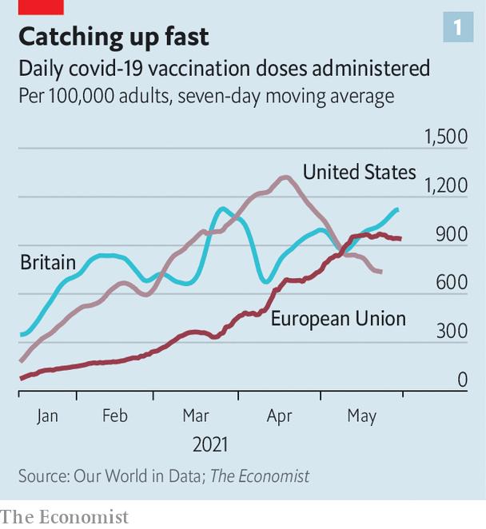
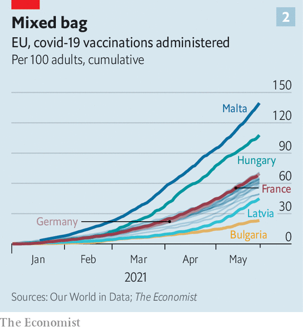

###### Hot shots

# Europe’s vaccination campaign has gathered pace, though not everywhere 

##### Eastern Europe still lags behind 

 

> Jun 3rd 2021 

SPRING SHOWERS and outdoor dining are a clammy combination. But busy café terraces in Paris and beyond suggest that, after months of home cooking, many Europeans are ready to put up with a little discomfort to get out of the kitchen. For now only al fresco service is allowed across much of the EU, sometimes paired with curfews. The prospect of a return to normality in the months ahead must suffice to warm diners’ spirits during cloudbursts.

It may be a mild annoyance to those huddled under improvised awnings to think of Americans and Britons mostly feasting indoors these days. That mainland Europe is several weeks behind in reopening restaurants (and the economy more generally) is largely caused by the botched start of its vaccination drive. Now the jabbing has gained speed. Normality feels within sight. Tourist hotspots think they can avoid a rerun of the difficult summer of 2020; economists are busy upgrading growth forecasts. But not everywhere is feeling the benefits of vaccines yet.


EU citizens are still far less protected than their American and British counterparts. Just 47% of adults have received their first jab, compared with 67% in America and 75% in Britain. (The figures for second jabs are 22%, 54% and 49%.) A lack of doses at the start of the year meant the  was about six weeks behind America’s and ten weeks behind Britain’s. At last, however, supply bottlenecks in Europe have eased.

The steady ramp-up of vaccinations in the EU, paired with a drop-off in America, means the two will converge soon enough (see chart 1). Europe wants 70% of its adult population fully vaccinated by summer, whereas America has set a target of 64% by July 4th. A few things need to go right for Europe to reach its goal, but the prospect of overtaking America in the second half of the year is not far-fetched.

 


The ramp-up in vaccinations is good news for diners—and the European Commission. The EU’s executive arm in Brussels was hurriedly put in charge of procuring vaccines for the bloc’s 445m citizens last year. Its purchases arrived more slowly than those of America and Britain, which had ensured speedy access to jabs by helping to fund the vaccines’ development and signing early contracts with drug firms.


In particular, shortfalls in deliveries by AstraZeneca, purveyor of a cheap vaccine, slowed vaccination. Partly as a result, at the height of the crisis Europe brought in export controls to divert supplies to its own citizens. That jarred with its desire to be seen as an open economy helping the world to face the pandemic. But efforts by Eurocrats to get more doses have paid off. Europe is now receiving roughly as much vaccine per inhabitant as America. Thierry Breton, the European commissioner put in charge of turbocharging deliveries, says the EU will be able to make 3bn doses of vaccines a year by the end of 2021.

More jabs, more jobs

The joint procurement plan was meant to ensure that all EU citizens got vaccinated at roughly the same speed. Having each European country go it alone would have resulted in some places with vastly higher vaccination rates than others. This would undermine Europe’s unity in the face of a crisis, and make open borders, for everything from goods to tourists, untenable.

Yet months into the vaccination drive the overall EU figure masks a worrying range of outcomes (see chart 2). Malta, the member state with the smallest population, is near Israeli (ie, world-beating) levels of inoculation. At the other end of the scale, Bulgaria is lagging badly behind. The poorest member state has put 24 needles in arms for every 100 adults, a third of the EU average. Most of the laggards are in the poorer east of the bloc.

 


That EU citizens would end up vaccinated in lockstep depended on two assumptions. The first was that each country would get the same number of doses relative to population. The second was that national governments would prove roughly as adept at converting doses delivered into arms injected. Neither is true.

On deliveries, some countries have had to make do with less vaccine than their neighbours. The EU scheme works by giving countries an option to buy a set number of doses of various approved vaccines. Many poorer countries last year plumped for relatively more AstraZeneca, which was cheaper and easier to handle. In contrast, the Pfizer-BioNTech and Moderna jabs were often favoured by richer countries. (Hungary, whose prime minister, Viktor Orban, is always keen to needle the EU, took delivery of Chinese and Russian jabs which are not approved at the European level.) So the AstraZeneca shortfall has affected some members, such as Bulgaria, more than others. The EU has tried to rectify this, notably by agreeing to send some of its spare Pfizer doses to the countries that are most deprived.

To make matters worse, not everyone is keen on the AstraZeneca jab. Reports of rare but potentially fatal  have limited its use in some EU countries. Even though Britain has administered it to millions, America has yet to approve it. And Europe has pointedly failed to order any more of it, in part because relations with the company have soured.

As a result there are growing stockpiles of AstraZeneca doses in the EU’s fridges. Only three-quarters of the 54m doses delivered have been administered, compared with 95% of Pfizer’s serum. Romania has used barely a third of its AstraZeneca stocks; Bulgaria less than half. Part of the reason France has fallen behind Germany in its vaccination rate is because of 3m unused shots of le AstraZeneca.

Other factors have held back vaccination, particularly in some eastern European countries. Many of their citizens live in richer parts of the EU and may have been jabbed there, skewing their home countries’ national tallies. Minorities, for example the Roma in Romania or Hungary, seem harder to reach. Health systems were often struggling before the pandemic. There has been plenty of disinformation on the safety of inoculations. And good old administrative incompetence has all too often slowed things down.

Fortunately, vaccine scepticism seems to be less common than once feared. Europeans have flocked to be inoculated at higher rates than opinion polls suggested they would. That said, the proportion of Europeans who have been vaccinated is now reaching the level at which the pace of injections began to slow in America.

Europe is trying to paint its slow start as a sign of virtue. By allowing more exports of vaccines, in contrast to America, it looked after some people in poorer countries. But it has faced flak for resisting an American-led campaign to loosen intellectual-property rules around vaccines. A startling order for a further 900m-1.8bn doses of the Pfizer-BioNTech jab signed last month suggests the EU will have plenty to give away in years to come.

Covid-19 cases have fallen across the EU as they did at the same time last year. That is probably thanks to a mix of warmer weather (notwithstanding the odd shower) and vaccines, though the EU is watching the spread across Britain of a new variant, first spotted in India, with concern. A system of “” allowing people to travel across European borders if they have been tested or jabbed is being set up. After soggy dinners, it may be the prospect of a sunny beach that gets people to the vaccination centre. ■

A version of this article was published online on June 1st 2021

Dig deeper

All our stories relating to the pandemic and the vaccines can be found on our . You can also listen to , our podcast on the race between injections and infections, and find trackers showing ,  and the virus’s spread across  and .

