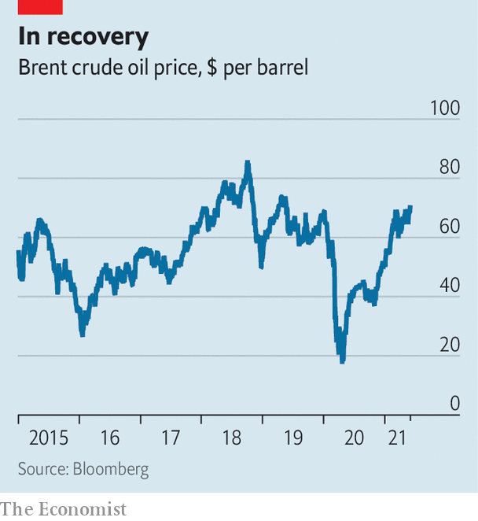

###### The clumsy cartel

# As oil demand picks up, OPEC’s discipline will be tested 

##### Recovering demand pushed prices above $70 a barrel for the first time since 2019 

 

> Jun 3rd 2021 

“THE DEMAND picture has shown clear signs of improvement.” So declared Abdulaziz bin Salman, the energy minister of Saudi Arabia, at a virtual gathering of the Organisation of the Petroleum Exporting Countries (OPEC) on June 1st. The cartel and its allies, chief among them Russia, have been squeezed badly by the covid-induced recession, which  from nearly 100m barrels a day (bpd) in 2019 to 91m last year. In a frantic effort to prevent a price collapse, OPEC+, as the group calls itself, agreed to cut output in early 2020. Yet it failed to stop the price dipping below $20 a barrel (see chart).

Now the cartel believes that oil demand is at last on a firm path to recovery. Ministers agreed to boost supply by roughly 450,000 bpd in July, part of their plan to restore nearly half of the output cuts made last year. Saudi Arabia, which boasts the lowest production costs and the most spare capacity in the cartel, and often acts as a swing producer, indicated it would also soon reverse a unilateral output cut of 1m bpd made earlier this year.


In response, the price of the benchmark Brent crude shot above $70 a barrel on June 1st for the first time in two years. Several indicators confirm the view that oil demand, a proxy for economic growth, is taking off. Oil inventories, which shot up last year, are falling sharply. The International Energy Agency, an official body, estimates that global oil demand may recover to pre-pandemic levels within a year. In America, demand for petrol surged during the Memorial Day weekend at the end of May, a robust start to its summer “driving season”.

 


OPEC’s celebrations may yet prove premature. One drag on prices could be Iran, where output has been curbed by . Speculation that negotiations to revive a deal on  might soon make progress proved unfounded. The delay means extra Iranian oil is not about to suddenly flood the market. But if a deal is somehow struck this summer, analysts reckon that Iranian exports could rise by 1m bpd or more by the end of the year.

Furthermore, though tight inventories and high demand push up prices in the near term, those very same prices will tempt America’s shale-oil producers, currently restraining investment, to splash out. Saudi Arabia might also find it harder to keep OPEC disciplined, observes David Fyfe of Petroleum Argus, an industry journal. Members tend to adhere to agreed cuts when demand is collapsing, but rising prices encourage cheating.

A bigger worry, says Paul Sheldon of S&amp;P Global Platts, an analytics firm, is “an unexpected demand setback” in 2022. America and China are back to their gas-guzzling ways thanks to the spread of vaccines; Europe is not far behind. But energy demand in India and Latin America, where the pandemic still rages, remains fragile. Mr Fyfe points out that long-haul transportation is another source of weakness.

The gravest threat to the cartel comes from technological change. There are widely divergent views on how quickly demand for the black stuff will give way to greener fuels, even among oil majors. But purveyors of petroleum will almost certainly find a carbon-constrained world tough going. Edward Morse of Citigroup, a bank, makes a subtler point about innovation. Oil may surge to $80 a barrel in the short term, but that is hardly the start of a “new secular bull run”: as the global cost of finding and developing oil has fallen by over half in the past five years to $10-15 per barrel, he reckons fair value for crude is $40-55. The “clumsy cartel”, as Morris Adelman, an energy economist, once dubbed OPEC, is in for a rocky ride. ■

A version of this article was published online on June 2nd 2021

