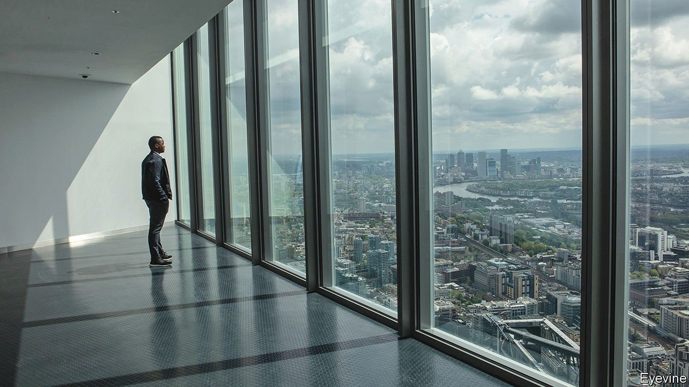
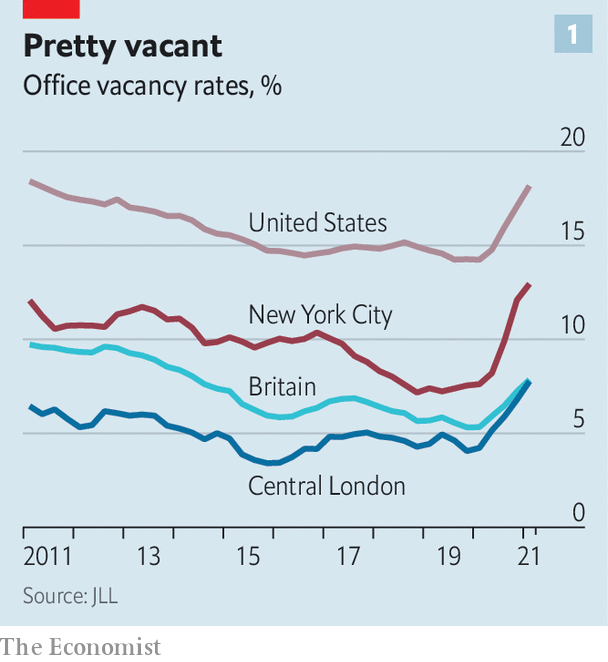
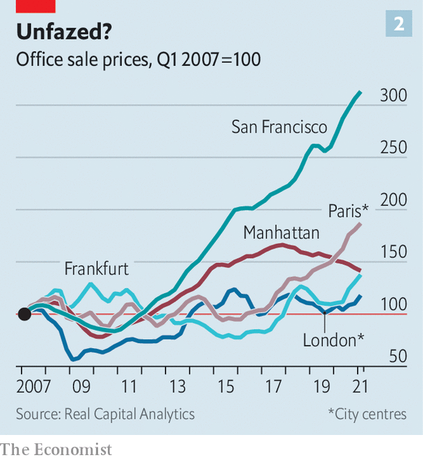
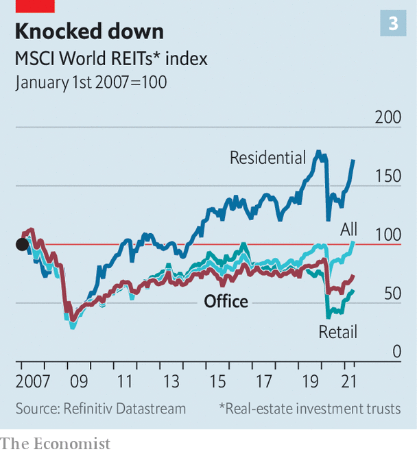

###### Shaky foundations

# What a work-from-home revolution means for commercial property 

##### As offices remain empty, does a financial reckoning loom? 

 

> Jun 3rd 2021 

OFFICES THESE days are temples of indulgence as much as places of work. One Vanderbilt, a new skyscraper in Manhattan, has unveiled a restaurant run by Daniel Boulud, a Michelin-starred chef. Amazon’s second headquarters in Arlington, Virginia, will include an amphitheatre for outdoor concerts. In London, 22 Bishopsgate is so dog-friendly that its receptionists issue passes to pets. The recently opened glass tower, which dominates the City of London’s skyline, also houses a climbing wall and a spa.

As companies try to tempt workers , developers and investors are betting on  with alluring amenities. But a huge uncertainty hangs over them: will enough people come? Even as vaccinations progress, workers have been slow to return. In early May only one in 20 buildings in America had occupancy levels above 10%, compared with a third in Europe and Africa, and roughly half of buildings in Asia, according to Freespace, a property-tech firm. With the return to work only just beginning, stimulus still in place and long leases yet to expire, the extent of any losses is worryingly hazy.


Covid-19 has sharpened the demand for newer buildings with better facilities. JPMorgan Chase, a bank, will reduce its overall office space even as it builds the second-tallest skyscraper in Manhattan for its new headquarters. More than half of tours across New York City by prospective tenants are of high-quality “Grade A” offices, compared with 38% before covid-19. This shift is happening alongside another disruption: a tilt towards greener workspaces. Energy efficiency and air-filtration systems are now seen as essential. Asset managers including BlackRock and Brookfield have pledged to get their assets to net-zero emissions by 2050 or sooner. Many property firms are pledging that all new buildings will be net-zero carbon. The shift towards wellness and sustainability is no fad, insists James Goldsmith of AXA Investment Managers. “This isn’t a social experiment. We’re asset managers—pension money is at stake.”

Few in the industry, however, will be drawn on the reckoning they may face. The flight to quality is leaving older buildings looking undesirable just as remote working reduces the total demand for office space. Start with the risk that older buildings become stranded assets. Around half of Hong Kong’s premium stock and nearly two-thirds of commercial property in London were built more than 20 years ago. SL Green, Manhattan’s largest office landlord, says rents at its older properties are down by as much as 10%. Without substantially lower rents or , access to outdoor space or natural light, many will struggle to sell or attract tenants.

Some dated offices are getting facelifts. Fabrix, a developer, is upgrading a 1960s building in London to include a rooftop forest and a glass-floored infinity pool. Others will be converted into lab and research space, or houses. When AIG, an insurer, moves to a recently renovated skyscraper in midtown Manhattan, part of its old headquarters, a tower block built in the 1980s, will be converted into flats. The City of London Corporation, which oversees the Square Mile, plans to turn vacant space into at least 1,500 new homes by 2030.

Yet none of this can mask the fact that as remote working sticks, demand for office space should fall. Companies are beginning to rethink their property needs, with many downsizing or delaying new leases. Globally, more than 103m square feet of office space has already been vacated since the pandemic began, according to Cushman and Wakefield, a broker. That is 18% more lost floor space than during the financial crisis of 2007-09. Vacancy rates rose steeply over the past year, reaching 18% in the spring in America (see chart 1). The forecasts are gloomy. Roughly one in five offices in America will be empty in 2022, according to Moody’s Analytics, a consultancy. Rents across the country are projected to fall by 7.5% this year; those in San Francisco, by 15%.

 


Puzzlingly, the gloom has not yet made its way into conventional measures of prices and credit. Rent-collection rates for properties run by real-estate investment trusts (REITs) in North America remained above 90% for most of last year, according to S&amp;P, a rating agency. They may have risen since then. The Economist has examined collection rates for half a dozen of the world’s big listed office landlords: the average stands at 98% for the most recent quarter. Delinquency rates on commercial-mortgage-backed securities linked to shops spiked last summer, and are still high, according to Trepp, a data provider. But those for offices have been unperturbed by the pandemic, at around 2%. The price paid for office space in several big cities has also held up so far (see chart 2).

 


A number of obfuscating factors cloud the picture, however. Generous stimulus might have postponed increases in delinquencies and distressed sales. And many firms have not made up their minds yet. No one knows how many workers will stay home, and for how many days of the week. For the most part, investors are avoiding rash transactions: buyers are wary of overpaying, while sellers are unwilling to take a loss in case the crisis turns out to be a blip. The volume of sales has shrunk, making prices a less reliable gauge of health.

One way to penetrate the uncertainty is to look at more forward-looking measures of valuations. These suggest that office property has been dealt a blow by covid-19. A price index based on appraisals, calculated by Green Street, a research firm, is 9% below its pre-pandemic peak in America. The share prices of REITs that invest in offices remain 13% below their level in early 2020 (see chart 3).

 


 are on the alert. The reliance of commercial property on debt financing means a downturn could have nasty reverberations across the financial system. Banks’ exposures are sizeable: the stock of loans made to the sector by American banks exceeds $2trn, or about a fifth of their total lending. In its latest Financial Stability Review the European Central Bank warned that subdued activity could be masking deeper trouble, and deemed risks from property to be “elevated”. Many pension funds around the world have loaded up on commercial property in recent years as lower interest rates have forced them to seek returns from less liquid assets.

The fate of office property could well rest on vacancy rates. If they stay high, then things could start to get hairy. In April the IMF reckoned that a lasting increase in the vacancy rate of five percentage points would dent commercial-property valuations by 15% over five years. Fitch, another rating agency, estimates that the value of offices in America could fall by more than half if workers continue to work from home for three days a week. The long-term nature of property leases and the continued availability of debt mean that losses from the pandemic may not materialise for several years. But if the reckoning comes, it will be painful. ■

A version of this article was published online on May 31st 2021

