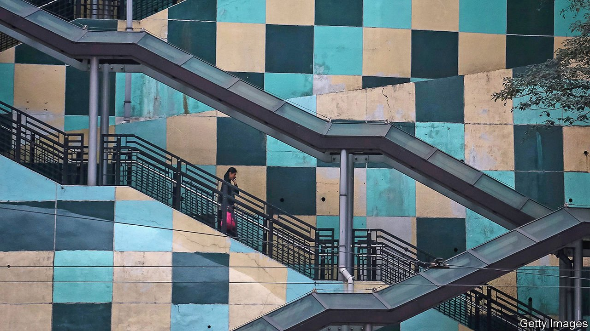

###### Failure to land

# What could break Hong Kong’s property market? 

##### Protests and a pandemic have barely made a dent 

 

> Jun 5th 2021 

PLANES NO LONGER land in Kai Tak, Hong Kong’s old airport. But nostalgists can stroll along the new “sky garden”, an elevated walkway lined with frangipani, myrtle and acacia, that passes above the old runway. By scanning a QR code along the route, visitors can “augment reality” by superimposing an image of a landing plane on their selfies. The park is part of a redevelopment plan that will eventually yield a hospital, tax office and new homes for tens of thousands of people. On either side of the walkway, cranes, diggers and welders labour busily to augment the reality of Hong Kong’s cramped and pricey housing.

They have their work cut out for them. Property in Hong Kong remains horribly expensive, despite two years of protests and pandemic. House prices in April were only 1.5% below their peak in 2019. In one tower block being built in Kai Tak, a flat of 889 square feet sold last month for over HK$30m ($3.9m).


The property market has resisted the pandemic better than it did the SARS outbreak of 2003, when prices fell by almost 8%. Indeed, the market has remained tight this time partly because of decisions made back then. When SARS struck, house prices had already fallen by more than 60% since 1997. To curtail supply the government resolved to “withdraw from its role of property developer”, vowed not to “sell land at a pathetic price”, and reported with satisfaction that the supply of new flats was dwindling. Hong Kong built nine new towns (now home to almost half of its population of 7.5m) between the 1970s and the early 2000s. It has not finished any since.

Instead the government has corralled housebuilding into smaller, piecemeal sites, often located in and around existing developments. It is too embarrassed to call them “new towns”, said one speaker at a recent conference hosted by Hong Kong University Business School. It calls them “new development areas” instead.

With the help of such sites, the government hopes Hong Kong will add 430,000 flats over the next ten years. That, it reckons, would satisfy rising demand. But these targets tend to be over-optimistic: since 2007, housebuilding has undershot them by about 18% in an average year. If the pattern persists, Hong Kong will add only about 350,000 homes in the next decade.

 


In this “baseline” scenario, housing is likely to grow dearer still, according to Morgan Stanley. So what would it take to curb property prices? The bank has also put together what it calls a “bear” scenario where prices fall by a fifth or more. For that to happen, Hong Kong would have to add about 730,000 homes over the next ten years, the bank calculates, increasing the existing stock by almost 30% (see chart).

That would require encroaching on fields, sea and sky. Hong Kong would have to build taller, packing more floor space into each site. It would have to speed up the conversion of farmland, which can take 15 or more years. And it would have to add 235,000 homes on land reclaimed from the sea. This would include the government’s controversial plan to add land to eastern Lantau, Hong Kong’s biggest island, home to 172,000 people as well as white-bellied eagles, Bogadek’s burrowing lizards and finless porpoises, which conservationists argue could be threatened by the initiative.

Although it would take years for these efforts to reach fruition, a credible plan could change sentiment—and prices—immediately, points out Praveen Choudhary of Morgan Stanley. In the bear scenario house prices fall by 20% by the end of 2022. The downward turn would, in other words, resemble one of the abrupt landings in Kai Tak that used to make arriving in Hong Kong so thrilling. ■

