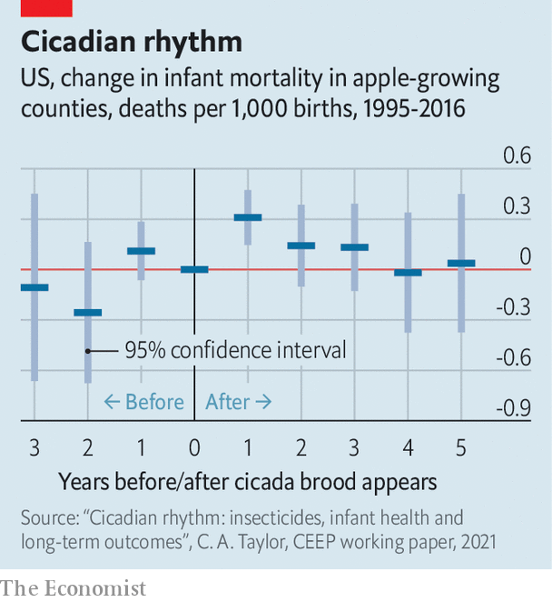

###### A brooding problem

# Cicadas, insecticides and children 

##### The return of periodical cicadas bodes ill for children’s well-being 

 

> Jun 2nd 2021 

AS SUMMER APPROACHES, adults of , last seen in 2004, have begun emerging in the eastern United States. Their return is welcome news for entomologists who study them, and for adventurous chefs in search of novel ingredients. It could, though, have bad consequences for unborn infants and young children in the places where they live.

The cicadas themselves are harmless to people, but their nymphs feed on the roots of woody plants such as apple trees. Farmers, understandably peeved by their uninvited guests, respond by spraying those trees with large quantities of pesticides to stop the adults mating. This chemical warfare successfully curbs the insects, but, according to new working paper by Charles Taylor of Columbia University, it may also have adverse consequences for children.


Mr Taylor, who studies environmental and health economics, started his investigation by collecting, on a county-by-county basis, data stretching back from 2016 to 1950 for the parts of America where periodical cicadas live. There are, altogether, 15 such broods; 12 of them emerge as adults every 17 years (of which Brood X is the largest) and three every 13 years, in a phenomenon known as predator swamping. Lacking good information on pesticide use, Mr Taylor used the abundance of apple trees in a county as a proxy for how much of the stuff farmers were likely to deploy in a brood year. He also studied local health and education records for brood years and non-brood years. The results are disturbing.

Mr Taylor’s analysis found that in the year immediately after the emergence of periodical cicadas, infant-mortality rates would increase by 0.3 deaths per 1,000 live births in counties which have lots of apple trees (see chart). That represents a 5% increase over America’s national rate of six deaths per 1,000 births. No such change was seen in non-apple-growing counties.

 


Cicada-driven pesticide spikes seem to harm cognitive development, too. Primary-school pupils (those aged roughly eight to ten) who lived in counties which saw emergences of periodical cicadas while those children were in their mothers’ wombs later fared worse than others on standardised exams. Mr Taylor estimates that these pupils, in effect, lose around 10% of a grade-year’s-worth of learning. The study finds, too, that high-school pupils are around 5% more likely to drop out of school in their 12th grade (ie, at the age of 17-18) if they live in a county that was affected by a cicada event 19 years earlier, when they were in utero. That suggests pesticide use does indeed hurt long-term cognitive development.

Mr Taylor’s study focuses on the use of pesticides on a single crop, apples, against a single foe, cicadas. If his results are accurate, they suggest that quite modest exposure to pesticides can have a serious effect on unborn infants—for even in counties where apples are an important crop, orchards cover only a small fraction of the land, meaning that tree-spraying is not dumping huge amounts of pesticides into the environment. What that implies for the effects of other, more extensive pesticide uses would certainly bear investigation. ■

A version of this article was published online on June 2nd 2021

