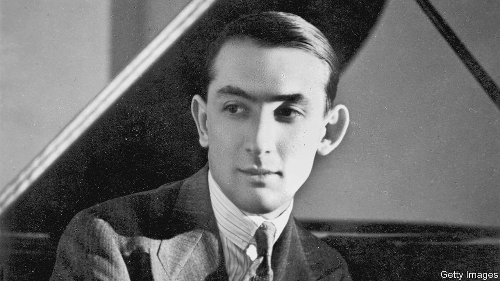

###### Programmes by programs

# Composing by computer 

##### Concerts may soon feature music written by artificial intelligence 

 

> Jun 3rd 2021 

THESE DAYS, anyone with a computer can be a composer. Sort of. Give a piece of commercial software such as Magenta, developed by Google, the first few notes of a song, and it will make something merrily tuneful out of them. Tuneful, but not sophisticated. At least, that is the view of Gerhard Widmer of Johannes Kepler University, in Linz, Austria.

In Dr Widmer’s opinion, “what they create may contain certain statistical properties. It’s not dissonant, but it’s not actually music...It would create a piece that would last three days because it has no notion of what it wants to do. It doesn’t know that things need an end, a beginning, and something in-between.” He thinks he can do better. He wants to use artificial intelligence to explore how toying with a listener’s expectations affects the perception of music, and then to employ that knowledge to create software which can produce something more akin to Beethoven than “Baa Baa Black Sheep”. That means giving computers an ability to perceive subtleties they cannot currently detect but might, using the latest techniques, be able to learn. To this end, Dr Widmer is running a project called “Whither music?”—a title borrowed from a lecture series given at Harvard University in 1973 by , a celebrated 20th-century composer.


When human beings listen to music, they subconsciously predict what the next note will be. One trick composers use is to toy with these expectations—sometimes delivering what is expected and sometimes deliberately taking an unexpected turn. Performers then enhance that emotional manipulation by adding expression—for example, by playing a particular phrase louder or more staccato than the one which came before. One thing Dr Widmer is doing, therefore, is teaching computers to copy them.

To this end, he and his colleagues have amassed a huge body of recordings captured on specially designed instruments, notably the Bösendorfer 290 SE, a type of concert piano made in the 1980s which was rigged by the manufacturers with sensors that measure the force and timings of the pianist’s key-pressing with great accuracy. The jewel of their collection is a set of performances on a 290 SE by Nikita Magaloff (pictured), a legendary concert pianist and Chopin expert, of almost all of Chopin’s solo piano work. These were recorded at a series of six concerts which Magaloff gave in Vienna, shortly before his death in 1992.

The team’s software takes data from these and other, humbler recordings and compares them with the score as written by the composer. It is looking for mismatches between the two—places, for instance, where the performer misses the beat by a few milliseconds or plays a note more forcefully than the score indicates. By analysing thousands of performances and comparing them with digitised versions of the composers’ scores, the software learns what performers are choosing to accentuate when they play, and thus what those performers think is particularly interesting to the audience.

Other algorithms are being taught the rules of composition. “[Existing software models] take all the past notes that have already been played and predict the next note, which has nothing to do with how a human composer would compose,” Dr Widmer explains. “Composition is a planning process that involves structure. We want to create models that make predictions at several levels simultaneously.” The team are designing and training individual modules for different elements of music: melody, rhythm, harmony and so on—with the intention of combining them into a master program that can be trained on performances and scores in toto.

Once complete, the resulting megabyte maestro will decide not just which note follows which, but why that should be so and how that note should be played. “Instead of saying, ‘the next note is statistically likely to be a C’, it would say, ‘I believe that the next four bars will feature some kind of IV-I-V harmony [a common type of chord progression in Western music], because we had a similar pattern in a similar melodic context earlier in the piece’.”

Software of this sort might have applications beyond composition. Existing “” algorithms struggle to generate musical playlists that appeal to particular tastes. A recent paper showed that they are good at suggesting pieces for fans of pop music with catholic appetites, but not for those who prefer a specific genre, such as heavy metal or rap. Software that understands musical expectancy might do a better job. A program which knows what to listen out for might discover that the music of Skepta or Slayer has specific types of musical surprises within it, and, on this basis, be able to recommend new music with similar surprises.

Whether computer software will ever be able to write music that stands up to comparison with the likes of Chopin or Cream remains to be seen. Dr Widmer remains sceptical, but it is hard to see why. Great art is often a product of knowing when to obey the rules and when to break them. And that is exactly what he is teaching his machines. ■

A version of this article was published online on June 2nd 2021

