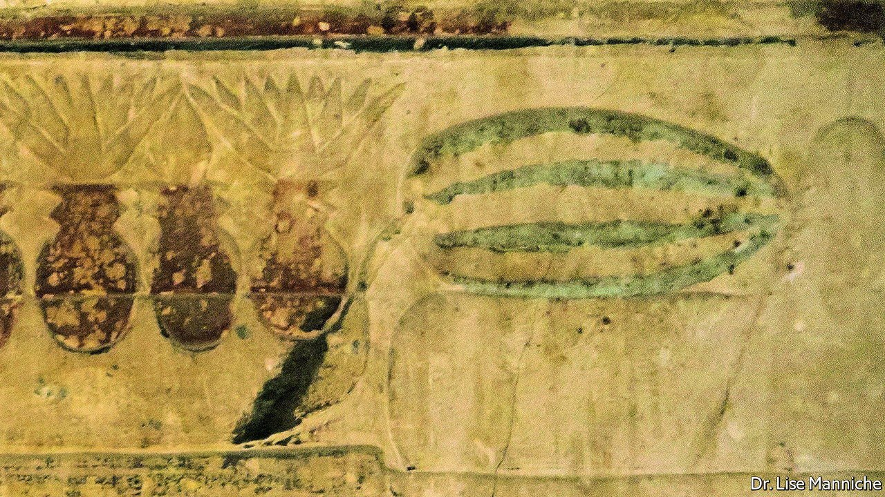

###### Horticulture

# The origin of watermelons 

##### A popular fruit started off in Darfur 

 

> Jun 3rd 2021 

THE ORIGINS of some crops are well known. Maize derives from a wild grass growing in the Balsas river valley, in what is now Mexico. Rice descends from another grass, native to the Yangzi basin. Potatoes hail from the border between Peru and Bolivia. Apples trace back to the woodlands of southern Kazakhstan. Some crops’ beginnings, though, are lost in the mists of time—among them those of the watermelon.

That watermelons’ ancestors are African has long been clear. Archaeological evidence from Libya and Egypt suggests they were cultivated there thousands of years ago, and the continent is home to seven species and numerous subspecies of plants classified in the same genus, Citrullus, as the cultivated crop. But only now has a likely candidate been nailed down. An examination of available genetic data about members of Citrullus, published in the Proceedings of the National Academy of Sciences by Susanne Renner of Washington University, in St Louis, and Guillaume Chomicki of the University of Sheffield, in Britain, has led them to conclude that watermelons were domesticated from a subspecies called the Sudanese Kordofan melon, which grows in Darfur, the western part of Sudan.


Tellingly, this is one of the few wild members of Citrullus that is bland, rather than excruciatingly bitter to the human palate. That ties in with a reinterpretation by the two researchers of a 4,450-year-old Egyptian tomb painting (pictured). The previous assumption had been that early cultivated watermelons were too bitter to eat raw, and would thus need to be cooked and sweetened for consumption. This painting, though, shows what appears to be a stripped watermelon being served raw at a table decorated by lotus flowers.

A version of this article was published online on June 1st 2021

