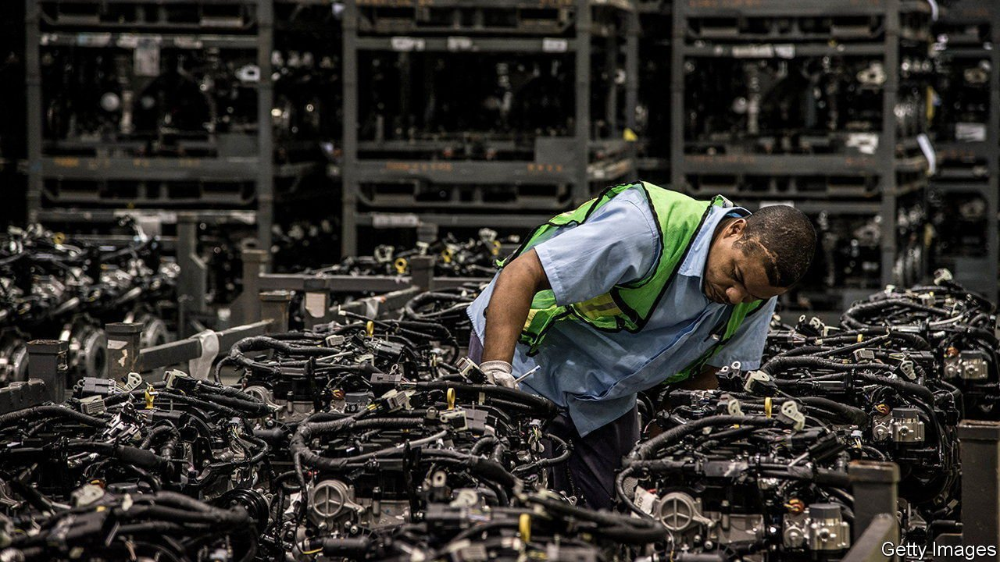
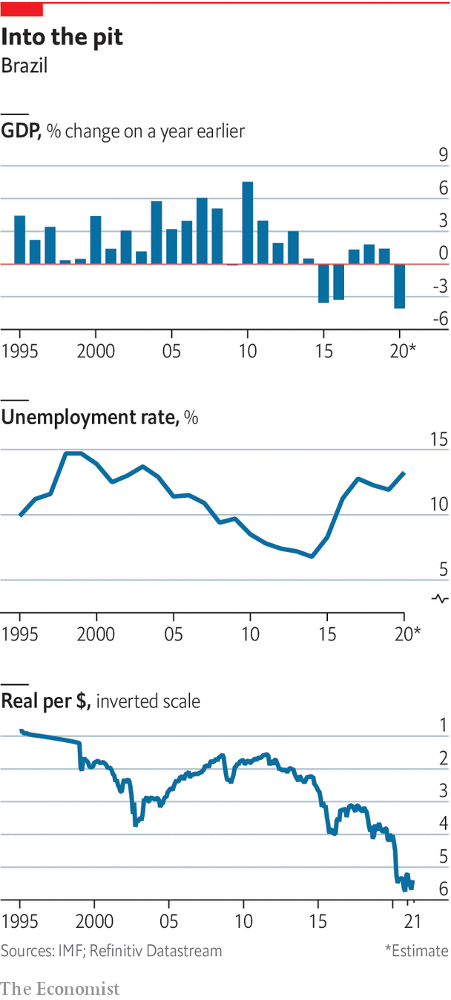

###### The economy

# A dream deferred 

##### After a generation of progress, social mobility is slowing in Brazil 

 

> Jun 3rd 2021 

VINICIUS RABELO’S grandparents were manioc farmers in the interior of Bahia. His parents moved to the city for a better life and, after opening a clothes shop, sent their children to private school. In 2018 Mr Rabelo started as an electrical mechanic in Camaçari, near the state capital, Salvador. Home to a petrochemical plant and a Ford factory, Camaçari had almost doubled in population over his lifetime. More than 40m Brazilians had joined an emerging middle class known as Classe C.

By the time he entered the workforce, the country was reeling from a recession that chopped 9% off GDP per head between 2014 and 2016. Unemployment stayed high and hundreds of factories closed. In January Ford said it was leaving. For 5,000 employees and tens of thousands of indirect workers, including Mr Rabelo, whose firm did safety checks, the job loss was compounded by a sense that social mobility had stopped. The 24-year-old, who has trendy glasses and an Apple Watch, now drives for Uber, “like 800 others who got laid off and had the exact same idea”.


Under President Fernando Henrique Cardoso in the 1990s, Brazil’s RealPlan ended hyperinflation, allowing Brazilians to start saving again. Under Lula in the 2000s, poverty fell by 41% thanks to a commodity boom, social programmes and rises in the minimum wage. The 2010s were meant to continue this progress. Instead it was a decade of bad policies and worse luck.

The PT, in power from 2003 to 2016, failed to build on its gains. Between 2003 and 2012, GDP growth averaged 4%. Informal working shrank and wages climbed. The government built thousands of schools, from crèches to universities. Bolsa Família, a cash-transfer programme, gave poor mothers a basic income. Light for All brought electricity to favelas and rural areas. Millions bought cars and took their first plane rides. Marcelo Neri, an economist, found that rising perceptions of well-being outpaced GDP growth as tangible changes made Brazilians feel better off than they really were. Between 2006 and 2009, Brazil moved up five places on a Gallup ranking of happiness, to 17th among 144 countries.

The optimism proved ephemeral. The PT did not invest enough in areas promising long-term productivity gains, like infrastructure. Despite expanded access to education (85% of pupils completed primary school in 2018, up from 50% in 2000), quality lagged behind. On the latest PISA tests of learning among 15-year-olds, Brazil came 57th out of 79 countries in reading. One analysis estimated that it would take 260 years to reach the OECD average. After 15 months without in-person classes, the outlook is worse. Some 15% of six- to 17-year-olds may have dropped out of school.

“We expected better,” says Valterlinda Alves, a professor in Camaçari. For nearly a decade the economy was booming and the mayor, governor and president all came from the PT. But the best jobs at the petrochemical plant still went to workers from Salvador or São Paulo. In 2018 Ms Alves persuaded the Federal University of Bahia to open a campus in Camaçari, aimed at teaching STEM subjects to local students. After budget cuts its future is uncertain. Over the years, unions won pay bumps. Yet the median salary when Ford closed was only 3,800 reais ($720) a month, three times the minimum wage. “Middle class in Brazil means just scraping by,” says Jorge do Nascimento, a foreman.

 


Worse trouble hit when Lula gave up pro-business reforms and Ms Rousseff launched an industrial policy redolent of import substitution. The development bank pumped subsidised loans worth up to 9% of GDP a year into favoured firms, while the finance ministry hid a growing deficit. The result was Brazil’s worst-ever recession. It overlapped with Lava Jato, which dealt an extra blow in Camaçari, where affected firms like Petrobras and private construction companies employed thousands. Tax breaks worth billions of dollars no longer made up for low productivity and high costs. Ford’s exit came after years of losses.

The protests in 2013 demanded even more subsidies. But as unrest continued, Brazilians seemed to conclude that the entire economy needed a revamp. In 2016 Congress impeached Ms Rousseff for breaking budget rules. Mr Temer, her successor, charged ahead with liberal reforms, slashing subsidised lending, creating a constitutional ceiling on spending and passing a labour reform to make contracts more flexible. All the frontrunners in the 2018 election (except for Fernando Haddad, who became the PT candidate after Lula was barred) talked of curbing public spending.

Soon after taking office in 2019, Mr Bolsonaro signed a pensions reform that will save 800bn reais over a decade. Mr Guedes bragged that reforms to simplify the tax code, slim down the public sector and privatise inefficient state firms would follow. Yet the reformist spirit proved fleeting. Mr Bolsonaro is not much of a liberal. His distaste for hard reforms made it easy for Congress to ignore the Guedes agenda.

Victories were smaller: a law opening sanitation to private investment, the sale of oil refineries and subsidiaries of state firms, a measure allowing a freeze of civil-service salaries when mandatory spending exceeds 95% of revenues. A trade deal between the European Union and the Mercosur bloc of South American countries stalled because of Mr Bolsonaro’s environmental policies. Growth averaged just 1% a year between 2017 and 2019.

Enter covid-19

Covid-19 put an already troubled economy on life support. Health-care and stimulus spending pushed public debt to a record 89% of GDP in 2020. Mr Guedes predicted that support to businesses and monthly payments to 68m informal workers would spur a “ V-shaped recovery”. But although poverty briefly dipped and a drop of GDP in 2020 by 4.1% was not as bad as feared, the second wave shut the economy again. GDP is expected to shrink in the second quarter of this year. Payments to the poor were slashed just as the pandemic worsened. Some 18m more people fell into poverty.

The future looks grim. Just 19% of Brazilians have been vaccinated, making a third wave quite possible. The currency has fallen by 25% against the dollar since covid-19 broke out. Inflation rose to 7% in April. The central bank is raising interest rates for the first time since 2015. A poster campaign in São Paulo decried rising prices of food staples and blamed them on President “Bolsocaro”, a play on the Portuguese words for “pocket” and “expensive”.

Camaçari’s industrial sector sits on the outskirts of town, past tyre shops, big-box stores and the region’s first shopping mall. Its streets are ambitiously named: Benzene, Hydrogen, Oxygen. But its smokestacks are faded and its pipes rusty. The town centre is busier, but people are not buying much. Mothers with children stand in line to find out if they qualify for new emergency payments. One survey found that six out of ten Brazilians have reduced the quantity or quality of food they eat.

The mayor predicts that Ford’s closure will cost 15% of the city’s jobs. Ford employees will lose their private health insurance, which will strain public hospitals. Alan Lima, head of a network of private schools, says his enrolment has dropped from 2,000 to 1,250. “I look at yesterday, I look at today, and it’s starting to seem like yesterday was better than today,” says Ana Paula Luz, a mother of five who used to work on a motor assembly line. Some 65% of Brazilians think the economy will get worse, the highest proportion since the poll began in 1997.

There are glimmers of hope. Agriculture is booming, commodity prices are up again and Camaçari is becoming a logistics hub between Salvador and western Bahia. Mercado Libre, Latin America’s e-commerce giant, has opened a distribution centre nearby. Bahia is Brazil’s top source of wind power and turbines are made in Camaçari, though firms have hired technicians from India. Tourism is growing but cumbersome tax laws, licensing and labour rules make investors “think twice before opening a hotel,” says João Eça, head of a resort run by Tivoli, a Portuguese hotelier, on a beach near Camaçari.

To get back on track, Brazil must deal with old problems. Subsidies to industry and public servants are skewed to the well-off. Tax and labour laws distort or discourage investment. And 94% of the budget is eaten up by mandatory spending adjusted for inflation, leaving less and less for public investment and social programmes. Yet politicians drag their feet. Congress plans to split tax reform into several separate bills. In April it passed a budget exceeding the spending ceiling by 30bn reais, including 49bn reais-worth of pork for congressmen’s home states. Rather than trying to curb wasteful spending, politicians changed the constitution to exclude their projects from the fiscal rules. “Our idea of development continues to be that the state hands over money to build factories and create jobs,” says Marcos Lisboa of Insper, a business school in São Paulo.

Substantial reform is unlikely before the election in 2022. Brazil remains a closed economy, with red tape driving down growth and skewed spending driving up inequality. In 2019 the average income of the richest 1% was 33.7 times that of the poorest 50%, a ratio surpassed only in Qatar. A study by the OECD in 2018 found that it would take a Brazilian family from the poorest 10% of earners nine generations to reach the average income.

The risk is not Argentina-style default or Venezuela-style hyperinflation (most of Brazil’s debt is in its own currency). Instead, it is stagflation, or low growth, high unemployment and rising prices. Brazil is suffering a “confidence collapse”, declares Arminio Fraga, a former central-bank president. He once suggested reforms to save 9% of GDP: 3% from eliminating tax breaks, 3% from narrowing the gap between public- and private-sector pay, 3% from a second pensions reform. Now he says: “We keep looking for short cuts and magic tricks, but we’re not going anywhere until we get the political system in order.”■

Full contents of this special report


* The economy: A dream deferred


