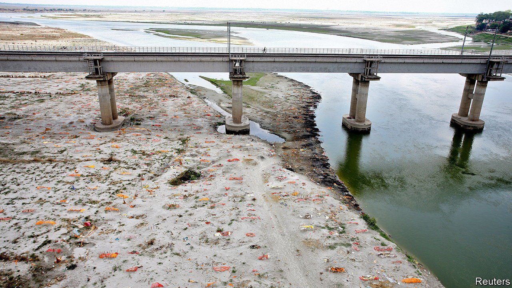
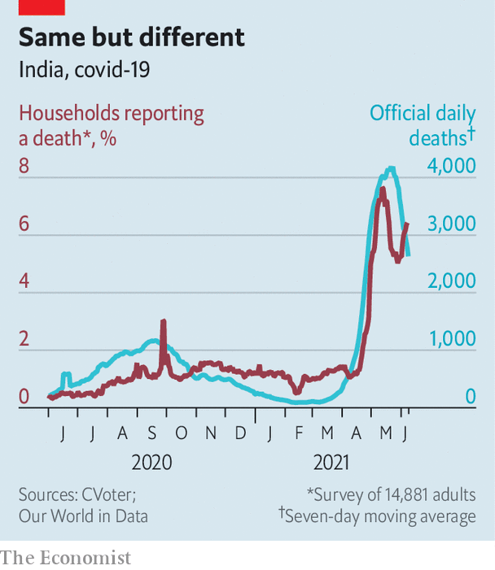

###### The rule of six

# More evidence emerges of India’s true death toll from covid-19 

##### New surveys corroborate earlier estimates that the number is some six times higher 

 

> Jun 12th 2021 

AS INDIA’S FEARSOME second wave of covid-19 recedes, the fact that fewer are falling ill is not the only cause for relief. On June 7th Narendra Modi, the prime minister, announced a policy switch that should make it easier for more Indians to get vaccinated. Instead of forcing individual states to compete in procuring vaccines, the central government will now itself buy all the jabs and give out 75% free of charge. The move may restore some faith in Mr Modi’s leadership, after his early promises of a world-beating vaccination programme crashed into the grim reality of surging deaths and shrinking supplies of shots.

Yet as Indians emerge from lockdowns, it is not easy to shake off the gloom. True, the official death toll has fallen steadily for the past month, to half its peak of over 4,000 a day in mid-May. But evidence continues to accumulate that the government’s numbers represent a disturbingly small fraction of the real figure. This discrepancy does not just mean that the true level of India’s suffering has been glossed over. It has made the crisis worse, for instance by causing authorities to underestimate demand for oxygen and drugs.


News organisations including The Economist, as well as independent epidemiologists, have speculated that India has suffered perhaps five-to-seven times more “excess deaths” than the official number of covid-19 fatalities, currently just over 355,000. A recent paper by Christopher Leffler of Virginia Commonwealth University in America analyses data on excess mortality from different parts of India to emerge with a rough estimate of between 1.8m and 2.4m deaths from the disease since the start of the pandemic. Another recent study of one state, Telangana, based on insurance claims, suggests that the virus has killed as many as six times more people than official numbers admit.

Such estimates have been extrapolated from patchy and often unreliable local-government data, from company records—including of deaths among staff—and from analysis of such things as obituaries. Evidence from another source, opinion surveys, corroborates the higher numbers. One, conducted in May by Prashnam, a new polling group, asked 15,000 people, across mostly rural areas in Hindi-speaking states in the north, whether anyone in their family or neighbourhood had died of covid-19. One in every six, or 17%, said yes.

Rajesh Jain, Prashnam’s founder, then compared this result with surveys in America that had asked a similar question, including one conducted in March by the University of Chicago, which found that 19% of respondents had a close friend or relative who had died in the pandemic. Given the closeness of those results, Mr Jain says that India’s overall covid-19 mortality rate is likely to be closer to America’s, at 1,800 deaths per million people, than to its official figure of 230 per million. If India’s rate does match America’s, the number of deaths in India so far would be about 2.5m, he says.

 


An older polling group, CVoter, has since June last year been collecting daily data on covid-19 from a wider pool of respondents in ten languages across India. Its team consistently posed a slightly different question from Prashnam’s, asking if any immediate family members had died from the virus. Following India’s first wave, in September, the number who answered yes predictably rose, and then lingered at around 1%. But in April and May it shot up, peaking at 7.4%. Given that India counts some 250m households, Yashwant Deshmukh, CVoter’s chair, calculates that the likely number to have died from covid-19 by mid-May was around 1.83m. The trend line from the survey matches the official figure, suggesting the survey is broadly accurate (see chart).

Why does India’s government, as well as its press, cling so firmly to misleading official numbers? Mr Deshmukh, who says he is very confident of his own figures, partly blames journalists for what he describes as poor numeracy. But he is dismissive of the excuse that India’s many layers of government lack the capacity to generate solid statistics. “This is not about capacity, but intent,” he says. “And it’s not about the central government or a particular party. It is about data suppression at every level, no matter who is in charge.” ■

Dig deeper

All our stories relating to the pandemic and the vaccines can be found on our . You can also listen to , our podcast on the race between injections and infections, and find trackers showing ,  and the virus’s spread across  and .

