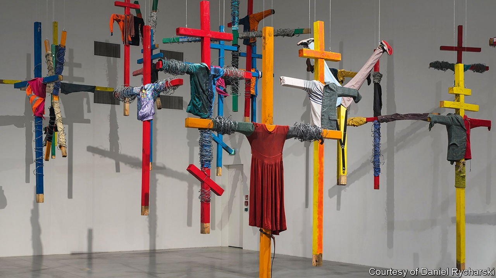

###### Art and activism in Poland

# Daniel Rycharski builds bridges with art 

##### A gay man, he is also a devout Catholic, as his work reflects 

 

> Jun 12th 2021 

WHEN TWO teenagers committed suicide in a quiet corner of north-west Poland in 2015, in part because of opposition to their gay relationship, Daniel Rycharski travelled to the village, took branches from the tree where the pair had killed themselves and made a simple crucifix. He carried his work, “The Cross”, to Warsaw and set it up in front of the presidential palace. Another cross once stood in the same spot to commemorate the traumatic plane crash in Smolensk in 2010 that killed Poland’s president and many other senior officials.

A legion of Polish artists are trying to shine a light on the country’s swing towards intolerance under the ruling Law and Justice party. But Mr Rycharski’s corner of the art scene is a lonely one. He has set up his studio in the village of Kurowko, some 110km from Warsaw. He considers himself a devout Catholic, but as a gay man he is rejected by the Polish church. “For me, to live in Poland is to live in a cage,” Mr Rycharski says.


Through his work, the 35-year-old artist-activist is rattling the bars. Mr Rycharski has moulded rosary beads from resin mixed with the blood of a gay friend. He has crafted scarecrows from wooden crosses and clothes donated by persecuted lesbian, gay, bisexual and transgender people. He stitched an ecclesiastical robe from the garments of Polish clergy, called it “Ku-Klux-Klan” and topped it with a distinctive pointed hood.

Yet Mr Rycharski is devout. Mateusz Pacewicz, an award-winning Polish screenwriter, points out that though “The Cross” could be considered “creepy”, Mr Rycharski’s pilgrimage with the crucifix turned the work into “a religious act, a ritual”. His faith has helped calm his critics. Government officials wrote to the Museum of Modern Art in Warsaw complaining about an exhibition of his work in 2019, but stopped short of shutting it down. Ordinary folk have tried to destroy pieces of his that were displayed in public spaces—but some apologised after the artist explained his meaning. “He doesn’t want to lose his connection to the church, he wants to try to create a dialogue,” says Kasia Matt-Uszynska, the curator of Mr Rycharski’s latest show, at the Kahan Art Space in Vienna.

In fact, Mr Rycharski began to consider his own sexuality in his work only recently. Four years ago he left cosmopolitan Krakow, having decided the city wasn’t for him. His goal was to tell the story of Poland’s rural communities, often disparaged as backward and philistine. Mr Rycharski won over local villagers with street art, decorating homes, barns and public spaces with images of hybrid animals, part wild and part domesticated. In 2014 he celebrated the 150th anniversary of the abolition of Poland’s feudal system by erecting a rainbow-coloured triumphal arch outside a neighbour’s home.

It may wind up in galleries across Europe, but his art is almost always displayed on Polish farmland first. His favourite project merged his two worlds. After a string of Polish villages declared themselves LGBTQ-free zones, last year Mr Rycharski persuaded five families in rural areas to invite LGBTQ visitors to stay for a few days. The most striking exhibit in Vienna is a tapestry depicting one of these hosts, dressed in shorts and a T-shirt, with mechanical farm equipment splayed behind him like the wings of an angel.

Finding willing hosts was hard, Mr Rycharski says. Persuading gay Poles to take part was even tougher. “People trust me, people understand me and people can do things with me they would never do”, he says, “with someone from the outside.” ■

